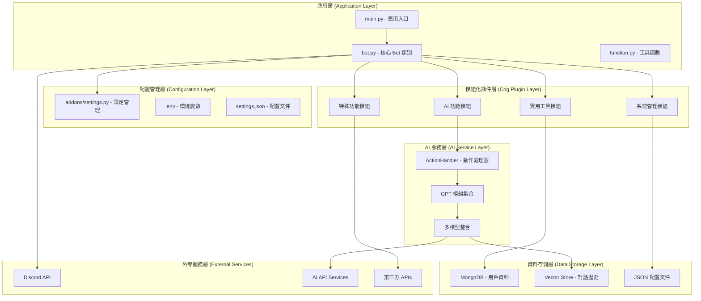
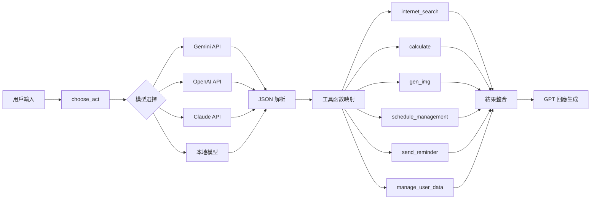
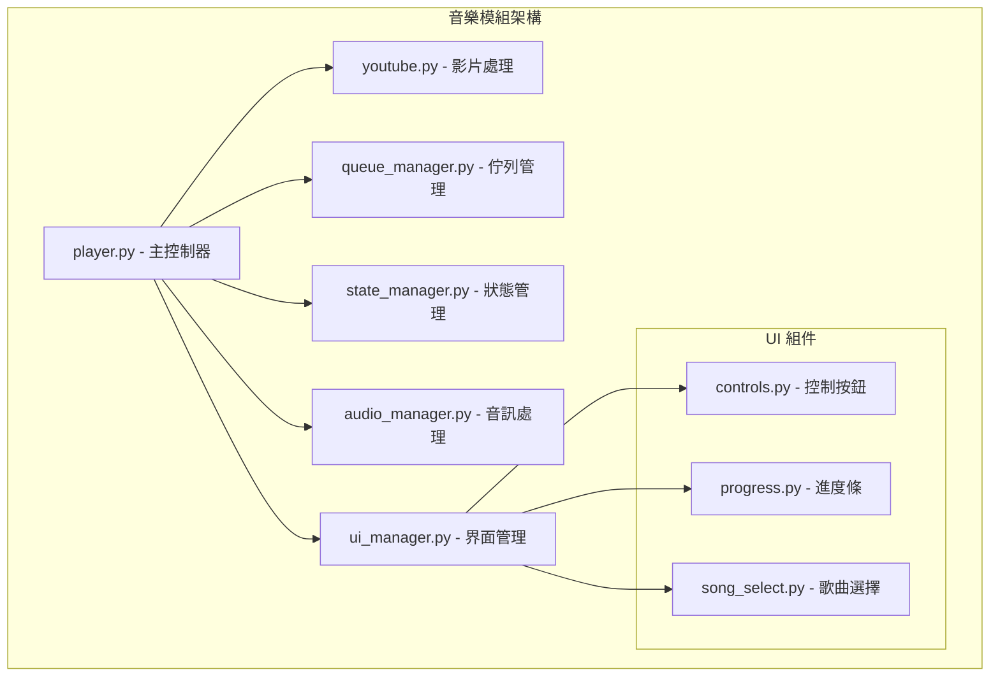
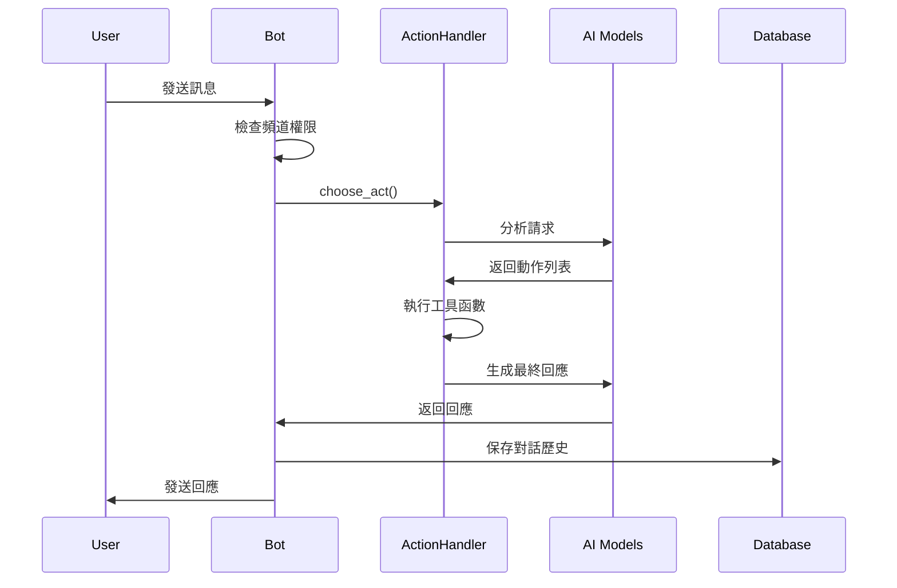

# PigPig Discord Bot 專案架構分析報告

## 📋 執行摘要

PigPig Discord Bot 是一個基於 Discord.py 的多模態 LLM 聊天機器人，採用現代化的插件架構設計，整合多種 AI 模型和實用功能。本報告全面分析其系統架構、技術棧、設計模式和架構優勢。

## 🏗️ 系統整體架構



## 🔍 核心架構層分析

### 1. 應用入口層

#### [`main.py`](main.py:1) - 應用程式入口點
```python
# 關鍵特徵分析：
- Discord Bot 初始化與配置
- CommandCheck 類別實現命令權限檢查
- 動態前綴支援 (get_prefix 函數)
- 版本檢查機制整合
```

**架構優勢：**
- 清晰的入口點設計
- 權限檢查的統一實現
- 配置與邏輯分離

#### [`bot.py`](bot.py:1) - PigPig 主類別
```python
# 核心功能分析：
class PigPig(commands.Bot):
    - 對話歷史管理 (dialogue_history)
    - 向量存儲整合 (vector_store)
    - 分伺服器日誌系統 (loggers)
    - ActionHandler 整合
    - 自動 Cog 載入機制
```

**設計模式識別：**
- **單例模式**: Bot 實例管理
- **觀察者模式**: 事件處理機制
- **策略模式**: ActionHandler 的動作選擇

### 2. 配置管理架構

#### [`addons/settings.py`](addons/settings.py:1) - 設定管理系統
```python
# 配置管理分析：
class Settings:
    - JSON 配置文件解析
    - 環境變數整合
    - 模型優先級配置
    - 音樂暫存路徑管理

class TOKENS:
    - API 金鑰管理
    - 多平台 Token 支援
    - 安全性考量 (dotenv)
```

**安全性評估：**
- ✅ 敏感資訊環境變數化
- ✅ 配置與代碼分離
- ✅ 類型化配置管理

## 🧩 模組化 Cog 系統架構

### AI 功能模組群組

#### 1. [`CoT_AI.py`](cogs/CoT_AI.py:1) - Chain of Thought 推理
```python
# 架構特徵：
- 多模型支援 (本地模型 + Gemini)
- JSON 回應解析機制
- 分步推理處理
- 系統提示詞管理
```

#### 2. [`gen_img.py`](cogs/gen_img.py:1) - 圖像生成模組
```python
# 多模態能力：
- Gemini API 整合
- 本地模型後備機制
- 對話歷史上下文支援
- 圖像編輯功能
```

#### 3. [`internet_search.py`](cogs/internet_search.py:1) - 網路搜尋
```python
# 搜尋能力：
- Google 搜尋整合
- 圖片搜尋功能
- YouTube 搜尋
- 網頁內容抓取
- 美食推薦搜尋
```

### 實用工具模組群組

#### 1. [`math.py`](cogs/math.py:1) - 數學計算引擎
```python
# 計算能力：
- SymPy 符號計算
- 安全表達式解析
- 多語言錯誤處理
- LaTeX 支援潛力
```

#### 2. [`remind.py`](cogs/remind.py:1) - 提醒系統
```python
# 時間管理：
- 靈活時間解析
- 異步任務調度
- 多用戶提醒支援
- 自然語言時間識別
```

#### 3. [`schedule.py`](cogs/schedule.py:1) - 行程管理
```python
# 行程功能：
- YAML 格式支援
- 多查詢模式
- 跨用戶行程查詢
- 時間區間分析
```

### 系統管理模組群組

#### 1. [`channel_manager.py`](cogs/channel_manager.py:1) - 頻道管理
```python
# 權限控制：
- 白名單/黑名單機制
- 自動回應控制
- 管理員權限檢查
- 伺服器級別配置
```

#### 2. [`language_manager.py`](cogs/language_manager.py:1) - 語言管理
```python
# 國際化架構：
- 動態語言切換
- 翻譯文件載入
- 格式化字串支援
- 後備語言機制
```

#### 3. [`model_management.py`](cogs/model_management.py:1) - 模型管理
```python
# AI 模型控制：
- 動態模型載入/卸載
- 記憶體管理
- 開發者權限控制
- 模型狀態監控
```

## 🤖 AI 整合架構深度分析

### ActionHandler 核心系統



### [`gpt/choose_act.py`](gpt/choose_act.py:1) - 動作選擇系統

```python
# 核心架構分析：
class ActionHandler:
    def __init__(self, bot):
        self.tool_func_dict = {
            'internet_search': self.internet_search,
            'directly_answer': gpt_message,
            'calculate': self.calculate_math,
            'gen_img': self.generate_image,
            'schedule_management': self.schedule_management,
            'send_reminder': self.send_reminder,
            'manage_user_data': self.manage_user_data
        }
```

**設計模式識別：**
- **命令模式**: 工具函數映射
- **策略模式**: 多模型選擇策略
- **責任鏈模式**: 錯誤處理與後備機制

### 多模態能力實現

#### 視覺處理流程
```python
# 圖像處理管道：
1. 附件檢測與下載
2. PIL 圖像轉換
3. Base64 編碼
4. API 整合 (Gemini/本地模型)
5. 結果處理與回應
```

#### 對話歷史與上下文管理
```python
# RAG 實現：
- 對話歷史 JSON 存儲
- 向量化存儲 (vector_store)
- 上下文窗口管理
- 動態歷史載入
```

## 🎵 特殊模組架構分析

### 音樂模組 ([`cogs/music/`](cogs/music/))



**架構優勢：**
- **模組化設計**: 關注點清晰分離
- **狀態管理**: 集中式狀態控制
- **UI 組件化**: 可重用的界面元素
- **資源管理**: 自動清理機制

### 餐廳推薦模組 ([`cogs/eat/`](cogs/eat/))

```python
# 機器學習架構：
cogs/eat/
├── db/           # 資料庫層
│   ├── db.py     # 資料庫連接
│   └── tables.py # 表格定義
├── providers/    # 外部服務
│   └── googlemap_crawler.py
└── train/        # 機器學習
    ├── data_loader.py
    ├── model.py
    └── train.py
```

**架構模式：**
- **分層架構**: 資料/服務/模型分離
- **策略模式**: 多provider支援
- **工廠模式**: 模型創建管理

## 🌐 國際化系統架構

### [`translations/`](translations/) 目錄結構
```
translations/
├── zh_TW/common.json  # 繁體中文
├── zh_CN/common.json  # 簡體中文
├── en_US/common.json  # 英文
└── ja_JP/common.json  # 日文
```

### 語言管理系統特徵

```python
# 國際化實現分析：
class LanguageManager:
    - 動態翻譯載入
    - 階層式翻譯結構
    - 格式化字串支援
    - 後備語言機制
    - 伺服器級別語言設定
```

**設計模式：**
- **外觀模式**: 統一翻譯介面
- **策略模式**: 多語言處理策略
- **工廠模式**: 翻譯對象創建

## 📊 技術棧分析

### 核心框架與依賴

基於 [`requirements.txt`](requirements.txt:1) 的技術棧評估：

#### Discord 框架
```python
discord==2.3.2
discord.py==2.4.0
```
- 現代化 Discord API 支援
- 異步程式設計模型
- 強大的事件系統

#### AI/ML 技術棧
```python
# 深度學習框架
transformers        # Hugging Face 模型
torch              # PyTorch 框架
torchaudio         # 音訊處理
torchvision        # 電腦視覺

# LangChain 生態系統
langchain==0.2.5
langchain-community==0.2.5
langchain-core==0.2.9
langchain_huggingface

# 圖像生成
diffusers==0.29.1
safetensors==0.4.3

# 量化與優化
bitsandbytes==0.43.1
accelerate==1.2.1
```

**AI 架構優勢：**
- **多模型支援**: 本地模型 + 雲端 API
- **量化優化**: 記憶體效率最佳化
- **模型管理**: 動態載入/卸載機制

#### 資料處理與存儲
```python
# 資料庫
pymongo==4.7.3     # MongoDB 同步驅動
motor==3.4.0       # MongoDB 異步驅動

# 數據處理
numpy==1.26.4
scipy==1.13.1
scikit-image==0.24.0

# 圖像處理
pillow==10.2.0
opencv-python==4.10.0.84
```

#### 網路與爬蟲
```python
# HTTP 客戶端
aiohttp==3.9.5
requests==2.32.3

# 網頁爬蟲
selenium==4.22.0
beautifulsoup4==4.12.3
webdriver-manager

# 影片處理
yt_dlp             # YouTube 下載
youtube_search     # YouTube 搜尋
moviepy==1.0.3     # 影片編輯
```

#### 多媒體處理
```python
# 音訊處理
librosa==0.9.0
soundfile==0.12.1
PyNaCl             # Discord 語音

# 影片處理
decord             # 影片解碼
moviepy            # 影片編輯
```

## 🏛️ 架構模式識別

### 1. 插件架構 (Plugin Architecture)
```python
# Discord.py Cog 系統實現
- 動態模組載入
- 熱插拔支援
- 模組間解耦合
- 統一生命週期管理
```

### 2. 事件驅動架構 (Event-Driven Architecture)
```python
# Discord 事件處理
async def on_message(self, message):
async def on_message_edit(self, before, after):
async def on_ready(self):
```

### 3. 分層架構 (Layered Architecture)
```python
應用層 → 服務層 → 資料層
Discord Commands → Cog Services → Database/APIs
```

### 4. 微服務導向設計
```python
# 功能模組化
- AI 服務 (gpt/)
- 配置管理 (addons/)
- 翻譯服務 (translations/)
- 日誌系統 (logs.py)
```

## 📈 資料流與狀態管理

### 對話處理流程



### 狀態管理策略

#### 1. 對話歷史管理
```python
# 分頻道對話歷史
self.dialogue_history[channel_id] = [
    {"role": "user", "content": "..."},
    {"role": "assistant", "content": "..."}
]
```

#### 2. 向量存儲 RAG
```python
# 向量存儲功能已移除，等待新記憶系統實作
# 詳見 docs/discord_bot_memory_system_architecture.md
```

#### 3. 分伺服器配置
```python
# 伺服器級別設定
SETTINGS_BUFFER: dict[int, dict[str, Any]] = {}
```

## 🔒 安全性與權限控制

### 1. 權限檢查機制
```python
class CommandCheck(discord.app_commands.CommandTree):
    async def interaction_check(self, interaction):
        # 群組限制檢查
        if not interaction.guild:
            return False
```

### 2. 管理員權限驗證
```python
async def check_admin_permissions(self, interaction):
    return interaction.user.guild_permissions.administrator
```

### 3. 開發者專用功能
```python
def check_user(user_id: int) -> bool:
    # 開發者 ID 驗證
    return user_id in DEVELOPER_IDS
```

### 4. 頻道存取控制
```python
# 白名單/黑名單機制
def is_allowed_channel(self, channel, guild_id):
    # 動態權限檢查
```

## 📊 效能與可擴展性分析

### 效能優勢

#### 1. 異步程式設計
```python
# 全面異步實現
async def on_message(self, message):
async def choose_act(self, prompt, message):
async def generate_response(...):
```

#### 2. 資源管理
```python
# 音樂文件自動清理
# 模型動態載入/卸載
# 連接池管理 (MongoDB)
```

#### 3. 快取機制
```python
# 設定緩存
SETTINGS_BUFFER: dict[int, dict[str, Any]] = {}
# 翻譯緩存
self.translations: Dict[str, Dict] = {}
```

### 可擴展性設計

#### 1. 模組化插件系統
- 新功能可作為獨立 Cog 添加
- 熱插拔支援
- 最小依賴耦合

#### 2. 多模型支援架構
```python
# 模型優先級配置
model_priority: ["gemini", "local", "openai", "claude"]
```

#### 3. 國際化預備
- 模組化翻譯系統
- 動態語言加載
- 易於添加新語言

## 🎯 架構優勢總結

### 1. 設計優勢
- **模組化程度高**: 功能清晰分離，易於維護
- **可擴展性強**: 插件架構支援功能擴展
- **安全性考量**: 多層權限控制機制
- **國際化支援**: 完整的多語言系統

### 2. 技術優勢  
- **現代化技術棧**: 最新框架和工具
- **AI 整合深度**: 多模型無縫整合
- **異步程式設計**: 高效能事件處理
- **資源管理**: 智慧記憶體和文件管理

### 3. 架構模式應用
- **插件模式**: Discord Cog 系統
- **策略模式**: AI 模型選擇
- **觀察者模式**: 事件驅動架構
- **工廠模式**: 物件創建管理

## 🚀 改進建議

### 1. 架構層面
- 考慮引入依賴注入容器
- 實現更細緻的錯誤處理策略
- 增加健康檢查與監控機制

### 2. 效能優化
- 實現更智慧的快取策略
- 優化資料庫查詢效能
- 考慮實現連接池管理

### 3. 可觀測性
- 增加詳細的效能指標
- 實現分散式追蹤
- 建立警報與監控系統

### 4. 開發體驗
- 增加自動化測試覆蓋
- 實現 CI/CD 管道
- 建立開發者文檔

## 📝 結論

PigPig Discord Bot 展現了優秀的架構設計，採用現代化的插件架構模式，實現了高度模組化和可擴展的系統。其 AI 整合深度、多模態能力和國際化支援都體現了專業的技術實力。

該專案在保持功能豐富性的同時，維持了良好的代碼組織和架構清晰度，為同類型專案提供了優秀的參考範例。

---

**分析完成日期**: 2025年06月02日  
**專案版本**: 基於當前 main 分支  
**分析範圍**: 完整專案架構與技術棧