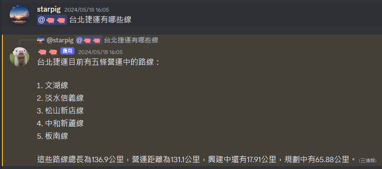
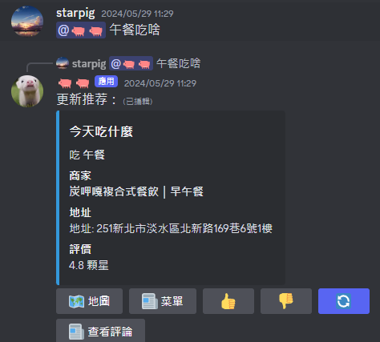
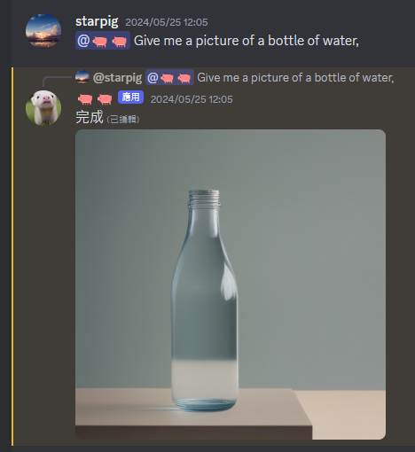
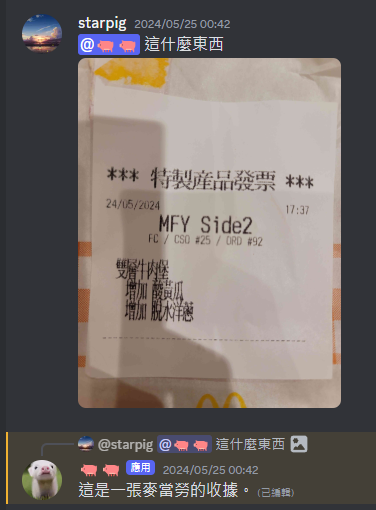
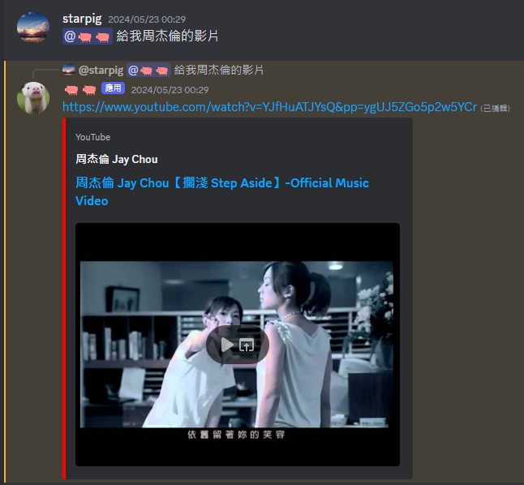

# PigPig: Advanced Multi-modal LLM Discord Bot

<p align="center">
  <a href="README.md">English</a> | <a href="README_zh-TW.md">繁體中文</a>
</p>

<p align="center">
  <a href="https://discord.gg/BvP64mqKzR">
    
  </a>
</p>

PigPig is a powerful Discord bot based on multi-modal Large Language Models (LLM), designed to interact with users through natural language. It combines advanced AI capabilities with practical features, offering a rich experience for Discord communities.

[Invite PigPig to your server](https://discord.com/oauth2/authorize?client_id=1208661941539704852&permissions=8&scope=bot)

## 🌟 Key Features

- 🧠 **AI-Powered Conversations**: Utilizes LLMs and LangChain for natural language understanding and generation.
- 🖼️ **Multi-modal Capabilities**: Visual question answering and image generation.
- 🍽️ **Practical Features**: Set reminders, get recommendations, and perform calculations.
- 👤 **User Information Management**: Create and maintain user profiles.
- 📊 **Channel Data RAG**: Use channel history for context-aware responses.
- 💭 **Chain of Thought Reasoning**: Employs Chain of Thought reasoning to provide detailed, step-by-step explanations of its thought process, enhancing transparency and understanding.  This feature allows the bot to break down complex problems into smaller, manageable steps, providing a more comprehensive and insightful response.
- 🔄 **Auto-Update System**: Automatically checks for and downloads GitHub updates with secure backup and rollback mechanisms.


## 🖥️ System Requirements

### Essential Dependencies
- [Python 3.10+](https://www.python.org/downloads/)
- [MongoDB](https://www.mongodb.com/) (for user data and restaurant recommendation features)
- [FFmpeg](https://ffmpeg.org/) (for music playback functionality)
- [Modules in requirements](requirements.txt)

### Hardware Requirements
- **GPU (Optional)**: NVIDIA GPU with at least 12GB VRAM (recommended for local model inference)
- **Note**: The bot prioritizes API services over local models, making GPU optional for most use cases

## 📸 Feature Showcase
### Discord Bot











## 🚀 Quick Start
```sh
git clone https://github.com/starpig1129/discord-LLM-bot-PigPig.git  #Clone the repository
cd discord-LLM-bot-PigPig                                        #Go to the directory
python -m pip install -r requirements.txt          #Install required packages
```

Start your bot with `python main.py`

## ⚙️ Configuration
1. **Rename `.env Example` to `.env` and fill all the values**
```sh
TOKEN = XXXXXXXXXXXXXXXXXXXXXXXX.XXXXXX.XXXXXXXXXXXXXXXXXXXXXXXXXXX
CLIENT_ID = 123456789012345678
CLIENT_SECRET_ID = XXXXXXXXXX-XXXXXXXXXXXXXXXXXXXXX
SERCET_KEY = DASHBOARD_SERCET_KEY

BUG_REPORT_CHANNEL_ID = 123456789012345678

LLM_MODEL_NAME = shenzhi-wang/Llama3-8B-Chinese-Chat
VQA_MODEL_NAME = openbmb/MiniCPM-Llama3-V-2_5-int4
ANTHROPIC_API_KEY = XXXXXXXXXXXXXXXXXXXXXXXXXXXXXXXXXXXX
OPENAI_API_KEY = XXXXXXXXXXXXXXXXXXXXXXXXXXXXXXXXXXXX
GEMINI_API_KEY = XXXXXXXXXXXXXXXXXXXXXXXXXXXXXXXXXXXX

# Bot Owner ID (for auto-update system and admin operations)
BOT_OWNER_ID = 123456789012345678

# MongoDB Configuration (required for user data and restaurant features)
MONGODB_URI = mongodb://localhost:27017/pigpig
```
| Values | Description |
| --- | --- |
| TOKEN | Your Discord bot token [(Discord Portal)](https://discord.com/developers/applications) |
| CLIENT_ID | Your Discord bot client id [(Discord Portal)](https://discord.com/developers/applications) |
| CLIENT_SECRET_ID | Your Discord bot client secret id [(Discord Portal)](https://discord.com/developers/applications) ***(optional)*** |
| SERCET_KEY | Secret key for dashboard ***(optional)*** |
| BUG_REPORT_CHANNEL_ID | All the error messages will send to this text channel ***(optional)*** |
| ANTHROPIC_API_KEY | Your Anthropic api key [(Anthropic API)](https://www.anthropic.com/api) ***(optional)*** |
| OPENAI_API_KEY | Your OpenAI api key [(OpenAI API)](https://openai.com/api/) ***(optional)*** |
| GEMINI_API_KEY | Your GEMINI API key [(GEMINI API)](https://aistudio.google.com/app/apikey/) ***(optional)*** |
| BOT_OWNER_ID | Your Discord User ID for bot owner privileges and auto-update system ***(required for auto-update)*** |
| MONGODB_URI | MongoDB connection string for user data storage ***(required for user data and restaurant features)*** |
2. **Rename `settingsExample.json` to `settings.json` and customize your settings**
***(Note: Do not change any keys from `settings.json`)***
```json
{
    "prefix": "/",
    "activity": [
        {
            "paly": "\u5b78\u7fd2\u8aaa\u8a71"
        }
    ],
    "ipc_server": {
        "host": "127.0.0.1",
        "port": 8000,
        "enable": false
    },
    "version": "v2.0.0",
    "mongodb": "mongodb://localhost:27017/",
    "music_temp_base": "./temp/music",
    "model_priority": ["gemini", "local", "openai", "claude"],
    "auto_update": {
        "enabled": true,
        "check_interval": 21600,
        "require_owner_confirmation": true,
        "auto_restart": true
    },
    "notification": {
        "discord_dm": true,
        "update_channel_id": null,
        "notification_mentions": []
    },
    "security": {
        "backup_enabled": true,
        "max_backups": 5,
        "verify_downloads": true,
        "protected_files": ["settings.json", ".env", "data/"]
    },
    "restart": {
        "graceful_shutdown_timeout": 30,
        "restart_command": "python main.py",
        "pre_restart_delay": 5
    },
    "github": {
        "repository": "starpig1129/ai-discord-bot-PigPig",
        "api_url": "https://github.com/starpig1129/ai-discord-bot-PigPig/releases/latest",
        "download_url": "https://github.com/starpig1129/ai-discord-bot-PigPig/archive/"
    }
}
```

## Cogs Overview

This bot utilizes a modular design with several cogs (modules) to handle different functionalities. Here's a brief overview:

- **CoT_AI:** Implements Chain of Thought reasoning for detailed, step-by-step responses.
- **Channel Manager:** Manages channel-specific settings and permissions.
- **Discord Manager Agent:** Handles Discord-specific management operations and automation.
- **Image Generation:** Generates images based on text prompts.
- **GIF Tools:** Provides GIF creation and manipulation functionality.
- **Help:** Provides a list of available commands and assistance.
- **Internet Search:** Performs various web searches (general, image, YouTube, URL content).
- **Language Manager:** Manages multi-language support and translations.
- **Math:** Performs mathematical calculations and problem-solving.
- **Model Management:** Loads and unloads language models for optimal performance.
- **Music:** Provides music playback using custom YouTube integration (yt_dlp + PyNaCl), supporting playlists, queues, and various playback modes.
- **Reminder:** Sets and manages reminders for users.
- **Schedule:** Manages user schedules and calendar functionality.
- **Update Manager:** Manages the auto-update system, providing version checking, secure downloading, and system restart functionality.
- **User Data:** Manages user-specific data and profiles.
- **Eat:** Provides intelligent food recommendations with MongoDB integration.


## License

This project is licensed under the MIT License - see the [LICENSE](LICENSE) file for details.