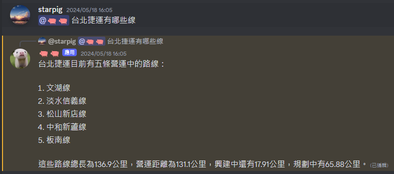

# PigPig：多模態大型語言模型 Discord 機器人

<p align="center">
  <a href="README.md">English</a> | <a href="README_zh-TW.md">繁體中文</a>
</p>

<p align="center">
  <a href="https://discord.gg/BvP64mqKzR">
    
  </a>
</p>

PigPig 是一個基於多模態大型語言模型 (LLM) 的強大 Discord 機器人，旨在透過自然語言與使用者互動。它結合了先進的 AI 功能與實用特性，為 Discord 社群提供豐富的體驗。

[邀請 PigPig 到您的伺服器](https://discord.com/oauth2/authorize?client_id=1208661941539704852&permissions=8&scope=bot)

## 🌟 主要功能

- 🧠 **AI 驅動的對話**: 使用 LLM 和 LangChain 進行自然語言理解和生成。
- 🖼️ **多模態功能**: 視覺問答和圖片生成。
- 🍽️ **實用功能**: 設定提醒事項、獲得推薦和執行計算。
- 👤 **使用者資訊管理**: 建立和維護使用者個人資料。
- 📊 **頻道資料 RAG**: 使用頻道歷史記錄來獲得具備情境感知的回應。
- 🧠 **智能頻道記憶系統**: 永久儲存並智能檢索頻道對話歷史，提供語義搜尋和上下文增強
- 💭 **思維鏈推理 (Chain of Thought Reasoning)**：採用思維鏈推理來提供詳細的、循序漸進的思考過程說明，增強透明度和理解力。此功能允許機器人將複雜的問題分解成較小的、易於管理的步驟，提供更全面和有見地的回應。
- 🔄 **自動更新系統**: 自動檢查和下載 GitHub 更新，支援安全備份和回滾機制。


## 🖥️ 系統需求

### 基本依賴項目
- [Python 3.10+](https://www.python.org/downloads/)
- [MongoDB](https://www.mongodb.com/)（用於使用者資料和餐廳推薦功能）
- [FFmpeg](https://ffmpeg.org/)（用於音樂播放功能）
- [requirements 中的模組](requirements.txt)

### 硬體需求
- **GPU（可選）**：至少具有 12GB VRAM 的 NVIDIA GPU（建議用於本地模型推理）
- **注意**：機器人優先使用 API 服務而非本地模型，因此 GPU 對大多數使用情況而言是可選的

## 📸 功能展示
### Discord 機器人




## 🚀 快速入門
```

### FFmpeg 設定

機器人現在支援透過 `settings.json` 檔案來配置 FFmpeg 設定。主要配置選項包括：

| 設定項目 | 描述 |
| --- | --- |
| `ffmpeg.location` | FFmpeg 執行檔路徑 (預設: `/usr/bin/ffmpeg`) |
| `ffmpeg.audio_quality` | 音樂下載的音訊品質 (預設: `192` kbps) |
| `ffmpeg.audio_codec` | 轉換用的音訊編解碼器 (預設: `mp3`) |
| `ffmpeg.postprocessor_args` | 用於最佳化的 FFmpeg 後處理器參數 |
| `ffmpeg.ytdlp_options` | yt-dlp 特定的下載行為選項 |
| `ffmpeg.http_headers` | 下載請求的 HTTP 標頭 |

這些設定讓您可以根據系統需求和偏好來自訂音樂下載和處理行為。sh
git clone https://github.com/starpig1129/discord-LLM-bot-PigPig.git  #複製儲存庫
cd discord-LLM-bot-PigPig                                        #進入目錄
python -m pip install -r requirements.txt          #安裝所需的套件
```

### FFmpeg 設定

機器人現在支援透過 `settings.json` 檔案來配置 FFmpeg 設定。主要配置選項包括：

| 設定項目 | 描述 |
| --- | --- |
| `ffmpeg.location` | FFmpeg 執行檔路徑 (預設: `/usr/bin/ffmpeg`) |
| `ffmpeg.audio_quality` | 音樂下載的音訊品質 (預設: `192` kbps) |
| `ffmpeg.audio_codec` | 轉換用的音訊編解碼器 (預設: `mp3`) |
| `ffmpeg.postprocessor_args` | 用於最佳化的 FFmpeg 後處理器參數 |
| `ffmpeg.ytdlp_options` | yt-dlp 特定的下載行為選項 |
| `ffmpeg.http_headers` | 下載請求的 HTTP 標頭 |

這些設定讓您可以根據系統需求和偏好來自訂音樂下載和處理行為。

使用 `python main.py` 啟動您的機器人

## ⚙️ 設定
1. **將 `.env Example` 重新命名為 `.env` 並填寫所有值**
```

### FFmpeg 設定

機器人現在支援透過 `settings.json` 檔案來配置 FFmpeg 設定。主要配置選項包括：

| 設定項目 | 描述 |
| --- | --- |
| `ffmpeg.location` | FFmpeg 執行檔路徑 (預設: `/usr/bin/ffmpeg`) |
| `ffmpeg.audio_quality` | 音樂下載的音訊品質 (預設: `192` kbps) |
| `ffmpeg.audio_codec` | 轉換用的音訊編解碼器 (預設: `mp3`) |
| `ffmpeg.postprocessor_args` | 用於最佳化的 FFmpeg 後處理器參數 |
| `ffmpeg.ytdlp_options` | yt-dlp 特定的下載行為選項 |
| `ffmpeg.http_headers` | 下載請求的 HTTP 標頭 |

這些設定讓您可以根據系統需求和偏好來自訂音樂下載和處理行為。sh
TOKEN = XXXXXXXXXXXXXXXXXXXXXXXX.XXXXXX.XXXXXXXXXXXXXXXXXXXXXXXXXXX
CLIENT_ID = 123456789012345678
CLIENT_SECRET_ID = XXXXXXXXXX-XXXXXXXXXXXXXXXXXXXXX
SERCET_KEY = DASHBOARD_SERCET_KEY

BUG_REPORT_CHANNEL_ID = 123456789012345678

LLM_MODEL_NAME = shenzhi-wang/Llama3-8B-Chinese-Chat
VQA_MODEL_NAME = openbmb/MiniCPM-Llama3-V-2_5-int4
ANTHROPIC_API_KEY = XXXXXXXXXXXXXXXXXXXXXXXXXXXXXXXXXXXX
OPENAI_API_KEY = XXXXXXXXXXXXXXXXXXXXXXXXXXXXXXXXXXXX
GEMINI_API_KEY = XXXXXXXXXXXXXXXXXXXXXXXXXXXXXXXXXXXX

# 機器人擁有者 ID（自動更新系統和管理員操作必需）
BOT_OWNER_ID = 123456789012345678

# MongoDB 配置（使用者資料和餐廳功能必需）
MONGODB_URI = mongodb://localhost:27017/pigpig
```

### FFmpeg 設定

機器人現在支援透過 `settings.json` 檔案來配置 FFmpeg 設定。主要配置選項包括：

| 設定項目 | 描述 |
| --- | --- |
| `ffmpeg.location` | FFmpeg 執行檔路徑 (預設: `/usr/bin/ffmpeg`) |
| `ffmpeg.audio_quality` | 音樂下載的音訊品質 (預設: `192` kbps) |
| `ffmpeg.audio_codec` | 轉換用的音訊編解碼器 (預設: `mp3`) |
| `ffmpeg.postprocessor_args` | 用於最佳化的 FFmpeg 後處理器參數 |
| `ffmpeg.ytdlp_options` | yt-dlp 特定的下載行為選項 |
| `ffmpeg.http_headers` | 下載請求的 HTTP 標頭 |

這些設定讓您可以根據系統需求和偏好來自訂音樂下載和處理行為。
| 值 | 描述 |
|---|---|
| TOKEN | 您的 Discord 機器人權杖 [(Discord 入口網站)](https://discord.com/developers/applications) |
| CLIENT_ID | 您的 Discord 機器人客戶端 ID [(Discord 入口網站)](https://discord.com/developers/applications) |
| CLIENT_SECRET_ID | 您的 Discord 機器人客戶端秘密 ID [(Discord 入口網站)](https://discord.com/developers/applications) ***(選填)*** |
| SERCET_KEY | 儀表板的秘密金鑰 ***(選填)*** |
| BUG_REPORT_CHANNEL_ID | 所有錯誤訊息將會傳送到此文字頻道 ***(選填)*** |
| ANTHROPIC_API_KEY | 您的 Anthropic API 金鑰 [(Anthropic API)](https://www.anthropic.com/api) ***(選填)*** |
| OPENAI_API_KEY | 您的 OpenAI API 金鑰 [(OpenAI API)](https://openai.com/api/) ***(選填)*** |
| GEMINI_API_KEY | 您的 GEMINI API 金鑰 [(GEMINI API)](https://aistudio.google.com/app/apikey/) ***(選填)*** |
| BOT_OWNER_ID | 您的 Discord 使用者 ID，用於機器人擁有者權限和自動更新系統 ***(自動更新功能必需)*** |
| MONGODB_URI | MongoDB 連線字串，用於使用者資料儲存 ***(使用者資料和餐廳功能必需)*** |
2. **將 `settingsExample.json` 重新命名為 `settings.json` 並自訂您的設定**
***(注意：請勿更改 `settings.json` 中的任何金鑰)***
```

### FFmpeg 設定

機器人現在支援透過 `settings.json` 檔案來配置 FFmpeg 設定。主要配置選項包括：

| 設定項目 | 描述 |
| --- | --- |
| `ffmpeg.location` | FFmpeg 執行檔路徑 (預設: `/usr/bin/ffmpeg`) |
| `ffmpeg.audio_quality` | 音樂下載的音訊品質 (預設: `192` kbps) |
| `ffmpeg.audio_codec` | 轉換用的音訊編解碼器 (預設: `mp3`) |
| `ffmpeg.postprocessor_args` | 用於最佳化的 FFmpeg 後處理器參數 |
| `ffmpeg.ytdlp_options` | yt-dlp 特定的下載行為選項 |
| `ffmpeg.http_headers` | 下載請求的 HTTP 標頭 |

這些設定讓您可以根據系統需求和偏好來自訂音樂下載和處理行為。json
{
    "prefix": "/",
    "activity": [
        {
            "paly": "\u5b78\u7fd2\u8aaa\u8a71"
        }
    ],
    "ipc_server": {
        "host": "127.0.0.1",
        "port": 8000,
        "enable": false
    },
    "version": "v2.2.11",
    "mongodb": "mongodb://localhost:27017/",
    "music_temp_base": "./temp/music",
    "model_priority": ["gemini", "local", "openai", "claude"],
    "auto_update": {
        "enabled": true,
        "check_interval": 21600,
        "require_owner_confirmation": true,
        "auto_restart": true
    },
    "notification": {
        "discord_dm": true,
        "update_channel_id": null,
        "notification_mentions": []
    },
    "security": {
        "backup_enabled": true,
        "max_backups": 5,
        "verify_downloads": true,
        "protected_files": ["settings.json", ".env", "data/"]
    },
    "restart": {
        "graceful_shutdown_timeout": 30,
        "restart_command": "python main.py",
        "pre_restart_delay": 5
    },
    "github": {
        "repository": "starpig1129/ai-discord-bot-PigPig",
        "api_url": "https://github.com/starpig1129/ai-discord-bot-PigPig/releases/latest",
        "download_url": "https://github.com/starpig1129/ai-discord-bot-PigPig/archive/"
    },
    "ffmpeg": {
        "location": "/usr/bin/ffmpeg",
        "audio_quality": "192",
        "audio_codec": "mp3",
        "postprocessor_args": {
            "threads": 2,
            "loglevel": "warning",
            "overwrite_output": true,
            "max_muxing_queue_size": 2048,
            "analyzeduration": "20M",
            "probesize": "20M",
            "reconnect": true,
            "reconnect_streamed": true,
            "reconnect_delay_max": 30,
            "timeout": 30000000,
            "rw_timeout": 30000000
        },
        "ytdlp_options": {
            "socket_timeout": 300,
            "retries": 10,
            "concurrent_fragment_downloads": 1,
            "file_access_retries": 5,
            "fragment_retries": 10,
            "retry_sleep_http": 5
        },
        "http_headers": {
            "user_agent": "Mozilla/5.0 (Windows NT 10.0; Win64; x64) AppleWebKit/537.36",
            "accept": "text/html,application/xhtml+xml,application/xml;q=0.9,*/*;q=0.8",
            "accept_language": "en-us,en;q=0.5",
            "sec_fetch_mode": "navigate"
        }
    }
}
```

### FFmpeg 設定

機器人現在支援透過 `settings.json` 檔案來配置 FFmpeg 設定。主要配置選項包括：

| 設定項目 | 描述 |
| --- | --- |
| `ffmpeg.location` | FFmpeg 執行檔路徑 (預設: `/usr/bin/ffmpeg`) |
| `ffmpeg.audio_quality` | 音樂下載的音訊品質 (預設: `192` kbps) |
| `ffmpeg.audio_codec` | 轉換用的音訊編解碼器 (預設: `mp3`) |
| `ffmpeg.postprocessor_args` | 用於最佳化的 FFmpeg 後處理器參數 |
| `ffmpeg.ytdlp_options` | yt-dlp 特定的下載行為選項 |
| `ffmpeg.http_headers` | 下載請求的 HTTP 標頭 |

這些設定讓您可以根據系統需求和偏好來自訂音樂下載和處理行為。

## 🧠 記憶系統配置

機器人包含智能頻道記憶系統，提供永久對話儲存和語義搜尋功能。主要特性包括：

### 記憶系統功能
- **永久儲存**: 所有頻道對話自動儲存至本地 SQLite 資料庫
- **語義搜尋**: 使用句子轉換器進行進階向量搜尋，實現有意義的上下文檢索
- **多語言支援**: 支援包括英文、中文、日文等多種語言
- **混合搜尋**: 結合關鍵字和語義搜尋以獲得最佳結果
- **上下文增強**: 自動提供相關對話歷史以改善 AI 回應

### 記憶系統指令
- `/memory_search <查詢>`: 使用語義搜尋查找對話歷史
- `/memory_stats`: 檢視記憶系統統計資訊和儲存狀態
- `/memory_config`: 管理記憶系統配置設定

### 記憶系統硬體需求
- **CPU**: 標準 CPU 足以應付基本操作
- **記憶體**: 建議最少 4GB 以支援向量運算
- **儲存空間**: 本地儲存空間用於 SQLite 資料庫和向量索引
- **可選 GPU**: NVIDIA GPU 可加速向量計算（安裝 `faiss-gpu` 取代 `faiss-cpu`）

### 記憶系統依賴項目
記憶系統使用以下核心依賴項目（透過 requirements.txt 自動安裝）：
- `faiss-cpu>=1.7.4`: 向量相似度搜尋引擎
- `sentence-transformers>=2.2.2`: 多語言句子嵌入
- `scikit-learn>=1.0.0`: 機器學習工具用於相似度計算
- `psutil>=5.9.8`: 系統監控以優化效能
詳細的設定和使用說明，請參閱 [記憶系統快速使用指南](docs/memory_system_quick_start_guide.md)。

## Cogs 概述

此機器人採用模組化設計，包含數個 Cogs (模組) 來處理不同的功能。以下是簡要概述：

- **CoT_AI:** 實現思維鏈推理，提供詳細的、循序漸進的回應。
- **頻道管理器 (Channel Manager):** 管理特定頻道的設定和權限。
- **Discord 管理代理 (Discord Manager Agent):** 處理 Discord 特定的管理操作和自動化功能。
- **圖片生成 (Image Generation):** 基於文字提示生成圖片。
- **GIF 工具 (GIF Tools):** 提供 GIF 創建和操作功能。
- **說明 (Help):** 提供可用指令的列表和協助。
- **網路搜尋 (Internet Search):** 執行各種網路搜尋 (一般、圖片、YouTube、網址內容)。
- **語言管理器 (Language Manager):** 管理多語言支援和翻譯功能。
- **數學 (Math):** 執行數學計算和問題解決。
- **記憶系統 (Memory System):** 智能頻道記憶系統，提供永久對話儲存、語義搜尋、智能上下文增強，支援多語言向量搜尋和混合搜尋策略。
- **記憶指令 (Memory Commands):** 記憶系統管理指令，包括記憶搜尋、統計資訊、配置管理等功能。
- **模型管理 (Model Management):** 載入和卸載語言模型以實現最佳效能。
- **音樂 (Music):** 使用自建 YouTube 整合系統 (yt_dlp + PyNaCl) 提供音樂播放，支援播放清單、佇列和各種播放模式。
- **提醒 (Reminder):** 為使用者設定和管理提醒事項。
- **行程表 (Schedule):** 管理使用者行程表和日曆功能。
- **系統提示管理器 (System Prompt Manager):** 管理頻道和伺服器專用的系統提示，具備權限驗證、快取機制和模組化提示系統整合功能。
- **更新管理器 (Update Manager):** 管理自動更新系統，提供版本檢查、安全下載和系統重啟功能。
- **使用者資料 (User Data):** 管理使用者特定資料和個人資料。
- **美食推薦 (Eat):** 透過 MongoDB 整合提供智慧美食推薦。


## 授權條款

此專案採用 MIT 授權條款授權 - 詳細資訊請參閱 [LICENSE](LICENSE) 檔案。
