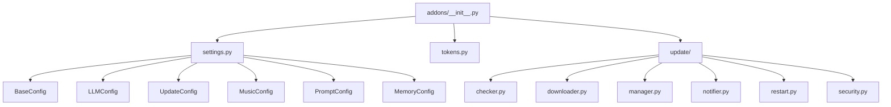

# Addons System

**Directory:** [`addons/`](addons/)

The Addons System is the core infrastructure module that provides essential services and functionality for the PigPig Discord Bot. It manages system configuration, security tokens, and the automatic update system.

## Overview

The addons system is organized into the following components:

- **Core Configuration:** Centralized configuration management for all bot subsystems
- **Security & Authentication:** Token management and environment variable handling  
- **Automatic Updates:** Comprehensive update system with security, backup, and rollback capabilities
- **System Integration:** Seamless integration between different bot components

## Architecture



## Core Components

### Configuration Management

The configuration system provides centralized management for all bot settings:

- **[BaseConfig](./settings.md#baseconfig):** Basic bot configuration (prefix, activity, etc.)
- **[LLMConfig](./settings.md#llmconfig):** Language model priorities and AI service settings
- **[UpdateConfig](./settings.md#updateconfig):** Auto-update system configuration
- **[MusicConfig](./settings.md#musicconfig):** Music system and FFmpeg settings
- **[PromptConfig](./settings.md#promptconfig):** System prompt and agent configuration
- **[MemoryConfig](./settings.md#memoryconfig):** Memory subsystem configuration

### Security & Tokens

- **[tokens.py](./tokens.md):** Environment variable management and API key handling
- Secure authentication for Discord bot operations
- Integration with third-party AI services (OpenAI, Anthropic, Google)

### Update System

- **[Version Checker](./update/checker.md):** GitHub version comparison and release detection
- **[Update Downloader](./update/downloader.md):** Secure file download with verification
- **[Update Manager](./update/manager.md):** Core orchestration of the update process
- **[Security Module](./update/security.md):** Permission checking, backup management, and rollback
- **[Notification System](./update/notifier.md):** Discord-based update notifications
- **[Restart Manager](./update/restart.md):** System restart after updates

## Key Features

### 1. Configuration Management
- **YAML-based Configuration:** All settings loaded from `base_configs/` directory
- **Environment Variable Integration:** Seamless .env file support
- **Error Handling:** Robust error reporting with `func.report_error()`
- **Lazy Loading:** Configurations loaded on demand for optimal performance

### 2. Security Features
- **Permission Validation:** Only bot owners can perform updates
- **Backup & Rollback:** Automatic backup before updates with rollback capability
- **Protected Files:** Config files and sensitive data protected during updates
- **Environment Validation:** Comprehensive checking of required environment variables

### 3. Update System
- **Automatic Version Checking:** Periodic checks for GitHub releases
- **Secure Downloads:** Verified file downloads with integrity checking
- **Progress Tracking:** Real-time update progress notifications
- **Graceful Restart:** Smooth bot restart after successful updates
- **Error Recovery:** Automatic rollback on update failures

### 4. Cross-System Integration
- **Module Exports:** Clean separation via `__all__` declarations
- **Lazy Imports:** Avoid circular dependencies through delayed imports
- **Consistent Error Handling:** Unified error reporting across all modules

## Usage Examples

### Configuration Access

```python
from addons import base_config, llm_config, update_config

# Access base bot configuration
print(f"Bot prefix: {base_config.prefix}")

# Check update settings
if update_config.auto_update.get("enabled", False):
    print("Auto-update is enabled")
```

### Token Management

```python
from addons import tokens

# Access environment variables
bot_token = tokens.token
owner_id = tokens.bot_owner_id

# Use in bot initialization
client.run(bot_token)
```

### Update System Integration

```python
from addons.update import UpdateManager

# Initialize update manager
update_manager = UpdateManager(bot)

# Check for updates
update_info = await update_manager.check_for_updates()

# Execute update if available
if update_info.get("update_available"):
    result = await update_manager.execute_update()
```

## Configuration Structure

The addons system expects the following configuration structure:

```
base_configs/
├── base.yaml          # Basic bot settings
├── llm.yaml           # AI model configuration
├── update.yaml        # Update system settings
├── music.yaml         # Music system settings
├── prompt/            # Prompt templates
│   ├── default.yaml
│   └── ...
└── memory.yaml        # Memory subsystem settings
```

## Error Handling

All modules in the addons system follow consistent error handling patterns:

- **Primary:** Use `func.report_error()` for unified error reporting
- **Fallback:** Local logging when the primary system is unavailable  
- **Graceful Degradation:** Continue operation with warnings when possible

## Security Considerations

1. **Environment Variables:** All sensitive data loaded from `.env` files
2. **Permission Control:** Update operations restricted to bot owners
3. **Backup Protection:** Critical files protected during updates
4. **Input Validation:** All external data validated before use
5. **Secure Downloads:** File integrity verified before installation

## Dependencies

The addons system depends on:

- **Core:** `yaml`, `dotenv`, `asyncio`, `logging`
- **Update System:** `aiohttp`, `zipfile`, `hashlib`
- **Security:** `discord.py`, `shutil`
- **Integration:** `function` module for unified error reporting

## Maintenance

For maintenance and troubleshooting:

1. **Configuration Issues:** Check `base_configs/` directory and YAML syntax
2. **Update Failures:** Review `data/update_logs/` for detailed logs
3. **Permission Errors:** Verify `BOT_OWNER_ID` environment variable
4. **Network Issues:** Check GitHub API connectivity and rate limits

---

*For detailed documentation on specific components, see the individual module documentation.*