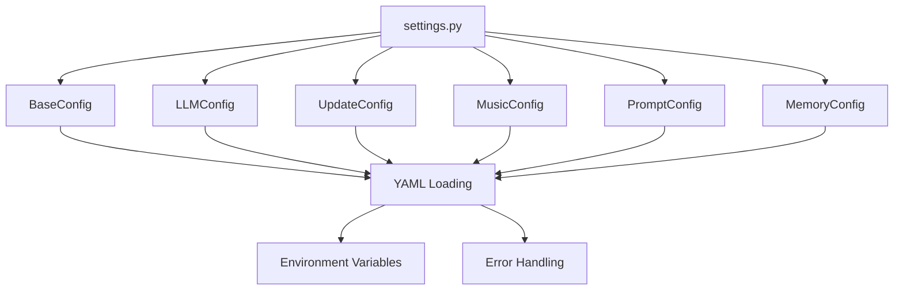

# Settings Module

**File:** [`addons/settings.py`](addons/settings.py)

The Settings module is the comprehensive configuration management system for the PigPig Discord Bot. It provides centralized access to all bot settings through YAML configuration files and environment variables, supporting multiple configuration domains including bot settings, AI models, updates, music, prompts, and memory systems.

## Overview

The settings module implements a robust configuration system that:
- Loads settings from YAML files in the `CONFIG_ROOT` directory
- Provides type-safe configuration objects for each domain
- Implements graceful error handling with fallback mechanisms
- Supports both required and optional configuration parameters
- Integrates with environment variables for sensitive data

## Architecture



## Core Configuration Classes

### BaseConfig

**Configuration File:** `CONFIG_ROOT/base.yaml`

Manages basic bot configuration including commands, activity, and system settings.

#### Properties

- **`prefix`** (str): Command prefix for bot commands (default: "/")
- **`activity`** (list): List of bot activity configurations
- **`ipc_server`** (dict): IPC server configuration settings
- **`version`** (str): Current bot version string
- **`logging`** (dict): Logging configuration settings

#### Usage Example

```python
from addons import base_config

# Access configuration properties
bot_prefix = base_config.prefix
activities = base_config.activity
version = base_config.version
ipc_config = base_config.ipc_server
```

### LLMConfig

**Configuration File:** `CONFIG_ROOT/llm.yaml`

Manages language model configuration and AI service settings.

#### Properties

- **`model_priorities`** (list): Priority order for language models
- **`google_search_agent`** (str): Default Google search agent model name (default: "gemini-2.0-flash")

#### Data Structure

```python
{
    "model_priorities": ["gemini-2.0-flash", "gpt-4", "claude-3"],
    "google_search_agent": "gemini-2.0-flash"
}
```

#### Usage Example

```python
from addons import llm_config

# Access LLM configuration
priorities = llm_config.model_priorities
default_agent = llm_config.google_search_agent

# Use in AI service initialization
model = llm_config.model_priorities[0]
```

### UpdateConfig

**Configuration File:** `CONFIG_ROOT/update.yaml`

Manages the automatic update system configuration.

#### Properties

- **`auto_update`** (dict): Auto-update system settings
- **`security`** (dict): Security and backup configuration
- **`notification`** (dict): Update notification settings
- **`restart`** (dict): System restart configuration
- **`github`** (dict): GitHub repository configuration

#### Configuration Structure

```yaml
auto_update:
  enabled: true
  check_interval: 3600
  require_owner_confirmation: true

security:
  backup_enabled: true
  protected_files:
    - ".env"
    - "data/"
    - "config/"
  max_backups: 5

github:
  api_url: "https://api.github.com/repos/starpig1129/ai-discord-bot-PigPig/releases/latest"
```

#### Usage Example

```python
from addons import update_config

# Check if auto-update is enabled
if update_config.auto_update.get("enabled"):
    interval = update_config.auto_update.get("check_interval", 3600)
    print(f"Auto-update enabled, check interval: {interval}s")

# Access security settings
backup_enabled = update_config.security.get("backup_enabled", False)
protected_files = update_config.security.get("protected_files", [])
```

### MusicConfig

**Configuration File:** `CONFIG_ROOT/music.yaml`

Manages music system configuration including temporary files and FFmpeg settings.

#### Properties

- **`music_temp_base`** (str): Base directory for temporary music files (default: "temp/music")
- **`ffmpeg`** (dict): FFmpeg configuration settings
- **`youtube_cookies_path`** (str): Path to YouTube cookies file (default: "./data/youtube_cookies.txt")

#### Usage Example

```python
from addons.settings import MusicConfig

music_config = MusicConfig()

# Access music settings
temp_dir = music_config.music_temp_base
cookies_path = music_config.youtube_cookies_path
ffmpeg_config = music_config.ffmpeg
```

### PromptConfig

**Configuration File:** `CONFIG_ROOT/prompt/`

Manages system prompts and agent configurations for different AI behaviors.

#### Configuration Structure

```
prompt/
├── default.yaml
├── assistant.yaml
├── creative.yaml
└── ...
```

#### Key Methods

##### `get_system_prompt(agent_name: str, bot_id: int | None = None, message=None) -> str`

Retrieves and formats system prompts for specific agents with variable substitution.

**Parameters:**
- `agent_name`: Name of the agent configuration file
- `bot_id`: Optional bot ID for variable substitution
- `message`: Optional Discord message object

**Returns:** Formatted system prompt string

**Supported Variables:**
- `{bot_id}`: Discord bot ID
- `{bot_owner_id}`: Bot owner's Discord ID
- `{bot_name}`: Bot name from configuration
- `{creator}`: Bot creator name
- `{environment}`: Operating environment description

#### Usage Example

```python
from addons.settings import PromptConfig

prompt_config = PromptConfig()

# Get system prompt for specific agent
system_prompt = prompt_config.get_system_prompt("default", bot_id=123456789)

# Use in AI client initialization
client = anthropic.Anthropic()
response = client.messages.create(
    model="claude-3-haiku-20240307",
    max_tokens=1024,
    system=system_prompt,
    messages=[{"role": "user", "content": "Hello"}]
)
```

### MemoryConfig

**Configuration File:** `CONFIG_ROOT/memory.yaml`

Manages the memory subsystem configuration for persistent conversation storage.

#### Properties

- **`enabled`** (bool): Whether memory system is enabled (default: true)
- **`procedural_data_path`** (str): Path to procedural memory database
- **`episodic_data_path`** (str): Path to episodic memory database
- **`vector_store_type`** (str): Vector store provider (default: "qdrant")
- **`qdrant_url`** (str): Qdrant vector store URL
- **`qdrant_api_key`** (str | None): Qdrant API key
- **`qdrant_collection_name`** (str): Vector collection name
- **`embedding_provider`** (str): Embedding provider (default: "google")
- **`embedding_model_name`** (str): Default embedding model
- **`embedding_dim`** (int): Embedding dimensions (default: 768)
- **`vector_search_k`** (int): Number of vector search results (default: 5)
- **`keyword_search_k`** (int): Number of keyword search results (default: 5)
- **`ollama_url`** (str | None): Ollama service URL
- **`provider_options`** (dict): Provider-specific options
- **`message_threshold`** (int): Messages before triggering memory processing

#### Configuration Example

```yaml
enabled: true
procedural_data_path: "data/memory/procedural.db"
episodic_data_path: "data/memory/episodic.db"
vector_store_type: "qdrant"
qdrant_url: "http://localhost:6333"
qdrant_api_key: null
qdrant_collection_name: "ephemeral_memory"
embedding_provider: "google"
embedding_model_name: "gemini-embedding-001"
embedding_dim: 768
vector_search_k: 5
keyword_search_k: 5
ollama_url: "http://localhost:11434"
provider_options: {}
message_threshold: 100
```

#### Usage Example

```python
from addons.settings import MemoryConfig

memory_config = MemoryConfig()

# Check if memory system is enabled
if memory_config.enabled:
    print(f"Using {memory_config.vector_store_type} vector store")
    print(f"Embedding model: {memory_config.embedding_model_name}")
    
    # Access configuration for memory system initialization
    config = {
        "vector_store_url": memory_config.qdrant_url,
        "collection_name": memory_config.qdrant_collection_name,
        "embedding_provider": memory_config.embedding_provider
    }
```

## Configuration File Structure

The settings module expects the following directory structure:

```
CONFIG_ROOT/
├── base.yaml          # Basic bot configuration
├── llm.yaml           # Language model settings
├── update.yaml        # Update system configuration
├── music.yaml         # Music system settings
├── prompt/            # System prompts
│   ├── default.yaml
│   ├── assistant.yaml
│   └── ...
└── memory.yaml        # Memory subsystem settings
```

## Error Handling

The module implements comprehensive error handling:

### Primary Error Reporting

```python
try:
    from function import func
    asyncio.create_task(func.report_error(e, "addons/settings.py/method_name"))
except Exception:
    # Fallback to local logging
    print(f"Configuration error: {e}")
```

### Graceful Degradation

- **Missing Files**: Use empty dictionaries with default values
- **Invalid YAML**: Log warnings and use empty configurations
- **Environment Issues**: Fall back to default configuration paths

### Error Scenarios

1. **Missing Configuration Files**: Module continues with empty configurations
2. **Invalid YAML Syntax**: Uses fallback empty dictionaries
3. **Environment Variable Issues**: Uses default configuration root
4. **Permission Errors**: Logs warnings and attempts alternative approaches

## Configuration Loading Process

### 1. Environment Setup

```python
from dotenv import load_dotenv
load_dotenv()  # Load .env file
```

### 2. Root Configuration Detection

```python
def _get_config_root() -> str:
    root = os.getenv("CONFIG_ROOT")
    if root is None:
        # Report error and fall back to default
        root = "./base_configs"
    return root.rstrip("/\\")
```

### 3. Individual Configuration Loading

Each configuration class:
1. Loads YAML file from determined root
2. Applies default values for missing keys
3. Handles errors gracefully with logging
4. Provides type-safe access to configuration data

## Usage Patterns

### Standard Import Pattern

```python
from addons import base_config, llm_config, update_config

# Access configuration
prefix = base_config.prefix
models = llm_config.model_priorities
update_enabled = update_config.auto_update.get("enabled", False)
```

### Custom Configuration Access

```python
from addons.settings import MusicConfig, PromptConfig

music_config = MusicConfig()
prompt_config = PromptConfig()

# Access specific configurations
temp_dir = music_config.music_temp_base
system_prompt = prompt_config.get_system_prompt("default")
```

### Configuration Validation

```python
def validate_configurations():
    """Validate that all configurations are properly loaded"""
    
    # Check basic configuration
    if not hasattr(base_config, 'prefix'):
        raise ValueError("Base configuration not properly loaded")
    
    # Check update configuration
    if not hasattr(update_config, 'auto_update'):
        raise ValueError("Update configuration not properly loaded")
    
    return True
```

## Integration with Other Modules

### With TOKENS Module

```python
from addons.tokens import tokens
from addons.settings import MemoryConfig

memory_config = MemoryConfig()

# Use bot owner ID from tokens
owner_id = getattr(tokens, "bot_owner_id", 0)
```

### With Update System

```python
from addons.update import UpdateManager
from addons.settings import UpdateConfig

update_config = UpdateConfig()
update_manager = UpdateManager(bot, update_config)
```

## Best Practices

1. **Use Pre-initialized Instances**: Prefer `base_config` over creating new instances
2. **Handle Missing Keys**: Always provide defaults when accessing configuration
3. **Validate Configuration**: Check required configurations on startup
4. **Environment Separation**: Use different configuration files for dev/prod
5. **Error Handling**: Always handle configuration loading failures gracefully

## Troubleshooting

### Common Issues

**"CONFIG_ROOT environment variable not set"**
- Set `CONFIG_ROOT` environment variable to your configuration directory
- Or ensure `base_configs/` directory exists in the project root

**"YAML loading failed"**
- Check YAML syntax in configuration files
- Ensure files are valid UTF-8 encoded text
- Verify file permissions allow reading

**"Configuration attributes missing"**
- Check that all expected configuration files exist
- Verify YAML structure matches expected format
- Check for typos in configuration property names

### Debug Configuration Loading

```python
import os
from addons.settings import CONFIG_ROOT

print(f"Configuration root: {CONFIG_ROOT}")
print(f"Environment CONFIG_ROOT: {os.getenv('CONFIG_ROOT')}")

# Check if configuration files exist
config_files = ["base.yaml", "llm.yaml", "update.yaml"]
for file in config_files:
    path = f"{CONFIG_ROOT}/{file}"
    print(f"{file}: {'EXISTS' if os.path.exists(path) else 'MISSING'}")
```

## Related Documentation

- **[Tokens Module](./tokens.md):** Environment variable management
- **[Update System](./update/index.md):** Automatic update system configuration
- **[Bot Integration Guide](../guides/bot-integration.md):** Complete setup instructions

---

*The settings module provides a robust, scalable foundation for configuration management while maintaining simplicity and reliability.*