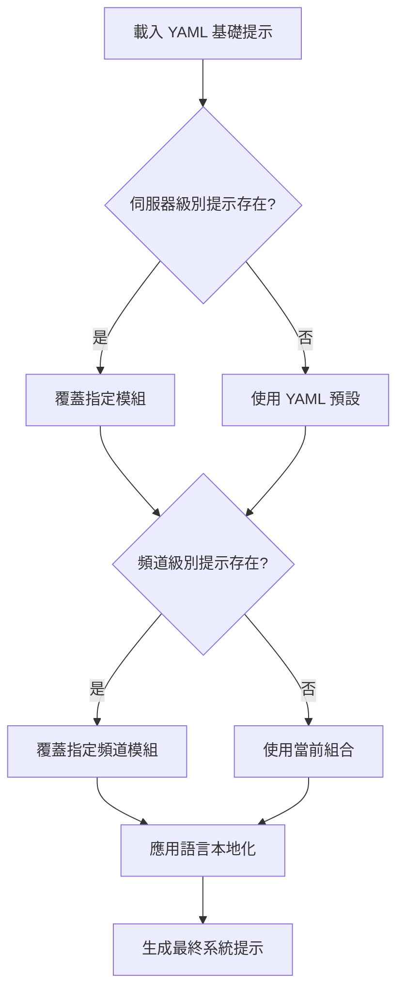
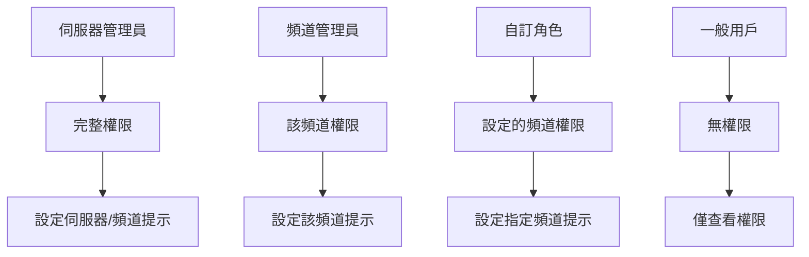
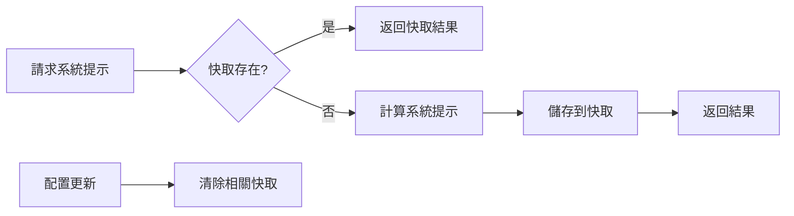
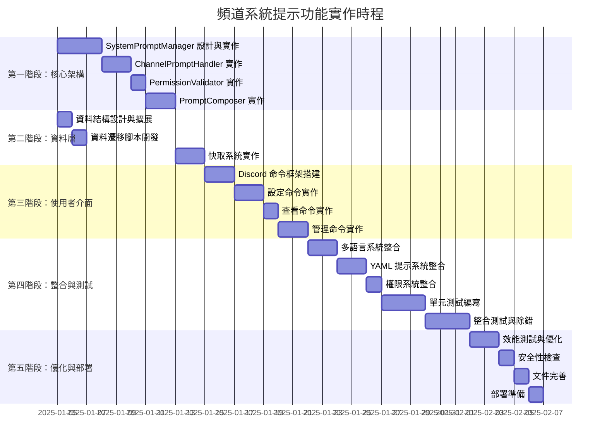

# 頻道系統提示自訂功能架構設計文件

## 📋 專案概覽

### 目標
設計一個頻道系統提示自訂功能的架構方案，支援三層繼承機制（預設 → 伺服器級別 → 頻道級別），與現有 Discord 機器人系統深度整合。

### 核心特性
- 🏗️ **三層繼承機制**：全域預設 → 伺服器級別 → 頻道級別
- 🧩 **模組化設計**：可覆蓋 YAML 中的特定模組
- 🔐 **靈活權限控制**：管理員、頻道管理員、自訂角色
- 🌐 **多語言整合**：與現有語言管理系統整合
- ⚡ **高效能快取**：智慧快取策略
- 🛡️ **安全性保障**：完整的驗證和錯誤處理

## 🏗️ 系統架構

### 整體架構圖

```mermaid
graph TB
    subgraph "系統提示層級架構"
        A[YAML 系統提示<br/>全域預設] --> B[伺服器級別提示<br/>server_configs]
        B --> C[頻道級別提示<br/>channel_configs]
        C --> D[最終系統提示<br/>發送給 AI]
    end
    
    subgraph "資料儲存層"
        E[data/channel_configs/{guild_id}.json<br/>頻道配置]
        F[data/serverconfig/{guild_id}.json<br/>伺服器配置]
        G[systemPrompt.yaml<br/>全域提示]
    end
    
    subgraph "核心模組"
        H[SystemPromptManager<br/>系統提示管理器]
        I[ChannelPromptHandler<br/>頻道提示處理器]
        J[PromptComposer<br/>提示組合器]
        K[PermissionValidator<br/>權限驗證器]
    end
    
    E --> H
    F --> H
    G --> H
    H --> I
    I --> J
    J --> K
```

### 提示組合流程



## 🗃️ 資料結構設計

### 頻道配置擴展

基於現有的 `data/channel_configs/{guild_id}.json` 結構，新增 `system_prompts` 欄位：

```json
{
  "mode": "unrestricted",
  "whitelist": [],
  "blacklist": [],
  "auto_response": {},
  "system_prompts": {
    "enabled": true,
    "server_level": {
      "personality": "你是一個專業的技術助手...",
      "interaction_style": "保持正式但友好的語調...",
      "language_preference": null,
      "custom_modules": {
        "technical_focus": "專注於程式設計相關問題..."
      }
    },
    "channels": {
      "123456789": {
        "enabled": true,
        "override_modules": ["personality", "interaction_style"],
        "custom_content": {
          "personality": "你是一個活潑有趣的聊天機器人...",
          "interaction_style": "使用輕鬆幽默的語調..."
        },
        "append_content": "額外的頻道特定指令...",
        "created_by": "987654321",
        "created_at": "2025-01-04T12:30:00Z",
        "updated_at": "2025-01-04T12:30:00Z"
      }
    },
    "permissions": {
      "allowed_roles": ["234567890"],
      "allowed_users": ["987654321"],
      "manage_server_prompts": ["234567890"]
    }
  }
}
```

### 資料欄位說明

#### system_prompts 結構
- **enabled**: 是否啟用自訂系統提示功能
- **server_level**: 伺服器級別的系統提示設定
- **channels**: 各頻道的系統提示設定
- **permissions**: 權限控制設定

#### 頻道級別設定
- **enabled**: 該頻道是否啟用自訂提示
- **override_modules**: 要覆蓋的 YAML 模組列表
- **custom_content**: 自訂的模組內容
- **append_content**: 額外附加的提示內容
- **created_by/created_at/updated_at**: 審計資訊

## 🔧 核心模組設計

### 1. SystemPromptManager 類別

```python
class SystemPromptManager:
    """系統提示管理器 - 核心協調器"""
    
    def __init__(self, bot):
        self.bot = bot
        self.prompt_manager = get_prompt_manager()
        self.cache = {}
        
    def get_effective_system_prompt(self, guild_id: str, channel_id: str, message) -> str:
        """
        取得有效的系統提示（整合三層繼承）
        
        Args:
            guild_id: 伺服器ID
            channel_id: 頻道ID
            message: Discord 訊息物件
            
        Returns:
            最終的系統提示字串
        """
        
    def validate_prompt_content(self, content: str, user_permissions: dict) -> bool:
        """
        驗證提示內容
        
        Args:
            content: 提示內容
            user_permissions: 用戶權限字典
            
        Returns:
            是否通過驗證
        """
        
    def get_available_modules(self) -> List[str]:
        """取得可覆蓋的 YAML 模組列表"""
        
    def clear_cache(self, guild_id: str = None, channel_id: str = None):
        """清除快取"""
```

### 2. ChannelPromptHandler 類別

```python
class ChannelPromptHandler:
    """頻道提示處理器"""
    
    def __init__(self, system_prompt_manager: SystemPromptManager):
        self.manager = system_prompt_manager
        self.data_dir = "data/channel_configs"
        
    def set_channel_prompt(self, guild_id: str, channel_id: str, 
                          modules: dict, user_id: str) -> bool:
        """
        設定頻道系統提示
        
        Args:
            guild_id: 伺服器ID
            channel_id: 頻道ID
            modules: 要設定的模組內容
            user_id: 操作用戶ID
            
        Returns:
            是否設定成功
        """
        
    def remove_channel_prompt(self, guild_id: str, channel_id: str) -> bool:
        """移除頻道系統提示"""
        
    def copy_channel_prompt(self, source_guild: str, source_channel: str,
                           target_guild: str, target_channel: str) -> bool:
        """複製頻道提示設定"""
        
    def get_channel_prompt(self, guild_id: str, channel_id: str) -> dict:
        """取得頻道提示設定"""
```

### 3. PermissionValidator 類別

```python
class PermissionValidator:
    """權限驗證器"""
    
    def can_modify_channel_prompt(self, user: discord.Member, 
                                 channel: discord.TextChannel) -> bool:
        """
        檢查用戶是否可修改頻道提示
        
        Args:
            user: Discord 用戶
            channel: 目標頻道
            
        Returns:
            是否有權限
        """
        
    def can_modify_server_prompt(self, user: discord.Member, 
                                guild: discord.Guild) -> bool:
        """檢查用戶是否可修改伺服器提示"""
        
    def get_user_permissions(self, user: discord.Member, guild: discord.Guild) -> dict:
        """取得用戶的詳細權限資訊"""
```

### 4. PromptComposer 類別

```python
class PromptComposer:
    """提示組合器"""
    
    def compose_final_prompt(self, guild_id: str, channel_id: str, 
                           message) -> str:
        """組合最終的系統提示"""
        
    def merge_modules(self, base_modules: dict, override_modules: dict) -> dict:
        """合併模組內容"""
        
    def apply_language_localization(self, prompt: str, lang: str) -> str:
        """應用語言本地化"""
```

## 📱 使用者介面設計

### Discord 命令結構

```mermaid
graph LR
    A[/system_prompt] --> B[set]
    A --> C[view]
    A --> D[remove]
    A --> E[copy]
    A --> F[reset]
    A --> G[modules]
    
    B --> B1[server]
    B --> B2[channel]
    
    C --> C1[current]
    C --> C2[effective]
    C --> C3[inheritance]
    
    E --> E1[from_channel]
    E --> E2[to_template]
```

### 主要命令實作

#### 1. 設定命令
```python
@app_commands.command(name="system_prompt_set_channel", 
                     description="設定頻道系統提示")
@app_commands.describe(
    channel="目標頻道",
    module="要覆蓋的模組名稱",
    content="自訂提示內容"
)
async def set_channel_prompt(interaction: discord.Interaction, 
                           channel: discord.TextChannel,
                           module: str, content: str):
    """設定頻道系統提示"""
```

#### 2. 查看命令
```python
@app_commands.command(name="system_prompt_view", 
                     description="查看系統提示")
@app_commands.choices(view_type=[
    app_commands.Choice(name="當前設定", value="current"),
    app_commands.Choice(name="最終效果", value="effective"),
    app_commands.Choice(name="繼承鏈", value="inheritance")
])
async def view_prompt(interaction: discord.Interaction,
                     view_type: str, channel: discord.TextChannel = None):
    """查看系統提示"""
```

#### 3. 管理命令
```python
@app_commands.command(name="system_prompt_remove", 
                     description="移除系統提示")
async def remove_prompt(interaction: discord.Interaction,
                       channel: discord.TextChannel = None):
    """移除系統提示"""

@app_commands.command(name="system_prompt_copy", 
                     description="複製系統提示")
async def copy_prompt(interaction: discord.Interaction,
                     source_channel: discord.TextChannel,
                     target_channel: discord.TextChannel):
    """複製系統提示"""
```

## 🔒 權限控制機制

### 權限層級設計



### 權限檢查實作

```python
def check_permissions(self, user: discord.Member, guild: discord.Guild, 
                     channel: discord.TextChannel = None) -> dict:
    """
    檢查用戶權限
    
    Returns:
        {
            'can_modify_server': bool,
            'can_modify_channel': bool,
            'allowed_channels': List[str],
            'permission_level': str  # 'admin', 'channel_manager', 'custom', 'none'
        }
    """
    permissions = {
        'can_modify_server': False,
        'can_modify_channel': False,
        'allowed_channels': [],
        'permission_level': 'none'
    }
    
    # 檢查伺服器管理員權限
    if user.guild_permissions.administrator:
        permissions.update({
            'can_modify_server': True,
            'can_modify_channel': True,
            'permission_level': 'admin'
        })
        return permissions
    
    # 檢查頻道管理員權限
    if channel and channel.permissions_for(user).manage_channels:
        permissions.update({
            'can_modify_channel': True,
            'permission_level': 'channel_manager'
        })
    
    # 檢查自訂角色權限
    config = self.load_config(str(guild.id))
    prompt_config = config.get('system_prompts', {})
    
    allowed_roles = prompt_config.get('permissions', {}).get('allowed_roles', [])
    allowed_users = prompt_config.get('permissions', {}).get('allowed_users', [])
    
    user_role_ids = [str(role.id) for role in user.roles]
    if (str(user.id) in allowed_users or 
        any(role_id in allowed_roles for role_id in user_role_ids)):
        permissions.update({
            'can_modify_channel': True,
            'permission_level': 'custom'
        })
    
    return permissions
```

## 🌐 多語言整合機制

### 與現有語言管理系統整合

```python
def apply_language_integration(self, prompt: str, guild_id: str) -> str:
    """
    應用語言本地化到系統提示
    
    Args:
        prompt: 原始系統提示
        guild_id: 伺服器ID
        
    Returns:
        本地化後的系統提示
    """
    lang_manager = self.bot.get_cog("LanguageManager")
    if not lang_manager:
        return prompt
    
    lang = lang_manager.get_server_lang(guild_id)
    
    # 應用語言特定的替換規則
    language_replacements = {
        'zh_TW': {
            'Always answer in Traditional Chinese': '總是使用繁體中文回答',
            'Keep responses concise': '保持回答簡潔'
        },
        'zh_CN': {
            'Always answer in Traditional Chinese': '总是使用简体中文回答',
            'Keep responses concise': '保持回答简洁'
        },
        'en_US': {
            'Always answer in Traditional Chinese': 'Always answer in English',
            'Keep responses concise': 'Keep responses concise'
        },
        'ja_JP': {
            'Always answer in Traditional Chinese': '常に日本語で回答してください',
            'Keep responses concise': '回答は簡潔に保ってください'
        }
    }
    
    replacements = language_replacements.get(lang, {})
    for original, replacement in replacements.items():
        prompt = prompt.replace(original, replacement)
    
    return prompt
```

## ⚡ 效能最佳化設計

### 快取策略



### 快取實作

```python
class SystemPromptCache:
    """系統提示快取管理器"""
    
    def __init__(self):
        self.cache = {}
        self.cache_ttl = 3600  # 1小時
        
    def get_cache_key(self, guild_id: str, channel_id: str, lang: str) -> str:
        """生成快取鍵值"""
        return f"system_prompt:{guild_id}:{channel_id}:{lang}"
        
    def get(self, guild_id: str, channel_id: str, lang: str) -> Optional[str]:
        """從快取取得系統提示"""
        key = self.get_cache_key(guild_id, channel_id, lang)
        cache_entry = self.cache.get(key)
        
        if cache_entry:
            timestamp, prompt = cache_entry
            if time.time() - timestamp < self.cache_ttl:
                return prompt
            else:
                del self.cache[key]
        
        return None
        
    def set(self, guild_id: str, channel_id: str, lang: str, prompt: str):
        """設定快取"""
        key = self.get_cache_key(guild_id, channel_id, lang)
        self.cache[key] = (time.time(), prompt)
        
    def invalidate(self, guild_id: str, channel_id: str = None):
        """清除快取"""
        pattern = f"system_prompt:{guild_id}"
        if channel_id:
            pattern += f":{channel_id}"
            
        keys_to_remove = [key for key in self.cache.keys() if key.startswith(pattern)]
        for key in keys_to_remove:
            del self.cache[key]
```

## 🛡️ 安全性考量

### 資料驗證機制

```python
class PromptValidator:
    """系統提示驗證器"""
    
    MAX_PROMPT_LENGTH = 4000
    MAX_MODULE_COUNT = 10
    
    def validate_prompt_content(self, content: str) -> Tuple[bool, str]:
        """
        驗證提示內容
        
        Returns:
            (是否有效, 錯誤訊息)
        """
        # 長度檢查
        if len(content) > self.MAX_PROMPT_LENGTH:
            return False, f"系統提示過長，最多 {self.MAX_PROMPT_LENGTH} 字元"
        
        # 基本格式檢查
        if not content.strip():
            return False, "系統提示不能為空"
        
        # 檢查潛在的注入攻擊
        dangerous_patterns = [
            r'<script[^>]*>',
            r'javascript:',
            r'data:text/html',
            r'eval\s*\(',
            r'setTimeout\s*\(',
            r'setInterval\s*\('
        ]
        
        for pattern in dangerous_patterns:
            if re.search(pattern, content, re.IGNORECASE):
                return False, "系統提示包含不安全的內容"
        
        return True, ""
    
    def validate_modules(self, modules: dict) -> Tuple[bool, str]:
        """驗證模組設定"""
        if len(modules) > self.MAX_MODULE_COUNT:
            return False, f"模組數量過多，最多 {self.MAX_MODULE_COUNT} 個"
        
        for module_name, module_content in modules.items():
            if not isinstance(module_content, str):
                return False, f"模組 '{module_name}' 的內容必須是字串"
            
            is_valid, error_msg = self.validate_prompt_content(module_content)
            if not is_valid:
                return False, f"模組 '{module_name}': {error_msg}"
        
        return True, ""
```

### 錯誤處理機制

```python
class SystemPromptError(Exception):
    """系統提示相關錯誤基類"""
    pass

class PermissionError(SystemPromptError):
    """權限不足錯誤"""
    pass

class ValidationError(SystemPromptError):
    """驗證失敗錯誤"""
    pass

class ConfigurationError(SystemPromptError):
    """配置錯誤"""
    pass

def handle_system_prompt_error(func):
    """系統提示錯誤處理裝飾器"""
    async def wrapper(*args, **kwargs):
        try:
            return await func(*args, **kwargs)
        except PermissionError as e:
            await interaction.response.send_message(
                f"❌ 權限不足：{str(e)}", ephemeral=True
            )
        except ValidationError as e:
            await interaction.response.send_message(
                f"❌ 驗證失敗：{str(e)}", ephemeral=True
            )
        except ConfigurationError as e:
            await interaction.response.send_message(
                f"❌ 配置錯誤：{str(e)}", ephemeral=True
            )
        except Exception as e:
            logging.error(f"系統提示操作錯誤: {str(e)}")
            await interaction.response.send_message(
                "❌ 系統錯誤，請稍後再試", ephemeral=True
            )
    return wrapper
```

## 📊 擴展性設計

### 未來功能預留

#### 1. 模板系統
```python
class PromptTemplate:
    """系統提示模板"""
    
    def __init__(self, name: str, description: str, modules: dict):
        self.name = name
        self.description = description
        self.modules = modules
        self.created_at = datetime.now()
    
    def apply_to_channel(self, guild_id: str, channel_id: str):
        """將模板應用到頻道"""
        pass

# 預定義模板
BUILT_IN_TEMPLATES = {
    'gaming': PromptTemplate(
        name='遊戲頻道',
        description='適用於遊戲討論頻道的活潑風格',
        modules={
            'personality': '你是一個熱愛遊戲的機器人...',
            'interaction_style': '使用遊戲術語和表情符號...'
        }
    ),
    'technical': PromptTemplate(
        name='技術頻道',
        description='適用於技術討論的專業風格',
        modules={
            'personality': '你是一個專業的技術助手...',
            'interaction_style': '提供詳細的技術解釋...'
        }
    )
}
```

#### 2. 版本控制系統
```python
class PromptHistory:
    """系統提示歷史記錄"""
    
    def save_version(self, guild_id: str, channel_id: str, 
                    prompt_data: dict, user_id: str):
        """保存系統提示版本"""
        pass
    
    def get_history(self, guild_id: str, channel_id: str) -> List[dict]:
        """取得歷史記錄"""
        pass
    
    def rollback_to_version(self, guild_id: str, channel_id: str, 
                          version_id: str) -> bool:
        """回滾到指定版本"""
        pass
```

#### 3. 匯入/匯出功能
```python
class PromptExporter:
    """系統提示匯出器"""
    
    def export_server_prompts(self, guild_id: str) -> dict:
        """匯出伺服器的所有系統提示設定"""
        pass
    
    def import_server_prompts(self, guild_id: str, data: dict) -> bool:
        """匯入系統提示設定"""
        pass
    
    def export_to_yaml(self, guild_id: str) -> str:
        """匯出為 YAML 格式"""
        pass
```

## 🔄 實作流程規劃

### 開發階段規劃



### 實作優先級

#### 高優先級 (P0)
1. **SystemPromptManager** - 核心管理器
2. **基本資料結構** - channel_configs 擴展
3. **基本設定/查看命令** - 核心功能
4. **權限驗證** - 安全性保障

#### 中優先級 (P1)
1. **PromptComposer** - 提示組合邏輯
2. **快取系統** - 效能最佳化
3. **多語言整合** - 與現有系統整合
4. **完整的管理命令** - 使用者體驗

#### 低優先級 (P2)
1. **模板系統** - 便利性功能
2. **版本控制** - 進階功能
3. **匯入/匯出** - 管理便利性
4. **統計分析** - 監控功能

### 技術要點

#### 關鍵設計原則
1. **向後相容性** - 與現有系統無縫整合
2. **模組化設計** - 便於維護和擴展
3. **效能優先** - 使用智慧快取策略
4. **安全第一** - 完整的驗證和權限控制
5. **用戶友好** - 直觀的命令介面設計

#### 技術挑戰與解決方案
1. **複雜的繼承邏輯** - 使用清晰的組合器模式
2. **效能瓶頸** - 實施多層快取機制
3. **權限複雜性** - 統一的權限驗證框架
4. **資料一致性** - 事務性操作和驗證

## 📋 總結

此架構設計提供了一個完整、可擴展、高效能的頻道系統提示自訂功能解決方案。主要特色包括：

✅ **模組化架構** - 易於維護和擴展  
✅ **三層繼承機制** - 靈活的提示管理  
✅ **完整權限控制** - 安全的操作環境  
✅ **高效能設計** - 智慧快取策略  
✅ **多語言支援** - 無縫整合現有系統  
✅ **向後相容性** - 不影響現有功能  

該設計為未來的功能擴展預留了充足空間，同時確保了系統的穩定性和安全性。實作過程遵循 Google 編程風格，優先考慮高效能實作設計。

---

*此文件將作為實作階段的詳細指引，確保開發過程中的一致性和完整性。*