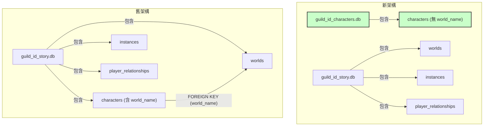

# 角色與世界解耦架構設計方案

## 1. 問題分析 (Problem Analysis)

目前的架構將每個 `Character` (角色) 透過 `world_name` 欄位與一個特定的 `StoryWorld` (故事世界) 進行了強綁定。這種設計存在以下主要局限性：

*   **缺乏複用性 (Lack of Reusability):** 一個為特定世界創建的角色（無論是 PC 或 NPC）無法在另一個世界的故事中出現。如果想在多個故事中使用同一個角色，必須在每個世界中重複創建，導致資料冗餘和管理困難。
*   **擴展性受限 (Limited Scalability):** 隨著世界和角色的增多，管理變得越來越複雜。例如，一個通用的「商人」NPC 需要在每個幻想世界中都創建一次。
*   **邏輯混亂 (Confusing Logic):** 程式碼中出現了將 `world_name` 和 `story_id` 混用的情況 (如 `get_characters_by_story_id` 方法)，這反映了當前設計的模糊地帶，增加了維護成本。

我們的目標是將「角色」轉變為一個獨立於任何特定「世界」的全域（伺服器範圍內）實體，使其可以自由參與任何世界的故事。

## 2. 新架構設計 (New Architecture Design)

為了實現解耦，我們將從資料庫、資料模型和資料庫管理層進行以下改造。

### 2.1. 資料庫分離 (Database Separation)

我們將採用獨立的資料庫檔案來管理不同的核心實體，以提高模組化程度和未來擴展性。

*   **`characters.db` (新):**
    *   **用途:** 專門儲存該伺服器 (`guild_id`) 下所有的 `Character` 資料。
    *   **位置:** `data/story/{guild_id}_characters.db`
    *   **優點:** 將角色資料獨立出來，使得角色管理與世界觀和故事實例完全分離。未來對角色的擴展（如全域技能、關係網路等）將更加容易。

*   **`story.db` (修改):**
    *   **用途:** 繼續儲存 `worlds` (世界觀) 和 `instances` (故事實例) 的資料。
    *   **位置:** `data/story/{guild_id}_story.db` (路徑不變)
    *   **變更:** `characters` 資料表將從此資料庫中移除。

#### Mermaid 圖：資料庫結構變更



### 2.2. 模型變更 (Model Changes)

對應資料庫的變更，我們需要修改 `cogs/story/models.py` 中的資料模型。

*   **`StoryCharacter` 模型:**
    *   **移除 `world_name: str` 欄位。** 這是解耦的核心步驟。
    *   **新增 `guild_id: int` 欄位。** 雖然資料庫檔案已經按 `guild_id` 分割，但在模型層級明確持有 `guild_id` 可以讓邏輯更清晰。
    *   **明確 `creator_id`:** 將現有的 `user_id` 欄位用於記錄角色的創建者。為了語意清晰，建議在實作中可以考慮將其更名為 `creator_id`。
    *   **新增 `show_creator: bool` 欄位。** 此欄位讓創作者可以決定在角色選擇介面中是否匿名。

**修改後 `StoryCharacter` 示例:**
```python
# cogs/story/models.py

@dataclass
class StoryCharacter:
    """Represents a character, either player-controlled (PC) or non-player (NPC)."""
    guild_id: int
    name: str
    description: str
    # world_name: str  <-- 移除此行
    creator_id: Optional[int] # 原 user_id，明確記錄創作者
    show_creator: bool = False # 新增：是否顯示創作者
    is_pc: bool = False
    webhook_url: Optional[str] = None
    attributes: Dict[str, Any] = field(default_factory=dict)
    inventory: List[str] = field(default_factory=list)
    status: str = "Normal"
    character_id: str = field(default_factory=lambda: str(uuid.uuid4()))
```

### 2.3. 資料庫管理類別 (DB Manager Classes)

我們將重構 `cogs/story/database.py`，創建職責分離的資料庫管理類別。

*   **`CharacterDBManager` (新類別):**
    *   **職責:** 專門負責 `characters.db` 的所有 CRUD (創建、讀取、更新、刪除) 操作。
    *   **方法:** `initialize()`, `save_character()`, `get_character()`, `get_characters_by_guild()` (取代 `get_characters_in_world`), `get_characters_by_user()` (移除 `world_name` 參數) 等。
    *   **初始化:** `__init__(self, guild_id: int)`，並管理 `data/story/{guild_id}_characters.db` 的連接。

*   **`StoryDBManager` (由原 `StoryDB` 重構):**
    *   **職責:** 專門負責 `story.db` 的所有 CRUD 操作，管理 `worlds` 和 `instances`。
    *   **方法:** `initialize()`, `save_world()`, `get_world()`, `save_story_instance()`, `get_story_instance()` 等。
    *   **變更:** 移除所有與 `characters` 資料表相關的方法。

*   **`StoryManager` 的調整:**
    *   `StoryManager` 將會持有 `CharacterDBManager` 和 `StoryDBManager` 的實例，並根據操作類型調用對應的管理員。例如，`_get_db` 方法需要被重構為 `_get_story_db` 和 `_get_character_db`。

## 3. 邏輯流程變更 (Logic Flow Changes)

### 3.1. 角色創建 (Character Creation)

*   **觸發點:** `CharacterCreateModal` (`cogs/story/ui/modals.py`)
*   **舊流程:** 創建角色時必須提供或選擇一個 `world_name`。角色資料與 `world_name` 一同存入 `_story.db`。
*   **新流程:**
    1.  `CharacterCreateModal` 不再需要 `world_name` 參數。
    2.  在 `CharacterCreateModal` 中新增一個選項（例如下拉選單或勾選框），讓使用者設定 `show_creator` 的值。
    3.  表單提交後，`on_submit` 方法根據使用者的輸入創建一個 `StoryCharacter` 物件。
    4.  呼叫 `CharacterDBManager` 的 `save_character` 方法，將新角色存入對應 `guild_id` 的 `characters.db` 中。
    5.  成功訊息中不再顯示「所屬世界」。

### 3.2. 開始故事 (Starting a Story)

*   **觸發點:** `StoryStartModal` (`cogs/story/ui/modals.py`)
*   **舊流程:** 在 `on_submit` 中，使用 `db.get_characters_by_story_id(world.id)` (其中 `world.id` 實為 `world_name`) 來獲取僅屬於該世界的 NPC 列表。
*   **新流程:**
    1.  在 `StoryStartModal` 的 `on_submit` 方法中，不再查詢與 `world` 相關的角色。
    2.  改為呼叫 `CharacterDBManager` 的 `get_characters_by_guild(guild_id)` 方法。
    3.  此方法會從 `characters.db` 中讀取該伺服器所有的角色（包括 PC 和 NPC）。
    4.  將獲取到的全域角色列表傳遞給 `NPCSelectView`。
    5.  **顯示創作者資訊:** 在 `NPCSelectView` 的選擇介面中（例如 `discord.ui.Select`），只有當角色的 `show_creator` 旗標為 `True` 時，才在其選項標籤旁附上創作者的名稱。例如："角色名稱 (由 @使用者名稱 創建)"。如果為 `False`，則只顯示 "角色名稱"。

#### Mermaid 圖：開始故事流程對比

```mermaid
sequenceDiagram
    participant U as User
    participant M as StoryStartModal
    participant SDB as StoryDBManager
    participant CDB as CharacterDBManager
    participant V as NPCSelectView

    box 舊流程
        U->>M: 提交初始狀態
        M->>SDB: get_world(world_name)
        SDB-->>M: world
        M->>SDB: get_characters_by_story_id(world.id)
        SDB-->>M: 該世界的角色列表
        M->>V: 創建視圖 (傳入特定角色)
        V-->>U: 顯示 NPC 選擇介面
    end

    box 新流程
        U->>M: 提交初始狀態
        M->>CDB: get_characters_by_guild(guild_id)
        CDB-->>M: 該伺服器所有角色列表
        M->>V: 創建視圖 (傳入所有角色)
        V-->>U: 顯示 NPC 選擇介面
    end
```
