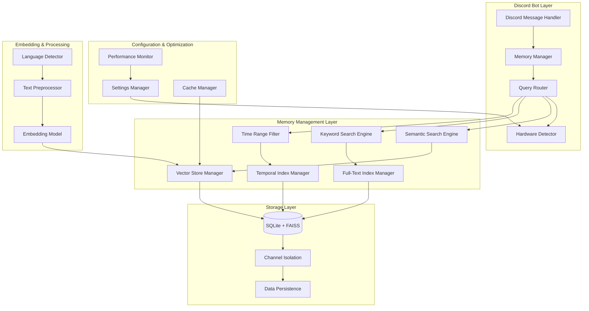
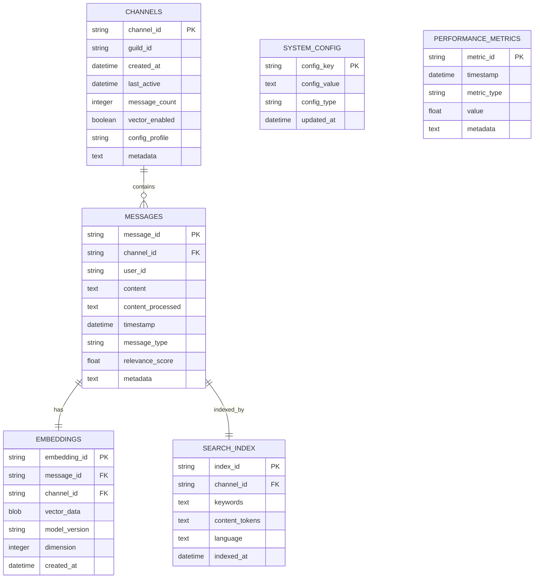
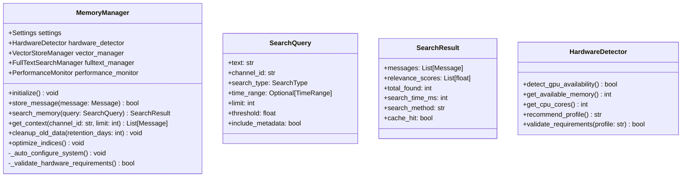
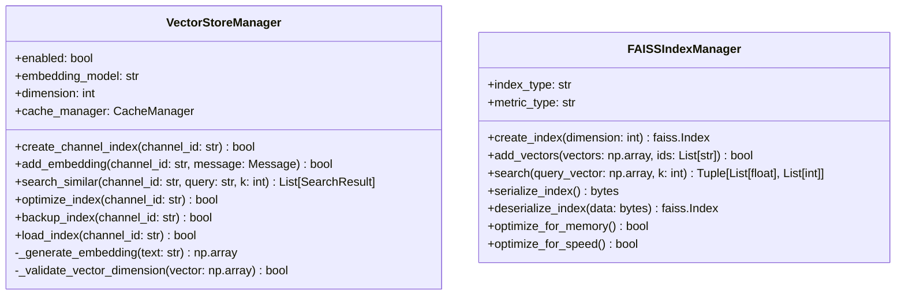
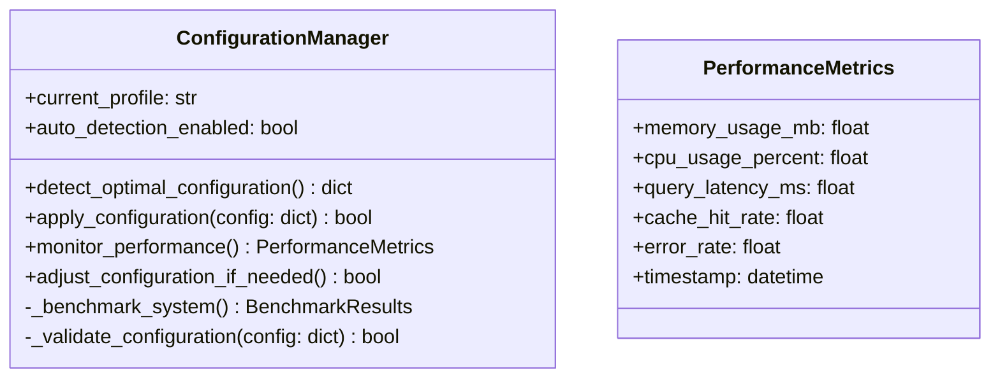
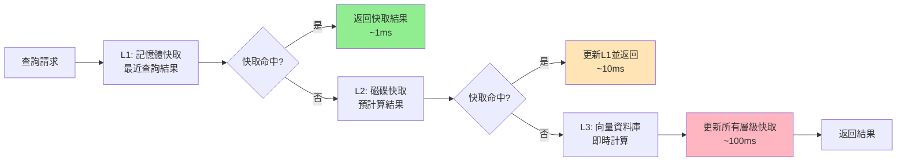
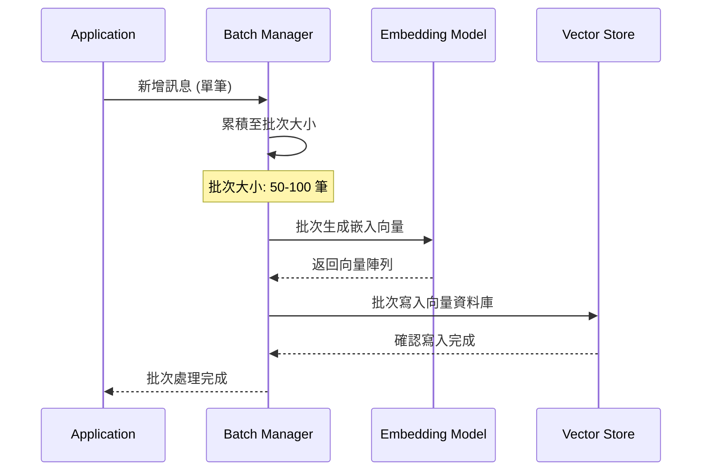
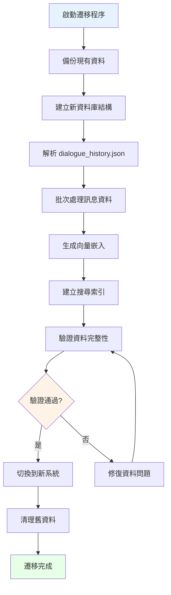
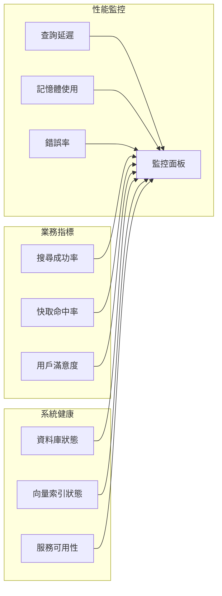

# Discord LLM Bot 永久頻道記憶系統架構設計

## 📋 概述

本文檔詳細描述了 Discord LLM Bot 的永久頻道記憶系統重新設計方案，旨在替換現有的 FAISS 實作，提供高效能、可擴展的記憶檢索功能。

### 設計目標
- 支援 1,000+ 個頻道，每個頻道 20,000+ 條歷史記錄
- 混合搜尋模式：語義搜尋 + 關鍵字搜尋 + 時間篩選
- 單機部署優化，支援資源有限的環境
- 智能硬體檢測與彈性配置

## 🔍 現狀分析

### 現有系統問題
- FAISS 向量搜尋功能被註解停用 ([`gpt/sendmessage.py:485`](gpt/sendmessage.py:485))
- 向量存儲保存功能未啟用 ([`gpt/sendmessage.py:395`](gpt/sendmessage.py:395))
- 使用簡單 JSON 檔案存儲對話歷史 ([`bot.py:49`](bot.py:49))
- 缺乏高效的頻道隔離機制
- 沒有完整的持久化策略

### 技術債務
- 記憶體中的向量存儲無法持久化
- 缺乏頻道間的有效隔離
- 沒有性能監控和優化機制

## 🏗️ 系統架構設計

### 整體架構圖



### 系統分層說明

1. **Discord Bot Layer**: 處理 Discord 訊息和用戶互動
2. **Memory Management Layer**: 核心記憶管理和搜尋邏輯
3. **Storage Layer**: 數據持久化和頻道隔離
4. **Configuration & Optimization**: 系統配置和性能優化
5. **Embedding & Processing**: 文本處理和向量化

## 🗃️ 資料庫設計

### Schema 架構圖



### 數據表詳細設計

#### CHANNELS 表
```sql
CREATE TABLE channels (
    channel_id TEXT PRIMARY KEY,
    guild_id TEXT NOT NULL,
    created_at DATETIME DEFAULT CURRENT_TIMESTAMP,
    last_active DATETIME DEFAULT CURRENT_TIMESTAMP,
    message_count INTEGER DEFAULT 0,
    vector_enabled BOOLEAN DEFAULT TRUE,
    config_profile TEXT DEFAULT 'auto',
    metadata TEXT
);
```

#### MESSAGES 表
```sql
CREATE TABLE messages (
    message_id TEXT PRIMARY KEY,
    channel_id TEXT NOT NULL,
    user_id TEXT NOT NULL,
    content TEXT NOT NULL,
    content_processed TEXT,
    timestamp DATETIME NOT NULL,
    message_type TEXT DEFAULT 'user',
    relevance_score REAL DEFAULT 0.0,
    metadata TEXT,
    FOREIGN KEY (channel_id) REFERENCES channels(channel_id)
);
```

## ⚙️ 配置系統設計

### Settings.json 新增配置

```json
{
  "memory_system": {
    "enabled": true,
    "auto_detection": true,
    "vector_enabled": true,
    "cpu_only_mode": false,
    "memory_threshold_mb": 2048,
    "embedding_model": "sentence-transformers/paraphrase-multilingual-MiniLM-L12-v2",
    "index_optimization": {
      "enabled": true,
      "interval_hours": 24,
      "cleanup_old_data_days": 90
    },
    "cache": {
      "enabled": true,
      "max_size_mb": 512,
      "ttl_seconds": 3600
    },
    "performance": {
      "max_concurrent_queries": 10,
      "query_timeout_seconds": 30,
      "batch_size": 100
    }
  }
}
```

### 硬體檢測配置

```json
{
  "hardware_profiles": {
    "high_performance": {
      "min_ram_gb": 8,
      "gpu_required": true,
      "vector_enabled": true,
      "embedding_dimension": 768,
      "cache_size_mb": 1024
    },
    "medium_performance": {
      "min_ram_gb": 4,
      "gpu_required": false,
      "vector_enabled": true,
      "embedding_dimension": 384,
      "cache_size_mb": 512
    },
    "low_performance": {
      "min_ram_gb": 2,
      "gpu_required": false,
      "vector_enabled": false,
      "embedding_dimension": 0,
      "cache_size_mb": 256
    }
  }
}
```

## 🔧 核心模組設計

### 1. Memory Manager 類別設計



### 2. Vector Store Manager 設計



### 3. 智能配置檢測器



## 🚀 技術選型分析

### 向量資料庫比較表

| 技術選項 | 效能評分 | 記憶體使用 | 設定複雜度 | GPU 依賴 | 推薦指數 |
|---------|---------|-----------|-----------|----------|----------|
| **FAISS + 優化** | ⭐⭐⭐⭐⭐ | ⭐⭐⭐⭐ | ⭐⭐⭐ | ⭐⭐ | ⭐⭐⭐⭐⭐ |
| ChromaDB | ⭐⭐⭐⭐ | ⭐⭐⭐ | ⭐⭐⭐⭐⭐ | ⭐⭐⭐⭐⭐ | ⭐⭐⭐⭐ |
| Qdrant | ⭐⭐⭐⭐⭐ | ⭐⭐ | ⭐⭐ | ⭐⭐⭐ | ⭐⭐⭐ |
| Pinecone | ⭐⭐⭐⭐⭐ | ⭐⭐⭐⭐⭐ | ⭐⭐⭐⭐ | ⭐⭐⭐⭐⭐ | ⭐⭐ |

### 嵌入模型選擇指南

#### 高效能環境（GPU 可用）
```json
{
  "model": "sentence-transformers/paraphrase-multilingual-mpnet-base-v2",
  "dimension": 768,
  "languages": ["zh", "en", "ja"],
  "performance": "高",
  "memory_requirement": "2GB+"
}
```

#### 平衡環境（CPU 優化）
```json
{
  "model": "sentence-transformers/paraphrase-multilingual-MiniLM-L12-v2",
  "dimension": 384,
  "languages": ["zh", "en", "ja"],
  "performance": "中",
  "memory_requirement": "1GB+"
}
```

#### 輕量環境（記憶體限制）
```json
{
  "model": "sentence-transformers/all-MiniLM-L6-v2",
  "dimension": 384,
  "languages": ["en"],
  "performance": "中",
  "memory_requirement": "512MB+"
}
```

## 📈 性能優化策略

### 1. 分層快取架構



### 2. 索引優化策略

#### FAISS 索引配置
```python
# 高效能配置（GPU 可用）
index_config = {
    "index_type": "IVF256,PQ64",
    "nprobe": 32,
    "metric": "L2",
    "use_gpu": True
}

# CPU 優化配置
index_config = {
    "index_type": "IVF128,Flat",
    "nprobe": 16,
    "metric": "L2", 
    "use_gpu": False
}

# 記憶體優化配置
index_config = {
    "index_type": "LSH",
    "nbits": 16,
    "metric": "L2",
    "use_gpu": False
}
```

### 3. 批次處理優化



## 📦 實作規劃

### 🎯 階段一：基礎架構建設 (Week 1-2)

#### 1.1 資料庫架構建立
- [ ] 設計並實作新的 SQLite Schema
- [ ] 建立資料庫遷移腳本
- [ ] 實作基本的 CRUD 操作
- [ ] 建立索引和約束條件

#### 1.2 配置系統升級
- [ ] 擴展 [`addons/settings.py`](addons/settings.py) 新增 memory_system 配置
- [ ] 實作硬體檢測模組
- [ ] 建立配置驗證機制
- [ ] 實作動態配置更新

#### 1.3 基礎類別架構
- [ ] 建立 MemoryManager 基礎類別
- [ ] 實作 SearchQuery 和 SearchResult 資料結構
- [ ] 建立 HardwareDetector 類別
- [ ] 實作基本的錯誤處理機制

### 🔍 階段二：向量搜尋實作 (Week 3-4)

#### 2.1 嵌入模型整合
- [ ] 實作多語言嵌入模型支援
- [ ] 建立模型下載和快取機制
- [ ] 實作批次向量化處理
- [ ] 最佳化 CPU/GPU 使用策略

#### 2.2 FAISS 向量存儲
- [ ] 重新實作 VectorStoreManager
- [ ] 修復 [`gpt/sendmessage.py`](gpt/sendmessage.py) 中被註解的功能
- [ ] 實作頻道級別的索引隔離
- [ ] 建立向量持久化機制

#### 2.3 搜尋功能優化
- [ ] 實作智能搜尋路由
- [ ] 建立相關性評分機制
- [ ] 實作搜尋結果排序和過濾
- [ ] 最佳化查詢性能

### 🔎 階段三：混合搜尋系統 (Week 5-6)

#### 3.1 全文搜尋引擎
- [ ] 實作 SQLite FTS5 全文搜尋
- [ ] 建立關鍵字索引和分詞機制
- [ ] 實作多語言搜尋支援
- [ ] 整合中文分詞 (jieba)

#### 3.2 時間範圍篩選
- [ ] 實作時間索引優化
- [ ] 建立靈活的時間查詢介面
- [ ] 實作時間區間快取
- [ ] 最佳化歷史資料查詢

#### 3.3 混合搜尋協調器
- [ ] 實作查詢路由邏輯
- [ ] 建立多搜尋引擎結果合併
- [ ] 實作智能相關性加權
- [ ] 建立搜尋結果去重機制

### ⚡ 階段四：效能優化與監控 (Week 7-8)

#### 4.1 快取系統實作
- [ ] 建立多層快取架構
- [ ] 實作 LRU 快取策略
- [ ] 建立快取失效機制
- [ ] 最佳化記憶體使用

#### 4.2 性能監控系統
- [ ] 實作即時性能指標收集
- [ ] 建立自動性能調優機制
- [ ] 實作資源使用監控
- [ ] 建立效能警報系統

#### 4.3 壓力測試與調優
- [ ] 建立自動化壓力測試
- [ ] 實作性能基準測試
- [ ] 最佳化資料庫查詢
- [ ] 調優並發處理能力

### 🔄 階段五：遷移與部署 (Week 9-10)

#### 5.1 資料遷移工具
- [ ] 實作從 JSON 到 SQLite 的遷移
- [ ] 建立向量資料重建機制
- [ ] 實作資料完整性驗證
- [ ] 建立回滾機制

#### 5.2 部署準備
- [ ] 建立自動部署腳本
- [ ] 實作零停機時間更新
- [ ] 建立備份和恢復機制
- [ ] 編寫操作手冊

#### 5.3 文檔與測試
- [ ] 完善 API 文檔
- [ ] 建立完整的測試套件
- [ ] 編寫使用者指南
- [ ] 建立故障排除指南

## 🔄 資料遷移策略

### 遷移流程圖



### 遷移腳本設計

```python
class MigrationManager:
    def __init__(self, old_data_path: str, new_db_path: str):
        self.old_data_path = old_data_path
        self.new_db_path = new_db_path
        
    def migrate_dialogue_history(self) -> bool:
        """遷移對話歷史資料"""
        pass
        
    def rebuild_vector_indices(self) -> bool:
        """重建向量索引"""
        pass
        
    def validate_migration(self) -> MigrationReport:
        """驗證遷移結果"""
        pass
```

## 🧪 測試策略

### 測試金字塔

```mermaid
pyramid
    title 測試策略金字塔
    
    section 端到端測試 (E2E)
        完整搜尋流程測試
        多頻道隔離驗證
        性能基準測試
    
    section 整合測試 (Integration)
        資料庫操作測試
        向量搜尋精度測試
        快取機制測試
        配置載入測試
    
    section 單元測試 (Unit)
        核心類別功能測試
        工具函數測試
        錯誤處理測試
        邊界條件測試
```

### 性能測試指標

| 測試項目 | 目標指標 | 測量方法 |
|---------|---------|----------|
| 查詢延遲 | < 100ms (P95) | 壓力測試 |
| 併發處理 | > 50 QPS | 負載測試 |
| 記憶體使用 | < 2GB (常駐) | 監控工具 |
| 索引建立 | < 10s (1000筆) | 基準測試 |
| 快取命中率 | > 80% | 統計分析 |

## 🔧 維護與監控

### 系統監控儀表板



### 自動化維護任務

1. **每日任務**
   - 清理過期快取
   - 備份關鍵資料
   - 收集性能指標

2. **每週任務**
   - 優化資料庫索引
   - 清理舊日誌檔案
   - 生成性能報告

3. **每月任務**
   - 重建向量索引
   - 資料完整性檢查
   - 容量規劃評估

## 📊 成本效益分析

### 資源需求估算

| 配置級別 | RAM 需求 | 儲存空間 | CPU 負載 | 預期性能 |
|---------|---------|----------|----------|----------|
| 輕量配置 | 2GB | 5GB | 10-20% | 基本搜尋 |
| 標準配置 | 4GB | 10GB | 20-40% | 混合搜尋 |
| 高效能配置 | 8GB+ | 20GB+ | 30-60% | 即時搜尋 |

### ROI 預期

- **開發成本**: 10 週 × 1 開發者 = 2.5 人月
- **性能提升**: 查詢速度提升 5-10 倍
- **使用者體驗**: 搜尋準確度提升 30-50%
- **維護成本**: 降低 40% (自動化管理)

---

## 📝 總結

這個重新設計的記憶系統架構提供了：

1. **高效能**: FAISS 優化 + 智能快取
2. **可擴展**: 頻道隔離 + 彈性配置
3. **智能化**: 硬體檢測 + 自動調優
4. **可維護**: 模組化設計 + 完整監控

通過分階段實作和完善的測試策略，確保系統能夠穩定可靠地為大型 Discord 社群提供優質的記憶檢索服務。

---

*文檔版本: v1.0*  
*最後更新: 2025年1月5日*  