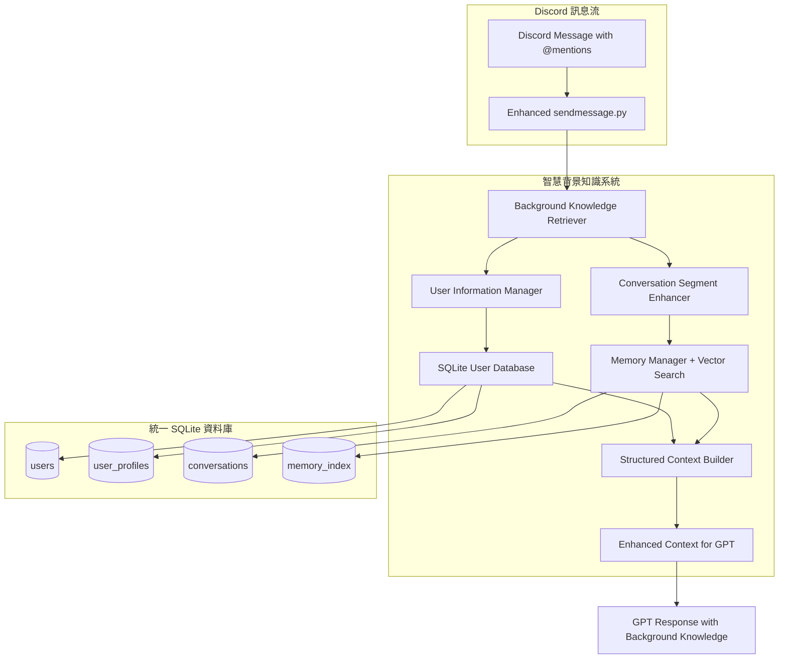

# 🧠 智慧背景知識整合系統 - 詳細實施計劃

## 📋 專案概述

### 主要任務
實現 Discord 機器人的智慧背景知識整合系統，使機器人能夠：
1. 自動識別對話參與者並提供其資訊
2. 基於語意相似性搜尋相關歷史對話片段
3. 以結構化格式向 GPT 模型提供背景知識

### 核心目標
- **使用者資訊整合**：從 MongoDB 遷移到 SQLite，支援 Discord ID 標籤
- **對話片段向量搜尋**：增強現有記憶系統的搜尋能力
- **結構化知識提供**：以清晰格式告知 GPT 可用的背景資訊

## 🏗️ 系統架構設計



## 🗄️ 資料庫設計

### SQLite 使用者表格結構

```sql
-- 使用者基本資料表
CREATE TABLE users (
    user_id TEXT PRIMARY KEY,           -- Discord ID
    discord_id TEXT UNIQUE NOT NULL,    -- Discord ID (備份)
    display_name TEXT,                  -- Discord 顯示名稱
    created_at DATETIME DEFAULT CURRENT_TIMESTAMP,
    last_active DATETIME DEFAULT CURRENT_TIMESTAMP,
    user_data TEXT,                     -- 從 MongoDB 遷移的使用者資料
    preferences TEXT                    -- JSON 格式偏好設定
);

-- 使用者詳細檔案表
CREATE TABLE user_profiles (
    profile_id TEXT PRIMARY KEY,
    user_id TEXT NOT NULL,
    profile_data TEXT,                  -- JSON 格式完整檔案
    interaction_history TEXT,           -- JSON 格式互動歷史
    updated_at DATETIME DEFAULT CURRENT_TIMESTAMP,
    FOREIGN KEY (user_id) REFERENCES users(user_id)
);

-- 索引設計
CREATE INDEX idx_users_discord_id ON users(discord_id);
CREATE INDEX idx_users_last_active ON users(last_active);
CREATE INDEX idx_user_profiles_user_id ON user_profiles(user_id);
```

## 🔧 核心組件實施

### 1. SQLite 使用者管理器

```python
# cogs/memory/user_manager.py
"""SQLite 使用者管理器"""

import sqlite3
import json
import logging
from datetime import datetime
from typing import Dict, List, Optional
from dataclasses import dataclass

@dataclass
class UserInfo:
    """使用者資訊資料類別"""
    user_id: str
    discord_id: str
    display_name: str
    user_data: Optional[str] = None
    last_active: Optional[datetime] = None
    profile_data: Optional[Dict] = None

class SQLiteUserManager:
    """SQLite 使用者管理器"""
    
    def __init__(self, db_manager):
        self.db_manager = db_manager
        self.logger = logging.getLogger(__name__)
        self._ensure_user_tables()
    
    def _ensure_user_tables(self):
        """確保使用者相關表格存在"""
        with self.db_manager.get_connection() as conn:
            # 建立 users 表格
            conn.execute("""
                CREATE TABLE IF NOT EXISTS users (
                    user_id TEXT PRIMARY KEY,
                    discord_id TEXT UNIQUE NOT NULL,
                    display_name TEXT,
                    created_at DATETIME DEFAULT CURRENT_TIMESTAMP,
                    last_active DATETIME DEFAULT CURRENT_TIMESTAMP,
                    user_data TEXT,
                    preferences TEXT
                )
            """)
            
            # 建立 user_profiles 表格
            conn.execute("""
                CREATE TABLE IF NOT EXISTS user_profiles (
                    profile_id TEXT PRIMARY KEY,
                    user_id TEXT NOT NULL,
                    profile_data TEXT,
                    interaction_history TEXT,
                    updated_at DATETIME DEFAULT CURRENT_TIMESTAMP,
                    FOREIGN KEY (user_id) REFERENCES users(user_id)
                )
            """)
            
            # 建立索引
            conn.execute("CREATE INDEX IF NOT EXISTS idx_users_discord_id ON users(discord_id)")
            conn.execute("CREATE INDEX IF NOT EXISTS idx_users_last_active ON users(last_active)")
            
            conn.commit()
    
    async def get_user_info(self, user_id: str) -> Optional[UserInfo]:
        """取得使用者完整資訊"""
        try:
            with self.db_manager.get_connection() as conn:
                cursor = conn.execute("""
                    SELECT u.user_id, u.discord_id, u.display_name, u.user_data, 
                           u.last_active, up.profile_data
                    FROM users u
                    LEFT JOIN user_profiles up ON u.user_id = up.user_id
                    WHERE u.user_id = ?
                """, (user_id,))
                
                row = cursor.fetchone()
                if row:
                    profile_data = json.loads(row[5]) if row[5] else None
                    return UserInfo(
                        user_id=row[0],
                        discord_id=row[1],
                        display_name=row[2],
                        user_data=row[3],
                        last_active=datetime.fromisoformat(row[4]) if row[4] else None,
                        profile_data=profile_data
                    )
                return None
        except Exception as e:
            self.logger.error(f"取得使用者資訊失敗: {e}")
            return None
    
    async def get_multiple_users(self, user_ids: List[str]) -> Dict[str, UserInfo]:
        """批量取得使用者資訊"""
        result = {}
        try:
            placeholders = ','.join('?' for _ in user_ids)
            with self.db_manager.get_connection() as conn:
                cursor = conn.execute(f"""
                    SELECT u.user_id, u.discord_id, u.display_name, u.user_data, 
                           u.last_active, up.profile_data
                    FROM users u
                    LEFT JOIN user_profiles up ON u.user_id = up.user_id
                    WHERE u.user_id IN ({placeholders})
                """, user_ids)
                
                for row in cursor.fetchall():
                    profile_data = json.loads(row[5]) if row[5] else None
                    user_info = UserInfo(
                        user_id=row[0],
                        discord_id=row[1],
                        display_name=row[2],
                        user_data=row[3],
                        last_active=datetime.fromisoformat(row[4]) if row[4] else None,
                        profile_data=profile_data
                    )
                    result[row[0]] = user_info
        except Exception as e:
            self.logger.error(f"批量取得使用者資訊失敗: {e}")
        
        return result
    
    async def update_user_data(self, user_id: str, user_data: str, display_name: str = None) -> bool:
        """更新使用者資料"""
        try:
            with self.db_manager.get_connection() as conn:
                # 檢查使用者是否存在
                cursor = conn.execute("SELECT user_id FROM users WHERE user_id = ?", (user_id,))
                exists = cursor.fetchone()
                
                if exists:
                    # 更新現有使用者
                    conn.execute("""
                        UPDATE users 
                        SET user_data = ?, display_name = COALESCE(?, display_name), 
                            last_active = CURRENT_TIMESTAMP
                        WHERE user_id = ?
                    """, (user_data, display_name, user_id))
                else:
                    # 建立新使用者
                    conn.execute("""
                        INSERT INTO users (user_id, discord_id, display_name, user_data)
                        VALUES (?, ?, ?, ?)
                    """, (user_id, user_id, display_name, user_data))
                
                conn.commit()
                return True
        except Exception as e:
            self.logger.error(f"更新使用者資料失敗: {e}")
            return False
    
    async def migrate_from_mongodb(self, mongodb_collection):
        """從 MongoDB 遷移資料到 SQLite"""
        try:
            # 取得所有 MongoDB 資料
            mongodb_users = list(mongodb_collection.find({}))
            
            migrated_count = 0
            for user_doc in mongodb_users:
                user_id = user_doc.get('user_id')
                user_data = user_doc.get('user_data')
                
                if user_id and user_data:
                    success = await self.update_user_data(user_id, user_data)
                    if success:
                        migrated_count += 1
            
            self.logger.info(f"成功遷移 {migrated_count} 個使用者資料")
            return migrated_count
            
        except Exception as e:
            self.logger.error(f"MongoDB 遷移失敗: {e}")
            return 0
```

### 2. 對話片段搜尋增強器

```python
# cogs/memory/conversation_segment_enhancer.py
"""對話片段搜尋增強器"""

import logging
from typing import Dict, List
from dataclasses import dataclass
from datetime import datetime

from .memory_manager import MemoryManager, SearchQuery, SearchType

@dataclass
class EnhancedSegment:
    """增強的對話片段"""
    content: str
    user_id: str
    timestamp: str
    relevance_score: float
    is_participant_related: bool
    user_display_name: str = ""

class ConversationSegmentEnhancer:
    """對話片段增強器"""
    
    def __init__(self, memory_manager: MemoryManager):
        self.memory_manager = memory_manager
        self.logger = logging.getLogger(__name__)
    
    async def search_enhanced_segments(self, 
                                     query: str,
                                     channel_id: str,
                                     participant_context: Dict[str, 'UserInfo']) -> List[EnhancedSegment]:
        """增強的對話片段搜尋"""
        try:
            # 使用現有的記憶管理器進行搜尋
            search_query = SearchQuery(
                text=query,
                channel_id=channel_id,
                search_type=SearchType.HYBRID,
                limit=10,
                threshold=0.5
            )
            
            search_result = await self.memory_manager.search_memory(search_query)
            
            # 增強處理：加入使用者上下文
            enhanced_segments = []
            participant_ids = set(participant_context.keys())
            
            for i, message_data in enumerate(search_result.messages):
                relevance_score = (search_result.relevance_scores[i] 
                                 if i < len(search_result.relevance_scores) else 0.0)
                
                user_id = message_data.get("user_id", "")
                is_participant_related = user_id in participant_ids
                
                # 取得使用者顯示名稱
                user_display_name = ""
                if user_id in participant_context:
                    user_display_name = participant_context[user_id].display_name or ""
                
                segment = EnhancedSegment(
                    content=message_data.get("content", ""),
                    user_id=user_id,
                    timestamp=message_data.get("timestamp", ""),
                    relevance_score=relevance_score,
                    is_participant_related=is_participant_related,
                    user_display_name=user_display_name
                )
                enhanced_segments.append(segment)
            
            # 按相關性和參與者關聯性排序
            return self._rank_segments_by_relevance(enhanced_segments, participant_ids)
            
        except Exception as e:
            self.logger.error(f"搜尋增強對話片段失敗: {e}")
            return []
    
    def _rank_segments_by_relevance(self, 
                                   segments: List[EnhancedSegment], 
                                   participant_ids: set) -> List[EnhancedSegment]:
        """按相關性和參與者關聯性排序片段"""
        def sort_key(segment):
            # 參與者相關的片段獲得額外分數
            participant_bonus = 0.2 if segment.is_participant_related else 0
            return segment.relevance_score + participant_bonus
        
        return sorted(segments, key=sort_key, reverse=True)
```

### 3. 結構化上下文建構器

```python
# cogs/memory/structured_context_builder.py
"""結構化上下文建構器"""

import logging
from typing import Dict, List
from datetime import datetime

class StructuredContextBuilder:
    """結構化上下文建構器"""
    
    def __init__(self):
        self.logger = logging.getLogger(__name__)
    
    def build_enhanced_context(self,
                              user_info: Dict[str, 'UserInfo'],
                              conversation_segments: List['EnhancedSegment'],
                              current_message) -> str:
        """建構增強的結構化上下文"""
        try:
            context_sections = []
            
            # 1. 對話參與者資訊
            if user_info:
                context_sections.append(self._build_participant_section(user_info))
            
            # 2. 相關歷史對話
            if conversation_segments:
                context_sections.append(self._build_conversation_section(conversation_segments))
            
            return "\n\n".join(context_sections)
            
        except Exception as e:
            self.logger.error(f"建構結構化上下文失敗: {e}")
            return ""
    
    def _build_participant_section(self, user_info: Dict[str, 'UserInfo']) -> str:
        """建構參與者資訊區塊"""
        lines = ["📋 **對話參與者資訊**"]
        
        for user_id, info in user_info.items():
            # 使用 Discord 標籤格式
            user_line = f"• <@{info.discord_id}>"
            
            # 顯示名稱
            if info.display_name:
                user_line += f" ({info.display_name})"
            
            # 最後活躍時間
            if info.last_active:
                user_line += f" | 最後活躍: {info.last_active.strftime('%Y-%m-%d %H:%M')}"
            
            lines.append(user_line)
            
            # 使用者資料摘要
            if info.user_data:
                data_preview = info.user_data[:100]
                if len(info.user_data) > 100:
                    data_preview += "..."
                lines.append(f"  └─ 資料: {data_preview}")
        
        return "\n".join(lines)
    
    def _build_conversation_section(self, segments: List['EnhancedSegment']) -> str:
        """建構對話歷史區塊"""
        lines = ["💬 **相關歷史對話**"]
        
        for segment in segments[:5]:  # 限制顯示數量
            # 相關性指示器
            relevance_emoji = "🔥" if segment.relevance_score > 0.8 else "📝"
            participant_emoji = "👤" if segment.is_participant_related else ""
            
            # 格式化內容
            content = segment.content[:150]
            if len(segment.content) > 150:
                content += "..."
            
            # 使用 Discord 標籤
            user_tag = f"<@{segment.user_id}>" if segment.user_id else "未知使用者"
            
            line = f"{relevance_emoji}{participant_emoji} `[{segment.timestamp}]` {user_tag}: {content}"
            lines.append(line)
        
        return "\n".join(lines)
```

## 🔄 整合到現有系統

### 修改 sendmessage.py

```python
# 在 gpt/sendmessage.py 中新增
async def search_enhanced_background_knowledge(
    bot: discord.Client,
    message: discord.Message,
    conversation_history: List[Dict]
) -> str:
    """搜尋增強的背景知識"""
    
    try:
        # 取得記憶管理器
        memory_manager = getattr(bot, 'memory_manager', None)
        if not memory_manager or not hasattr(memory_manager.db_manager, 'user_manager'):
            return ""
        
        # 1. 提取參與者 ID
        participant_ids = _extract_participant_ids(message, conversation_history)
        
        # 2. 取得使用者資訊
        user_manager = memory_manager.db_manager.user_manager
        user_info = await user_manager.get_multiple_users(list(participant_ids))
        
        # 3. 搜尋相關對話片段
        from cogs.memory.conversation_segment_enhancer import ConversationSegmentEnhancer
        segment_enhancer = ConversationSegmentEnhancer(memory_manager)
        segments = await segment_enhancer.search_enhanced_segments(
            message.content, 
            str(message.channel.id), 
            user_info
        )
        
        # 4. 建構結構化上下文
        from cogs.memory.structured_context_builder import StructuredContextBuilder
        context_builder = StructuredContextBuilder()
        enhanced_context = context_builder.build_enhanced_context(
            user_info, segments, message
        )
        
        return enhanced_context
        
    except Exception as e:
        logging.error(f"搜尋增強背景知識失敗: {e}")
        return ""

def _extract_participant_ids(message: discord.Message, conversation_history: List[Dict]) -> set:
    """提取參與者 ID"""
    participant_ids = {str(message.author.id)}
    
    # 從 @mentions 提取
    for mention in message.mentions:
        participant_ids.add(str(mention.id))
    
    # 從近期對話歷史提取
    for msg in conversation_history[-10:]:
        if 'user_id' in msg:
            participant_ids.add(msg['user_id'])
    
    return participant_ids

# 修改原有的 gpt_message 函式
async def gpt_message(
    message_to_edit: discord.Message,
    message: discord.Message,
    prompt: str,
    history_dict: Dict[str, Any],
    image_data: Optional[Any] = None
) -> Optional[str]:
    # ... 原有邏輯 ...
    
    # 替換原有的記憶搜尋
    bot = message.guild.me._state._get_client()
    enhanced_context = await search_enhanced_background_knowledge(bot, message, history_dict)
    
    # 建構增強的提示
    if enhanced_context:
        combined_prompt = f"{enhanced_context}\n\n[使用者訊息] {prompt}"
    else:
        combined_prompt = f"[使用者訊息] {prompt}"
    
    # 繼續原有流程...
```

### 修改 userdata.py

```python
# 修改 cogs/userdata.py
class UserDataCog(commands.Cog):
    def __init__(self, bot):
        self.bot = bot
        self.settings = Settings()
        
        # 移除 MongoDB 相關程式碼
        # self.client = MongoClient(self.settings.mongodb_uri)
        # self.db = self.client["user_data"]
        # self.collection = self.db["users"]
        
        self.lang_manager: Optional[LanguageManager] = None
        self.user_manager: Optional[SQLiteUserManager] = None
    
    async def cog_load(self):
        """當 Cog 載入時初始化"""
        self.lang_manager = LanguageManager.get_instance(self.bot)
        
        # 取得記憶管理器中的使用者管理器
        if hasattr(self.bot, 'memory_manager'):
            self.user_manager = self.bot.memory_manager.db_manager.user_manager
    
    async def manage_user_data(self, interaction, user: discord.User, user_data: str = None, action: str = 'read', message_to_edit: discord.Message = None, guild_id: str = None):
        if not self.user_manager:
            return "使用者管理系統未初始化"
        
        user_id = str(user.id)
        
        if action == 'read':
            user_info = await self.user_manager.get_user_info(user_id)
            if user_info and user_info.user_data:
                return f"使用者 <@{user_id}> 的資料：{user_info.user_data}"
            else:
                return f"找不到使用者 <@{user_id}> 的資料。"
        
        elif action == 'save':
            if user_data:
                success = await self.user_manager.update_user_data(
                    user_id, user_data, user.display_name
                )
                if success:
                    return f"已更新使用者 <@{user_id}> 的資料：{user_data}"
                else:
                    return "更新使用者資料失敗"
        
        return "無效的操作"
```

## 📅 實施時程表

### 第1週：使用者系統重構
- [ ] **第1天**：建立 `cogs/memory/user_manager.py`
- [ ] **第2天**：實作資料庫 Schema 和基本 CRUD 操作
- [ ] **第3天**：實作 MongoDB 遷移功能
- [ ] **第4天**：修改 `cogs/userdata.py` 移除 MongoDB 依賴
- [ ] **第5天**：整合測試使用者管理功能

### 第2週：對話搜尋增強
- [ ] **第1天**：建立 `cogs/memory/conversation_segment_enhancer.py`
- [ ] **第2天**：實作增強的搜尋邏輯
- [ ] **第3天**：實作參與者相關性評分
- [ ] **第4天**：與現有記憶管理器整合測試
- [ ] **第5天**：性能優化和錯誤處理

### 第3週：結構化輸出與整合
- [ ] **第1天**：建立 `cogs/memory/structured_context_builder.py`
- [ ] **第2天**：實作結構化上下文建構邏輯
- [ ] **第3天**：修改 `gpt/sendmessage.py` 整合新系統
- [ ] **第4天**：端到端測試和調試
- [ ] **第5天**：性能優化和文檔整理

## 🎯 預期輸出格式

```
📋 **對話參與者資訊**
• <@123456789> (張小明) | 最後活躍: 2024-01-15 14:30
  └─ 資料: 喜歡程式設計，目前在某科技公司擔任軟體工程師...
• <@987654321> (李美美) | 最後活躍: 2024-01-15 14:25
  └─ 資料: 專案經理，負責團隊協調工作，擅長時程管理...

💬 **相關歷史對話**
🔥👤 `[2024-01-10 10:15]` <@123456789>: 我下週要去台北出差，可能無法參加會議
📝 `[2024-01-08 16:20]` <@987654321>: 關於新專案的時程安排，我們需要重新評估
🔥 `[2024-01-05 09:30]` <@123456789>: 下季度的產品規劃方向已經確定了...
```

## 🧪 測試計劃

### 單元測試
- [ ] SQLiteUserManager 的 CRUD 操作
- [ ] ConversationSegmentEnhancer 的搜尋邏輯
- [ ] StructuredContextBuilder 的格式化輸出

### 整合測試
- [ ] MongoDB 到 SQLite 的資料遷移
- [ ] 與現有記憶管理器的整合
- [ ] sendmessage.py 的完整流程

### 性能測試
- [ ] 大量使用者資料的查詢性能
- [ ] 記憶搜尋的回應時間
- [ ] 併發請求處理能力

## 🚀 部署注意事項

1. **資料備份**：在遷移前備份現有 MongoDB 資料
2. **漸進式部署**：可以先在測試環境驗證
3. **監控指標**：設置回應時間和錯誤率監控
4. **回滾計劃**：準備快速回滾到原系統的方案

## 📝 開發檢查清單

### 開發前準備
- [ ] 確認現有系統的資料結構
- [ ] 備份 MongoDB 資料
- [ ] 設置開發環境

### 開發過程
- [ ] 遵循 Google Code Style Guide
- [ ] 添加適當的錯誤處理和日誌
- [ ] 編寫單元測試
- [ ] 性能優化

### 部署前檢查
- [ ] 完整的端到端測試
- [ ] 資料遷移驗證
- [ ] 性能基準測試
- [ ] 文檔更新

---

## 總結

這個智慧背景知識整合系統將大大增強 Discord 機器人的對話理解能力，使其能夠：

1. **智慧識別參與者**：自動提取和顯示對話參與者的相關資訊
2. **語意搜尋歷史**：基於向量搜尋找到相關的歷史對話片段
3. **結構化資訊提供**：以清晰的格式向 GPT 提供背景知識

通過這個系統，機器人將能夠提供更有針對性和上下文相關的回應，大大提升用戶體驗。