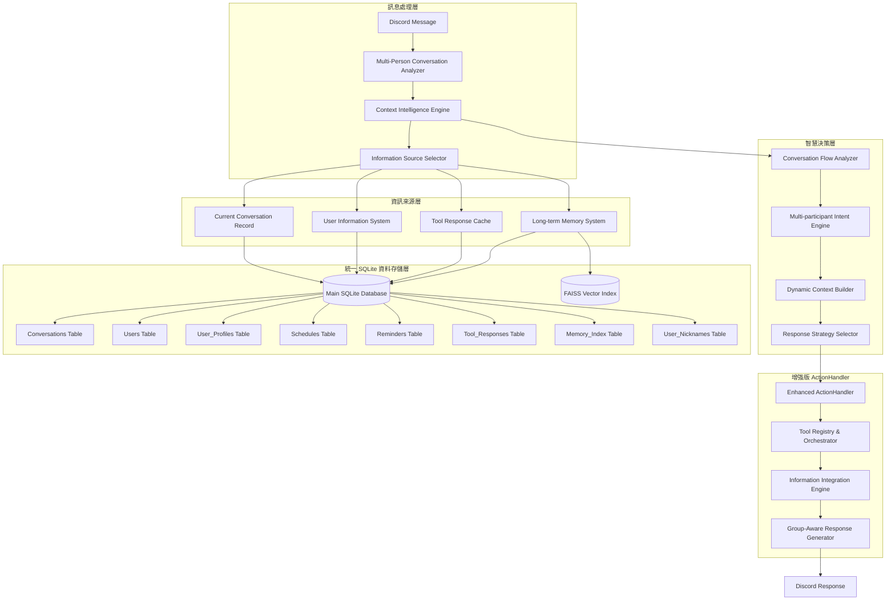
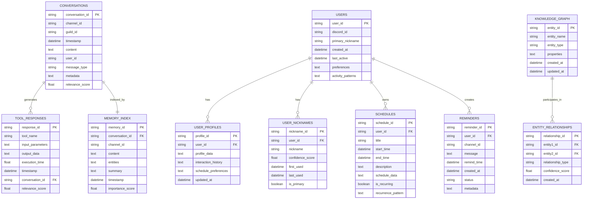
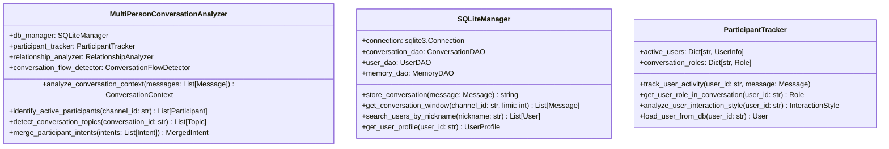
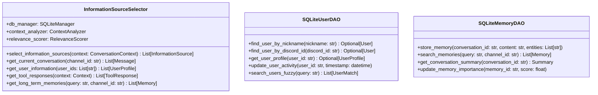

# 🤖 智慧群組成員機器人強化架構設計

## 📋 設計理念

**核心概念：機器人作為群組中的智慧成員，能夠理解多人對話脈絡，主動整合多種資訊來源，提供有意義的互動**

### 設計原則
- 🧠 **情境感知**：理解多人對話的動態和關係
- 🔄 **資訊整合**：智慧選擇和融合不同類型的資訊
- 👥 **群組導向**：以參與群組互動為核心，而非被動回應
- 🚀 **主動智慧**：根據情況主動提供相關資訊和建議

## 🏗️ 整體架構設計



## 🗄️ 統一 SQLite 資料庫設計

### 資料庫架構圖



### SQLite 資料表設計

```sql
-- 對話記錄表
CREATE TABLE conversations (
    conversation_id TEXT PRIMARY KEY,
    channel_id TEXT NOT NULL,
    guild_id TEXT NOT NULL,
    timestamp DATETIME NOT NULL,
    content TEXT NOT NULL,
    user_id TEXT NOT NULL,
    message_type TEXT DEFAULT 'user',
    metadata TEXT,
    relevance_score REAL DEFAULT 0.0,
    FOREIGN KEY (user_id) REFERENCES users(user_id)
);

-- 用戶基本資料表
CREATE TABLE users (
    user_id TEXT PRIMARY KEY,
    discord_id TEXT UNIQUE NOT NULL,
    primary_nickname TEXT,
    created_at DATETIME DEFAULT CURRENT_TIMESTAMP,
    last_active DATETIME DEFAULT CURRENT_TIMESTAMP,
    preferences TEXT, -- JSON 格式
    activity_patterns TEXT -- JSON 格式
);

-- 用戶詳細檔案表
CREATE TABLE user_profiles (
    profile_id TEXT PRIMARY KEY,
    user_id TEXT NOT NULL,
    profile_data TEXT, -- JSON 格式的完整用戶檔案
    interaction_history TEXT, -- JSON 格式的互動歷史
    schedule_preferences TEXT, -- JSON 格式的行程偏好
    updated_at DATETIME DEFAULT CURRENT_TIMESTAMP,
    FOREIGN KEY (user_id) REFERENCES users(user_id)
);

-- 用戶暱稱表 (支援模糊搜尋)
CREATE TABLE user_nicknames (
    nickname_id TEXT PRIMARY KEY,
    user_id TEXT NOT NULL,
    nickname TEXT NOT NULL,
    confidence_score REAL DEFAULT 1.0,
    first_used DATETIME DEFAULT CURRENT_TIMESTAMP,
    last_used DATETIME DEFAULT CURRENT_TIMESTAMP,
    is_primary BOOLEAN DEFAULT FALSE,
    FOREIGN KEY (user_id) REFERENCES users(user_id)
);

-- 行程表
CREATE TABLE schedules (
    schedule_id TEXT PRIMARY KEY,
    user_id TEXT NOT NULL,
    title TEXT NOT NULL,
    start_time DATETIME NOT NULL,
    end_time DATETIME,
    description TEXT,
    schedule_data TEXT, -- JSON 格式的詳細行程資料
    is_recurring BOOLEAN DEFAULT FALSE,
    recurrence_pattern TEXT,
    FOREIGN KEY (user_id) REFERENCES users(user_id)
);

-- 提醒表
CREATE TABLE reminders (
    reminder_id TEXT PRIMARY KEY,
    user_id TEXT NOT NULL,
    channel_id TEXT NOT NULL,
    message TEXT NOT NULL,
    remind_time DATETIME NOT NULL,
    created_at DATETIME DEFAULT CURRENT_TIMESTAMP,
    status TEXT DEFAULT 'active', -- active, completed, cancelled
    metadata TEXT, -- JSON 格式的額外資訊
    FOREIGN KEY (user_id) REFERENCES users(user_id)
);

-- 工具回應快取表
CREATE TABLE tool_responses (
    response_id TEXT PRIMARY KEY,
    tool_name TEXT NOT NULL,
    input_parameters TEXT, -- JSON 格式
    output_data TEXT,
    execution_time REAL,
    timestamp DATETIME DEFAULT CURRENT_TIMESTAMP,
    conversation_id TEXT,
    relevance_score REAL DEFAULT 0.0,
    FOREIGN KEY (conversation_id) REFERENCES conversations(conversation_id)
);

-- 記憶索引表
CREATE TABLE memory_index (
    memory_id TEXT PRIMARY KEY,
    conversation_id TEXT NOT NULL,
    channel_id TEXT NOT NULL,
    content TEXT NOT NULL,
    entities TEXT, -- JSON 格式的實體清單
    summary TEXT,
    timestamp DATETIME NOT NULL,
    importance_score REAL DEFAULT 0.0,
    FOREIGN KEY (conversation_id) REFERENCES conversations(conversation_id)
);

-- 知識圖譜實體表
CREATE TABLE knowledge_graph (
    entity_id TEXT PRIMARY KEY,
    entity_name TEXT NOT NULL,
    entity_type TEXT NOT NULL,
    properties TEXT, -- JSON 格式
    created_at DATETIME DEFAULT CURRENT_TIMESTAMP,
    updated_at DATETIME DEFAULT CURRENT_TIMESTAMP
);

-- 實體關係表
CREATE TABLE entity_relationships (
    relationship_id TEXT PRIMARY KEY,
    entity1_id TEXT NOT NULL,
    entity2_id TEXT NOT NULL,
    relationship_type TEXT NOT NULL,
    confidence_score REAL DEFAULT 1.0,
    created_at DATETIME DEFAULT CURRENT_TIMESTAMP,
    FOREIGN KEY (entity1_id) REFERENCES knowledge_graph(entity_id),
    FOREIGN KEY (entity2_id) REFERENCES knowledge_graph(entity_id)
);

-- 索引設計
CREATE INDEX idx_conversations_channel_timestamp ON conversations(channel_id, timestamp);
CREATE INDEX idx_conversations_user_timestamp ON conversations(user_id, timestamp);
CREATE INDEX idx_user_nicknames_nickname ON user_nicknames(nickname);
CREATE INDEX idx_user_nicknames_user_id ON user_nicknames(user_id);
CREATE INDEX idx_schedules_user_time ON schedules(user_id, start_time);
CREATE INDEX idx_reminders_user_time ON reminders(user_id, remind_time);
CREATE INDEX idx_tool_responses_timestamp ON tool_responses(timestamp);
CREATE INDEX idx_memory_index_channel_importance ON memory_index(channel_id, importance_score);
```

## 🧠 核心系統設計

### 1. 多人對話分析引擎



### 2. 智慧資訊來源選擇器



## 📊 四大資訊來源系統 (SQLite 實現)

### 1. 當前對話記錄系統 (必須)

```python
class CurrentConversationRecord:
    """當前對話記錄系統 - SQLite 實現"""
    
    def __init__(self, db_manager: SQLiteManager):
        self.db = db_manager
    
    def get_conversation_window(self, channel_id: str, size: int = 10) -> List[Message]:
        """取得對話窗口"""
        query = """
        SELECT conversation_id, content, user_id, timestamp, message_type, metadata
        FROM conversations 
        WHERE channel_id = ? 
        ORDER BY timestamp DESC 
        LIMIT ?
        """
        return self.db.execute_query(query, (channel_id, size))
    
    def store_message(self, message: discord.Message) -> str:
        """存儲訊息到 SQLite"""
        conversation_id = str(uuid.uuid4())
        query = """
        INSERT INTO conversations 
        (conversation_id, channel_id, guild_id, timestamp, content, user_id, message_type, metadata)
        VALUES (?, ?, ?, ?, ?, ?, ?, ?)
        """
        self.db.execute_query(query, (
            conversation_id,
            str(message.channel.id),
            str(message.guild.id),
            message.created_at,
            message.content,
            str(message.author.id),
            'user' if not message.author.bot else 'bot',
            json.dumps({"attachments": len(message.attachments)})
        ))
        return conversation_id
```

### 2. 參與者資訊系統 (SQLite 實現)

```python
class UserInformationSystem:
    """參與者資訊系統 - SQLite 實現"""
    
    def __init__(self, db_manager: SQLiteManager):
        self.db = db_manager
    
    def get_user_by_nickname(self, nickname: str) -> Optional[UserProfile]:
        """透過暱稱搜尋用戶 (模糊匹配)"""
        query = """
        SELECT u.user_id, u.discord_id, u.primary_nickname, up.profile_data
        FROM users u
        JOIN user_nicknames un ON u.user_id = un.user_id
        LEFT JOIN user_profiles up ON u.user_id = up.user_id
        WHERE un.nickname LIKE ?
        ORDER BY un.confidence_score DESC, un.last_used DESC
        LIMIT 1
        """
        result = self.db.execute_query(query, (f"%{nickname}%",))
        return self._parse_user_profile(result[0]) if result else None
    
    def get_user_by_discord_id(self, discord_id: str) -> Optional[UserProfile]:
        """透過 Discord ID 搜尋用戶"""
        query = """
        SELECT u.user_id, u.discord_id, u.primary_nickname, up.profile_data
        FROM users u
        LEFT JOIN user_profiles up ON u.user_id = up.user_id
        WHERE u.discord_id = ?
        """
        result = self.db.execute_query(query, (discord_id,))
        return self._parse_user_profile(result[0]) if result else None
    
    def update_user_nickname(self, user_id: str, nickname: str):
        """更新用戶暱稱"""
        # 檢查暱稱是否已存在
        existing_query = """
        SELECT nickname_id FROM user_nicknames 
        WHERE user_id = ? AND nickname = ?
        """
        existing = self.db.execute_query(existing_query, (user_id, nickname))
        
        if existing:
            # 更新最後使用時間
            update_query = """
            UPDATE user_nicknames 
            SET last_used = CURRENT_TIMESTAMP 
            WHERE nickname_id = ?
            """
            self.db.execute_query(update_query, (existing[0]['nickname_id'],))
        else:
            # 新增暱稱
            insert_query = """
            INSERT INTO user_nicknames (nickname_id, user_id, nickname, confidence_score)
            VALUES (?, ?, ?, ?)
            """
            self.db.execute_query(insert_query, (
                str(uuid.uuid4()), user_id, nickname, 1.0
            ))
```

### 3. 工具回應資訊系統 (SQLite 實現)

```python
class ToolResponseCache:
    """工具回應快取系統 - SQLite 實現"""
    
    def __init__(self, db_manager: SQLiteManager):
        self.db = db_manager
    
    def cache_tool_response(self, tool_name: str, input_params: dict, 
                          output_data: Any, execution_time: float,
                          conversation_id: str = None):
        """快取工具回應到 SQLite"""
        query = """
        INSERT INTO tool_responses 
        (response_id, tool_name, input_parameters, output_data, execution_time, conversation_id)
        VALUES (?, ?, ?, ?, ?, ?)
        """
        self.db.execute_query(query, (
            str(uuid.uuid4()),
            tool_name,
            json.dumps(input_params),
            str(output_data),
            execution_time,
            conversation_id
        ))
    
    def get_relevant_tool_responses(self, context: Context, limit: int = 5) -> List[ToolResponse]:
        """取得相關的工具回應"""
        query = """
        SELECT tool_name, input_parameters, output_data, execution_time, timestamp
        FROM tool_responses 
        WHERE tool_name IN ({})
        ORDER BY timestamp DESC, relevance_score DESC
        LIMIT ?
        """.format(','.join(['?' for _ in context.likely_tools]))
        
        params = list(context.likely_tools) + [limit]
        return self.db.execute_query(query, params)
```

### 4. 長久記憶系統 (SQLite + FAISS 實現)

```python
class EnhancedLongTermMemory:
    """長久記憶系統 - SQLite + FAISS 實現"""
    
    def __init__(self, db_manager: SQLiteManager, vector_manager: VectorManager):
        self.db = db_manager
        self.vector_manager = vector_manager
    
    def store_conversation_memory(self, conversation_id: str, 
                                content: str, entities: List[str]):
        """存儲對話記憶"""
        # 生成摘要
        summary = self._generate_summary(content)
        
        # 計算重要性分數
        importance_score = self._calculate_importance(content, entities)
        
        # 存儲到 SQLite
        query = """
        INSERT INTO memory_index 
        (memory_id, conversation_id, channel_id, content, entities, summary, timestamp, importance_score)
        VALUES (?, ?, ?, ?, ?, ?, ?, ?)
        """
        memory_id = str(uuid.uuid4())
        self.db.execute_query(query, (
            memory_id,
            conversation_id,
            self._get_channel_id_from_conversation(conversation_id),
            content,
            json.dumps(entities),
            summary,
            datetime.now(),
            importance_score
        ))
        
        # 存儲向量到 FAISS
        vector = self.vector_manager.generate_embedding(content)
        self.vector_manager.add_vector(memory_id, vector)
    
    def search_relevant_memories(self, query: str, channel_id: str, 
                               limit: int = 5) -> List[Memory]:
        """搜尋相關記憶 (混合搜尋)"""
        # 向量搜尋
        query_vector = self.vector_manager.generate_embedding(query)
        vector_results = self.vector_manager.search_similar(query_vector, limit * 2)
        
        # SQLite 關鍵字搜尋
        sql_query = """
        SELECT memory_id, content, summary, importance_score, timestamp
        FROM memory_index
        WHERE channel_id = ? AND (content LIKE ? OR summary LIKE ?)
        ORDER BY importance_score DESC, timestamp DESC
        LIMIT ?
        """
        keyword_results = self.db.execute_query(sql_query, (
            channel_id, f"%{query}%", f"%{query}%", limit
        ))
        
        # 合併結果
        return self._merge_search_results(vector_results, keyword_results, limit)
```

## 🚀 增強版 ActionHandler 整合

### 群組感知的 ActionHandler (SQLite 實現)

```python
class GroupAwareActionHandler:
    """群組感知的 ActionHandler - SQLite 實現"""
    
    def __init__(self, bot, db_manager: SQLiteManager):
        self.bot = bot
        self.db = db_manager
        self.conversation_analyzer = MultiPersonConversationAnalyzer(db_manager)
        self.information_selector = InformationSourceSelector(db_manager)
        self.user_system = UserInformationSystem(db_manager)
        self.tool_cache = ToolResponseCache(db_manager)
        self.memory_system = EnhancedLongTermMemory(db_manager, vector_manager)
    
    async def choose_act_with_context(self, prompt: str, message: discord.Message,
                                    message_to_edit: discord.Message) -> Callable:
        """基於多層級資訊選擇動作"""
        
        # 1. 分析多人對話脈絡
        conversation_context = self.conversation_analyzer.analyze_conversation_context(
            self._get_recent_messages(message.channel.id)
        )
        
        # 2. 選擇資訊來源
        information_needs = self.information_selector.determine_information_needs(
            conversation_context
        )
        
        # 3. 整合資訊來源
        integrated_context = await self._integrate_information_sources(
            conversation_context, information_needs, message
        )
        
        # 4. 生成動作列表
        action_list = await self._generate_actions_with_context(
            prompt, integrated_context
        )
        
        # 5. 執行動作
        return await self._execute_actions_with_context(
            action_list, message, message_to_edit, integrated_context
        )
    
    async def _integrate_information_sources(self, conversation_context: ConversationContext,
                                           information_needs: InformationNeeds,
                                           message: discord.Message) -> IntegratedContext:
        """整合四大資訊來源"""
        
        context = IntegratedContext()
        
        # 必須：當前對話記錄
        context.current_conversation = self.db.get_conversation_window(
            str(message.channel.id), 10
        )
        
        # 條件：參與者資訊
        if information_needs.requires_user_info:
            participants = conversation_context.participants
            context.user_information = {}
            for participant in participants:
                user_profile = self.user_system.get_user_by_discord_id(participant.discord_id)
                if user_profile:
                    context.user_information[participant.discord_id] = user_profile
        
        # 條件：工具回應
        if information_needs.requires_tool_responses:
            context.tool_responses = self.tool_cache.get_relevant_tool_responses(
                conversation_context
            )
        
        # 條件：長久記憶
        if information_needs.requires_long_term_memory:
            context.historical_memories = self.memory_system.search_relevant_memories(
                conversation_context.main_topic, str(message.channel.id)
            )
        
        return context
```

## 📈 實施路線圖

### 階段一：SQLite 資料庫建設 (3 週)

#### 週 1：資料庫架構設計
- **SQLite 資料庫設計**
  - 設計完整的資料表結構
  - 建立索引和外鍵約束
  - 實現資料庫初始化腳本

- **資料存取層 (DAO)**
  - 實現 SQLiteManager 基礎類別
  - 建立各資料表的 DAO 類別
  - 設計統一的查詢介面

#### 週 2：MongoDB 到 SQLite 遷移
- **資料遷移工具**
  - 分析現有 MongoDB 資料結構
  - 實現資料轉換和遷移腳本
  - 建立資料完整性驗證

- **系統重構**
  - 更新 UserDataCog 使用 SQLite
  - 重構 ScheduleManager 資料存取
  - 更新 ReminderCog 存儲邏輯

#### 週 3：多人對話分析引擎
- **對話參與者追蹤**
  - 實現參與者識別和追蹤
  - 建立對話脈絡分析
  - 設計群組動態檢測

### 階段二：智慧資訊整合 (4 週)

#### 週 4-5：四大資訊來源系統
- **當前對話記錄系統**
  - 實現對話窗口管理
  - 建立即時對話追蹤
  - 設計對話元資料存儲

- **參與者資訊系統**
  - 實現暱稱模糊搜尋
  - 建立用戶檔案管理
  - 設計用戶活動追蹤

#### 週 6-7：工具與記憶系統
- **工具回應快取系統**
  - 實現工具回應存儲
  - 建立效能追蹤機制
  - 設計相關性評分

- **長久記憶系統整合**
  - 整合現有 FAISS 向量系統
  - 實現 SQLite + FAISS 混合搜尋
  - 建立知識圖譜存儲

### 階段三：增強版 ActionHandler (3 週)

#### 週 8-9：群組感知 ActionHandler
- **智慧資訊選擇器**
  - 實現上下文感知的資訊來源選擇
  - 建立動態權重調整機制
  - 設計資訊整合策略

- **多人對話理解**
  - 實現群組意圖分析
  - 建立參與者關係理解
  - 設計對話流程追蹤

#### 週 10：系統整合與測試
- **端到端整合**
  - 完整系統功能測試
  - 多人對話場景驗證
  - SQLite 效能最佳化

- **部署與最佳化**
  - 資料庫效能調優
  - 記憶體使用最佳化
  - 建立監控和日誌系統

## 🎖️ 預期效益

### 技術架構優勢
- **統一 SQLite 存儲**：簡化部署，移除外部資料庫依賴
- **智慧資訊整合**：動態選擇四大資訊來源，提升回應品質
- **群組感知能力**：理解多人互動動態，提供適切參與
- **高效能搜尋**：SQLite + FAISS 混合搜尋，平衡效能與精確度

### 功能提升指標
- **多人對話理解準確率**：85%+ 的對話脈絡正確識別
- **暱稱搜尋成功率**：90%+ 的模糊暱稱搜尋成功匹配
- **資訊來源選擇精準度**：90%+ 的情況下選擇正確的資訊來源組合
- **群組互動自然度**：用戶感受機器人如群組成員般自然參與

### 部署與維護優勢
- **單一資料庫檔案**：SQLite 資料庫易於備份和遷移
- **零外部依賴**：移除 MongoDB，簡化部署環境
- **高效查詢**：最佳化的索引設計，提升查詢效能
- **資料一致性**：ACID 屬性保證資料完整性

---

這個重新設計的架構完全使用 SQLite 作為統一的資料存儲方案，是否符合您的期望？我特別著重於：
1. 完全移除 MongoDB，統一使用 SQLite
2. 設計完整的資料表結構和關聯
3. 保持四大資訊來源的智慧整合能力
4. 提供詳細的實施路線圖

您希望我調整任何特定部分嗎？