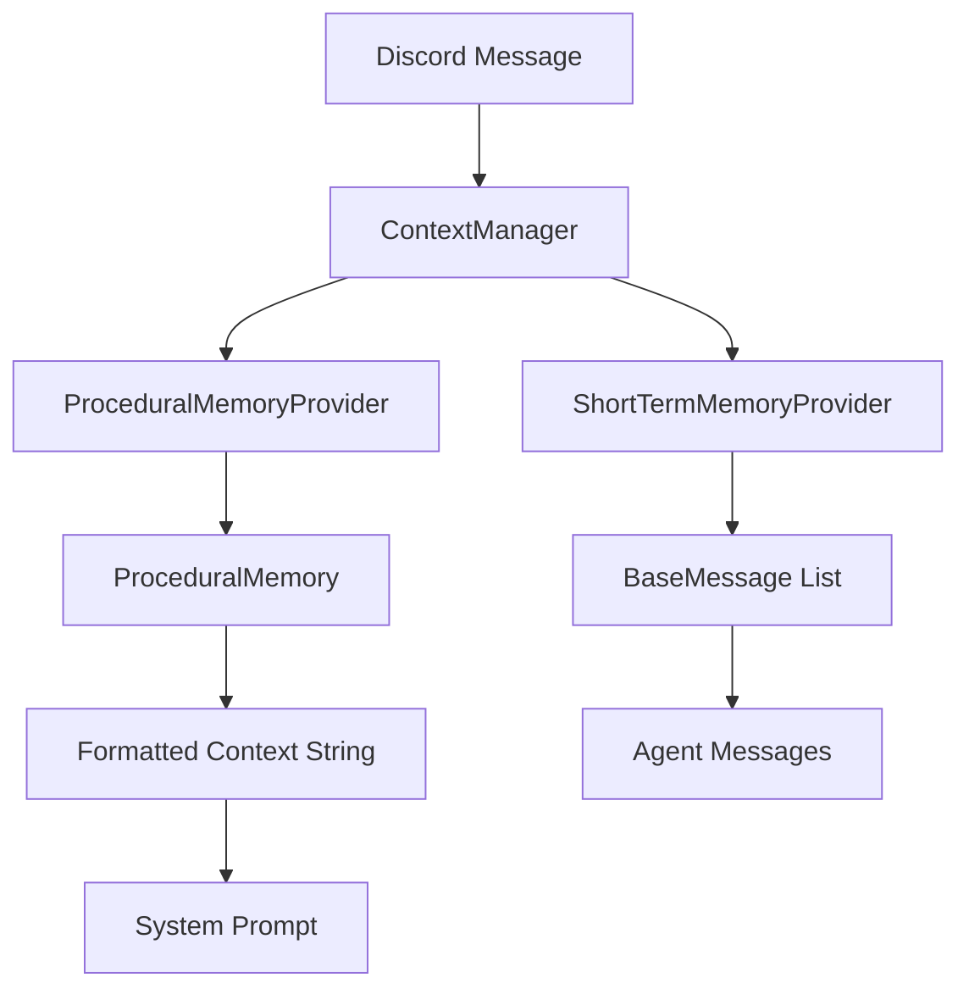

# Context Manager

## Overview

The `ContextManager` class is responsible for building procedural context strings and managing short-term memory messages for LLM interactions. It serves as a bridge between the Discord message system and the LLM by providing formatted context and conversation history.

## Architecture

### Core Components

- **ContextManager**: Main class that coordinates procedural and short-term memory
- **ProceduralMemoryProvider**: Fetches user background information and preferences  
- **ShortTermMemoryProvider**: Retrieves recent channel message history as LangChain messages

### Data Flow



## Class Reference

### ContextManager

#### Constructor

```python
def __init__(
    self,
    short_term_provider: ShortTermMemoryProvider,
    procedural_provider: ProceduralMemoryProvider,
) -> None
```

Initializes the context manager with memory providers.

#### Methods

##### get_context()

```python
async def get_context(self, message: discord.Message) -> Tuple[str, List[BaseMessage]]
```

**Parameters:**
- `message`: Discord message object

**Returns:**
- `procedural_context_str`: Formatted procedural memory string
- `short_term_msgs`: List of LangChain BaseMessage objects

**Description:**
Retrieves both procedural context and short-term messages, formatted appropriately for LLM consumption. Short-term messages are returned in oldest-to-newest order.

**Error Handling:**
- Uses `func.report_error` for centralized error logging
- Returns safe fallbacks (empty string, empty list) on failures
- Continues processing even if individual components fail

##### _extract_user_ids_from_messages()

```python
def _extract_user_ids_from_messages(
    self, messages: List[BaseMessage], message: discord.Message
) -> List[str]
```

**Parameters:**
- `messages`: List of short-term memory messages
- `message`: Current Discord message

**Returns:**
- List of unique user IDs

**Description:**
Extracts user IDs from message content and includes the current message author. Uses regex pattern matching to identify user IDs in bracketed format like `[123456]`.

##### _format_context_for_prompt()

```python
def _format_context_for_prompt(
    self, 
    procedural_memory: ProceduralMemory, 
    channel_name: str, 
    timestamp: float
) -> str
```

**Parameters:**
- `procedural_memory`: User information mapping
- `channel_name`: Current channel name
- `timestamp`: Unix timestamp

**Returns:**
- Formatted context string

**Description:**
Formats procedural memory into a structured string for inclusion in system prompts. Does not serialize short-term memory - that is handled separately by LangChain.

## Memory Systems

### Procedural Memory

- **User Background**: Stored user information and preferences
- **Contextual Information**: Channel-specific and timestamp information
- **Format**: Structured text blocks for easy LLM consumption

### Short-term Memory

- **Message History**: Recent Discord messages (configurable limit, default 15)
- **LangChain Format**: Converted to BaseMessage objects for agent compatibility
- **Multimodal Support**: Includes images, videos, audio, and PDF content
- **Author Information**: Preserves user ID and message metadata

## Error Handling Strategy

The context manager implements resilient error handling:

1. **Non-blocking Failures**: Individual component failures don't stop processing
2. **Safe Fallbacks**: Returns empty/fallback values instead of raising exceptions
3. **Centralized Logging**: All errors reported via `func.report_error`
4. **Resilient Processing**: Continues with available data when parts fail

## Usage Example

```python
# Initialize providers
short_term_provider = ShortTermMemoryProvider(bot=bot, limit=15)
procedural_provider = ProceduralMemoryProvider(user_manager=user_manager)

# Create context manager
context_manager = ContextManager(
    short_term_provider=short_term_provider,
    procedural_provider=procedural_provider,
)

# Get context for message
procedural_str, short_term_msgs = await context_manager.get_context(discord_message)

# Use in agent
agent = create_agent(
    model=model,
    tools=tools,
    system_prompt=procedural_str,
    messages=short_term_msgs  # Direct injection into LangChain
)
```

## Integration Points

### With Orchestrator
- Provides context data for both info_agent and message_agent
- Integrates with ModelManager for model configuration
- Works with ToolsFactory for dynamic tool loading

### With Memory System
- Connects to UserDataCog via user_manager
- Interfaces with VectorManager for episodic memory
- Maintains compatibility with Discord message structures

## Performance Considerations

1. **Caching**: Short-term messages cached per channel
2. **Lazy Loading**: Memory providers loaded on demand
3. **Batching**: User data fetched in batch operations
4. **Resilience**: Individual failures don't cascade

## Configuration

### Environment Variables
- No direct environment dependencies
- Relies on bot configuration and user data system

### Memory Limits
- Short-term memory limit: configurable (default 15 messages)
- User data batch sizes managed by user_manager
- No hard limits on procedural memory size

## Dependencies

- `discord.py`: Discord message handling
- `langchain_core.messages`: BaseMessage types
- `function.func`: Centralized error reporting
- `llm.memory.*`: Memory provider modules