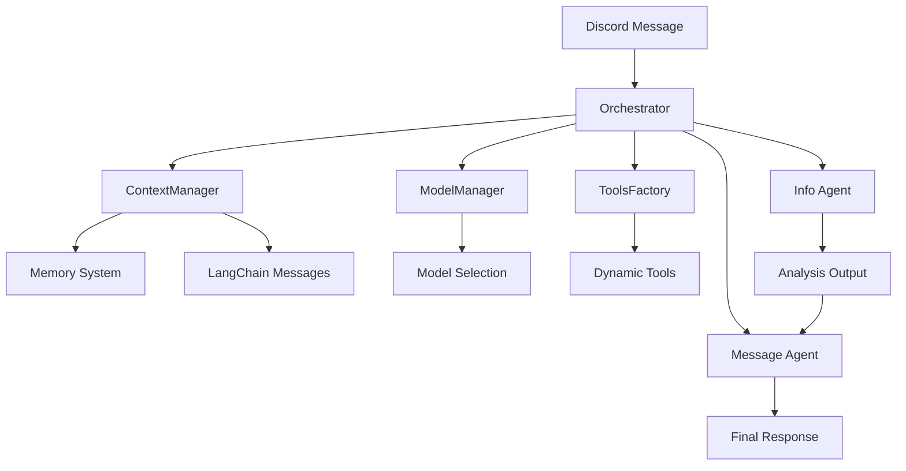

# LLM System Documentation

## Overview

The `llm` module provides a comprehensive Large Language Model (LLM) integration system for Discord bots. It implements a sophisticated two-agent architecture with dynamic tool loading, multi-layered memory management, and robust fault tolerance.

## System Architecture

### High-Level Flow

```mermaid
graph TD
    A[Discord Message] --> B[Orchestrator]
    B --> C[ContextManager]
    B --> D[ModelManager]
    B --> E[ToolsFactory]
    C --> F[Memory System]
    C --> G[LangChain Messages]
    D --> H[Model Selection]
    E --> I[Dynamic Tools]
    B --> J[Info Agent]
    B --> K[Message Agent]
    J --> L[Analysis Output]
    K --> M[Final Response]
    L --> K
```

## Core Components

| Component | Purpose | Documentation |
|-----------|---------|---------------|
| **[Orchestrator](orchestrator.md)** | Coordinates the two-phase agent conversation flow | [orchestrator.md](orchestrator.md) |
| **[Context Manager](context_manager.md)** | Aggregates procedural context and short-term memory | [context_manager.md](context_manager.md) |
| **[Model Manager](model_manager.md)** | Handles model selection and priority logic | [model_manager.md](model_manager.md) |
| **[Model Circuit Breaker](model_circuit_breaker.md)** | Fault tolerance and failure tracking for models | [model_circuit_breaker.md](model_circuit_breaker.md) |
| **[Tools Factory](tools_factory.md)** | Dynamic tool discovery and permission filtering | [tools_factory.md](tools_factory.md) |
| **[Protected Prompt System](protected_prompt_system.md)** | Immutable system instructions and customization | [protected_prompt_system.md](protected_prompt_system.md) |
| **[Schema](schema.md)** | Defines data structures for requests/responses | [schema.md](schema.md) |
| **[Callbacks](callbacks.md)** | Real-time tool execution feedback for users | [callbacks.md](callbacks.md) |

## Technical Subsystems

| Subsystem | Purpose | Documentation |
|-----------|---------|---------------|
| **[Memory System](memory/index.md)** | Dual-memory architecture (Episodic/Procedural) | [memory/index.md](memory/index.md) |
| **[Prompting System](prompting/index.md)** | Dynamic prompt generation and caching | [prompting/index.md](prompting/index.md) |
| **[Tool Collection](tools/index.md)** | Architecture for LangChain tool integration | [tools/index.md](tools/index.md) |
| **[Utilities](utils/index.md)** | File watching, media processing, and message handling | [utils/index.md](utils/index.md) |

## Key Features

### 🤖 Two-Phase Agent Architecture
- **Info Agent**: Analyzes intent and extract facts using search and memory tools.
- **Message Agent**: Formulates the final conversational reply with a focus on personality.

### 🛡️ Fault Tolerance & Resilience
- **Manual Fallback**: Guarantees a response even if the primary AI provider is down.
- **Circuit Breaker**: Automatically bypasses failing models to reduce latency.
- **Protected Prompts**: Prevents configuration errors from breaking core bot formatting.

### 🧠 Advanced Context Management
- **Procedural Memory**: User-specific biological info and behavioral instructions.
- **Short-Term Memory**: Preservation of conversation flow across multiple messages.
- **Episodic Memory**: Semantic search across past interactions via vector database.

### 🔧 Dynamic Extensibility
- **Hot-Reloading**: Configuration changes are detected and applied without restarting the bot.
- **Permission Filtering**: Tools are automatically enabled or disabled based on user roles.

---
*The LLM system is designed to be the "brain" of the PigPig Bot, providing a flexible and robust platform for AI-driven interactions.*