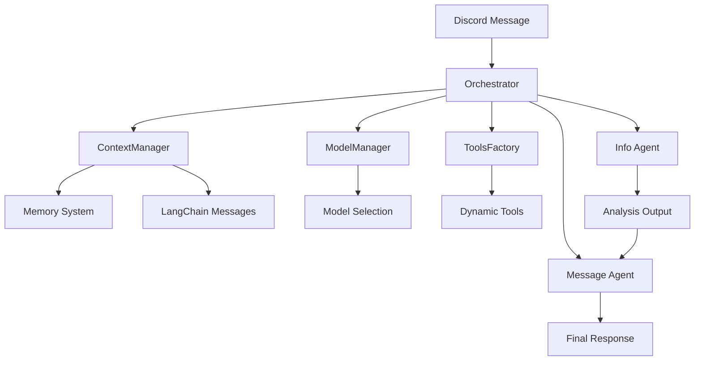

# LLM System Documentation

## Overview

The `llm` module provides a comprehensive Large Language Model (LLM) integration system for Discord bots. It implements a sophisticated two-agent architecture with dynamic tool loading, memory management, and multilingual support.

## System Architecture

### High-Level Flow



### Core Components

| Component | Purpose | Documentation |
|-----------|---------|---------------|
| **[Context Manager](context_manager.md)** | Manages procedural context and short-term memory | [context_manager.md](context_manager.md) |
| **[Model Manager](model_manager.md)** | Handles model selection and fallback logic | [model_manager.md](model_manager.md) |
| **[Orchestrator](orchestrator.md)** | Coordinates two-agent conversation flow | [orchestrator.md](orchestrator.md) |
| **[Schema](schema.md)** | Defines data structures for requests/responses | [schema.md](schema.md) |
| **[Tools Factory](tools_factory.md)** | Dynamic tool discovery and permission filtering | [tools_factory.md](tools_factory.md) |

### Submodules

| Submodule | Purpose | Documentation |
|-----------|---------|---------------|
| **[Memory System](memory/index.md)** | Procedural and short-term memory management | [memory/index.md](memory/index.md) |
| **[Prompting System](prompting/index.md)** | Dynamic system prompt generation and caching | [prompting/index.md](prompting/index.md) |
| **[Tools Collection](tools/index.md)** | LangChain tools for agent interactions | [tools/index.md](tools/index.md) |
| **[Utilities](utils/index.md)** | File watching, media processing, message handling | [utils/index.md](utils/index.md) |

## Key Features

### 🤖 Two-Phase Agent Architecture

1. **Info Agent**: Analyzes user intent and extracts information
2. **Message Agent**: Generates conversational responses

### 🔧 Dynamic Tool System

- **Permission-based filtering**: Admin and moderator tool restrictions
- **Runtime binding**: Tools bound to orchestrator context
- **Automatic discovery**: Scans `llm/tools/` for new tools
- **Caching**: Performance optimization with file change detection

### 🧠 Memory Management

- **Procedural Memory**: User background and preferences
- **Short-term Memory**: Recent conversation context
- **LangChain Integration**: Direct message object conversion
- **Database Integration**: Persistent storage via UserDataCog

### 🌐 Multi-language Support

- **Server-specific languages**: Per-guild language preferences
- **Automatic translation**: LanguageManager integration
- **Conversion support**: Traditional/Simplified Chinese
- **Fallback system**: Default language handling

### ⚡ Performance Optimization

- **Intelligent caching**: TTL-based prompt caching
- **Model fallbacks**: Automatic failover to backup models
- **File watching**: Live configuration reloading
- **Streaming responses**: Real-time message updates

## Quick Start

### Basic Usage

```python
from llm.orchestrator import Orchestrator

# Initialize orchestrator
orchestrator = Orchestrator(bot)

# Handle Discord message
response = await orchestrator.handle_message(
    bot=bot,
    message_edit=message_to_edit,
    message=discord_message,
    logger=logger
)

# Send response
await message.channel.send(response.reply)
```

### Tool Integration

```python
from llm.tools_factory import get_tools

# Load tools with permission filtering
tools = get_tools(
    user=message.author,
    guild=message.guild,
    runtime=orchestrator_request
)

# Tools automatically filtered by user permissions
# Admin tools → Admin users only
# Moderator tools → Moderator users only  
# Public tools → All users
```

### Memory Management

```python
from llm.memory import ProceduralMemoryProvider, ShortTermMemoryProvider

# Initialize memory providers
procedural = ProceduralMemoryProvider(user_manager=user_manager)
short_term = ShortTermMemoryProvider(bot=bot, limit=15)

# Get memory context
procedural_memory = await procedural.get(user_ids)
short_term_messages = await short_term.get(message)
```

## Configuration

### Model Configuration

```yaml
# config/llm.yaml
model_priorities:
  info_model:
    - provider: google
      models: [gemini-pro, gemini-pro-vision]
    - provider: openai  
      models: [gpt-4, gpt-3.5-turbo]
  message_model:
    - provider: anthropic
      models: [claude-3-opus, claude-3-sonnet]
```

### Prompt Configuration

```yaml
# config/prompts/message_agent.yaml
metadata:
  version: "1.0.0"
  cache_ttl: 3600

base:
  core_instruction: "You are a helpful AI assistant..."

composition:
  default_modules:
    - base
    - identity
    - language
    - interaction
```

## Integration Points

### Discord Bot Integration

- **Message Handler**: Coordinates message processing
- **UserDataCog**: Provides user management for memory
- **LanguageManager**: Enables multilingual responses
- **Permission System**: Role-based tool access

### External Systems

- **Vector Database**: Episodic memory storage
- **API Services**: External tool integrations
- **Configuration Files**: YAML-based configuration
- **Database Systems**: User data and memory storage

## Error Handling

### Resilient Design

- **Graceful degradation**: Continue with available components
- **Centralized logging**: All errors via `func.report_error`
- **Safe fallbacks**: Default values on component failures
- **Resilient processing**: Individual failures don't cascade

### Error Scenarios

1. **Model Unavailable**: Automatic fallback to backup models
2. **Tool Loading Failed**: Skip unavailable tools, continue processing
3. **Memory System Down**: Use empty context, continue conversation
4. **Configuration Invalid**: Use fallback prompts and default settings

## Performance Considerations

### Caching Strategy

- **Prompt Caching**: TTL-based with file change detection
- **Tool Caching**: Module-level caching with mtime checks
- **Model Caching**: Configuration loaded once per agent type
- **Memory Caching**: User data cached via UserDataCog

### Resource Management

- **Thread Safety**: RLock for concurrent access
- **Memory Limits**: Configurable short-term memory size
- **Connection Pooling**: Efficient database connections
- **Background Processing**: Non-blocking file monitoring

## Development

### Adding New Tools

1. Create tool class in `llm/tools/`
2. Implement `get_tools()` method
3. Use `@tool` decorator for LangChain compatibility
4. Handle permissions via `required_permission` attribute

### Custom Memory Providers

1. Extend appropriate provider base class
2. Implement required interface methods
3. Register with ContextManager
4. Add integration tests

### Extending Prompt System

1. Add YAML configuration sections
2. Update PromptBuilder with new modules
3. Implement language replacement logic
4. Add caching for new template types

## Testing

### Unit Testing

```python
def test_orchestrator_initialization():
    bot = MockBot()
    orchestrator = Orchestrator(bot)
    assert orchestrator.model_manager is not None

def test_tool_discovery():
    tools = get_tools(user, guild, runtime)
    assert len(tools) > 0
```

### Integration Testing

```python
async def test_full_pipeline():
    response = await orchestrator.handle_message(bot, None, message, logger)
    assert isinstance(response, OrchestratorResponse)
    assert response.reply is not None
```

## Dependencies

### Core Dependencies

- **LangChain**: Agent creation and tool management
- **Discord.py**: Discord integration and message handling
- **Pydantic**: Data validation and serialization
- **YAML**: Configuration file parsing
- **OpenCC**: Traditional/Simplified Chinese conversion

### Optional Dependencies

- **PIL**: Image processing for media tools
- **pdf2image**: PDF processing capabilities
- **aiohttp**: HTTP requests for internet search
- **sympy**: Mathematical expression evaluation

## Support

### Documentation Links

- [Context Manager](context_manager.md) - Memory and context management
- [Model Manager](model_manager.md) - Model selection and configuration
- [Orchestrator](orchestrator.md) - Main coordination logic
- [Schema](schema.md) - Data structures and types
- [Tools Factory](tools_factory.md) - Tool discovery and filtering
- [Memory System](memory/index.md) - Memory provider implementations
- [Prompting System](prompting/index.md) - Dynamic prompt generation
- [Tools Collection](tools/index.md) - Available LLM tools
- [Utilities](utils/index.md) - Supporting utility functions

### Getting Help

- Check individual module documentation for specific issues
- Review error logs via `func.report_error` system
- Test individual components in isolation
- Consult integration examples in test files

## Version History

- **v1.0.0**: Initial documentation structure
- **Core Components**: Complete documentation for all primary modules
- **Submodule Coverage**: Full documentation for memory, prompting, tools, and utils
- **Integration Guides**: Comprehensive setup and usage examples