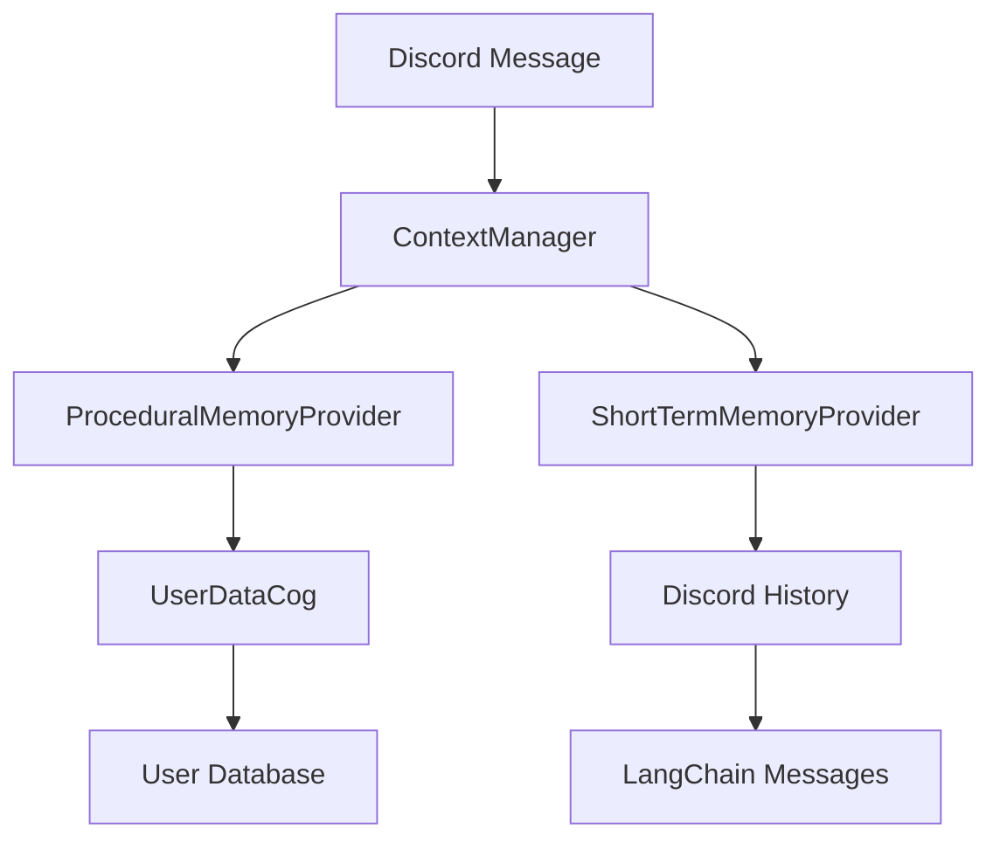

# Memory System

## Overview

The `llm.memory` module provides a comprehensive memory management system for the LLM integration, consisting of two main types of memory:

1. **Procedural Memory**: User background information and preferences
2. **Short-term Memory**: Recent conversation history in LangChain format

## Architecture

### Core Components



### Memory Types

#### Procedural Memory
- **Purpose**: Stores user background, preferences, and procedural information
- **Storage**: Persistent database via UserDataCog
- **Format**: Structured user information mapping

#### Short-term Memory  
- **Purpose**: Recent conversation context for immediate interactions
- **Storage**: Temporary cache of Discord message history
- **Format**: LangChain BaseMessage objects

## Module Components

### schema.py

Contains data structures for memory types:

```python
@dataclass
class UserInfo:
    """Information about a single user used by procedural memory."""
    user_background: Optional[str] = None
    procedural_memory: Dict[str, Any] = field(default_factory=dict)
    last_updated: Optional[str] = None

@dataclass
class ProceduralMemory:
    """Holds procedural memory for multiple users keyed by user_id."""
    user_info: Dict[str, UserInfo] = field(default_factory=dict)

@dataclass
class ShortTermMemory:
    """Stores recent messages; each message is a mapping containing at least author_id, author, content, timestamp (numeric UNIX seconds as float)."""
    messages: List[Dict[str, Any]] = field(default_factory=list)
```

### procedural.py

**ProceduralMemoryProvider**: Fetches user information from database

```python
class ProceduralMemoryProvider:
    """Provides procedural memory for multiple users.
    
    The provider fetches UserInfo for each user_id using the provided user manager
    and returns a ProceduralMemory mapping user_id -> UserInfo.
    """
    
    def __init__(self, user_manager: SQLiteUserManager):
        self.user_manager = user_manager
    
    async def get(self, user_ids: List[str]) -> ProceduralMemory:
        """Fetch procedural memory for a list of user IDs."""
```

**Key Features:**
- Batch fetching of user information
- Graceful error handling with empty fallbacks
- Integration with SQLiteUserManager
- Resilient to missing user data

### short_term.py

**ShortTermMemoryProvider**: Converts Discord messages to LangChain format

```python
class ShortTermMemoryProvider:
    """Provides short-term memory as a list of LangChain messages.
    
    The provider fetches recent message history from the channel and converts
    each Discord message to a LangChain HumanMessage or AIMessage.
    """
    
    def __init__(self, bot: Any, limit: int = 10):
        self.limit = limit
        self.bot = bot
    
    async def get(self, message: discord.Message) -> List[BaseMessage]:
        """Fetch recent messages and return as LangChain BaseMessage list."""
```

**Key Features:**
- Configurable message limit (default 15)
- Multimodal content support (images, videos, audio, PDFs)
- Author attribution with user IDs
- Reaction and reference tracking
- LangChain message conversion

## Data Structures

### UserInfo Schema

```python
{
    "user_background": "Optional[str] - User's background information",
    "procedural_memory": "Dict[str, Any] - Key-value preferences",
    "last_updated": "Optional[str] - Timestamp of last update"
}
```

### Short-term Message Format

Each message is converted to LangChain format with metadata:

```python
{
    "author_name": "str - Discord username",
    "author_id": "int - Discord user ID", 
    "message_id": "int - Discord message ID",
    "content": "str - Message content",
    "reactions": "str - Reaction summary",
    "reply_to": "int - Referenced message ID",
    "timestamp": "float - UNIX timestamp",
    "attachments": "[{type, url, mime_type}] - Multimodal content"
}
```

### LangChain Message Types

#### HumanMessage

```python
HumanMessage(content=[
    {
        "type": "text", 
        "text": "[Username | UserID:123 | MessageID:456] <som> message content <eom> [reactions: 😀 | reply_to: 789 | timestamp: 1234567890.0]"
    }
])
```

#### AIMessage

For bot messages, uses same format but creates AIMessage type.

#### Multimodal Content

Images, videos, audio, and PDFs are included as content items:

```python
{
    "type": "image",
    "url": "https://discord.com/attachments/...",
    "mime_type": "image/png"
}
```

## Integration Points

### With ContextManager

```python
# Procedural memory for context string
procedural_str = self._format_context_for_prompt(
    procedural_memory, channel_name, timestamp
)

# Short-term messages for agent consumption
short_term_msgs = await self.short_term_provider.get(message)
```

### With UserDataCog

```python
# ProceduralMemoryProvider integrates with SQLiteUserManager
procedural_provider = ProceduralMemoryProvider(user_manager=user_manager)
users_data = await user_manager.get_multiple_users(user_ids)
```

### With Discord Bot

```python
# ShortTermMemoryProvider uses bot instance
short_term_provider = ShortTermMemoryProvider(bot=bot, limit=15)
history = [msg async for msg in message.channel.history(limit=15)]
```

## Usage Patterns

### Creating Memory Providers

```python
# Procedural memory
user_manager = bot.get_cog("UserDataCog").user_manager
procedural_provider = ProceduralMemoryProvider(user_manager)

# Short-term memory
short_term_provider = ShortTermMemoryProvider(bot=bot, limit=15)
```

### Fetching Memory

```python
# Get procedural memory
user_ids = ["12345", "67890"]
procedural_memory = await procedural_provider.get(user_ids)

# Get short-term memory
discord_message = ctx.message
short_term_messages = await short_term_provider.get(discord_message)
```

### Processing Results

```python
# Process procedural memory
for user_id, user_info in procedural_memory.user_info.items():
    background = user_info.user_background
    preferences = user_info.procedural_memory

# Process short-term messages  
for msg in short_term_messages:
    if isinstance(msg, HumanMessage):
        # Handle user message
    elif isinstance(msg, AIMessage):
        # Handle bot message
```

## Configuration

### Memory Limits

- **Short-term Memory**: Configurable limit (default 15 messages)
- **Message Filtering**: Excludes bot's own messages
- **Channel Scope**: Limited to current channel context

### Database Integration

- **Procedural Memory**: SQLite database via UserDataCog
- **Batch Operations**: Efficient multi-user fetching
- **Fallback Strategy**: Empty results for missing users

## Error Handling

### Resilient Design

- **Procedural Memory**: Empty mapping returned on failure
- **Short-term Memory**: Empty list returned on failure
- **Database Errors**: Caught and reported via `func.report_error`
- **Message Parsing**: Individual message errors don't break collection

### Error Scenarios

1. **Database Connection Failed**: ProceduralMemoryProvider returns empty mapping
2. **Channel History Unavailable**: ShortTermMemoryProvider returns empty list
3. **User Not Found**: ProceduralMemoryProvider omits missing users
4. **Message Parse Error**: Skips problematic messages and continues

## Performance Considerations

### Caching Strategy

- **Procedural Memory**: Cached by UserDataCog
- **Short-term Memory**: Fresh fetch per request (no caching)
- **Batch Operations**: Efficient multi-user database queries

### Memory Efficiency

- **Limited History**: Configurable short-term memory size
- **Selective Parsing**: Skips bot messages automatically
- **Metadata Minimization**: Essential metadata only

## Testing

### Unit Tests

```python
def test_procedural_memory_provider():
    user_manager = MockUserManager()
    provider = ProceduralMemoryProvider(user_manager)
    
    result = await provider.get(["123", "456"])
    assert isinstance(result, ProceduralMemory)
    assert len(result.user_info) <= 2

def test_short_term_memory_provider():
    bot = MockBot()
    provider = ShortTermMemoryProvider(bot, limit=5)
    
    message = MockMessage()
    result = await provider.get(message)
    assert isinstance(result, list)
```

### Integration Tests

```python
async def test_memory_flow():
    # Create providers
    procedural = ProceduralMemoryProvider(user_manager)
    short_term = ShortTermMemoryProvider(bot, limit=10)
    
    # Fetch memory
    proc_result = await procedural.get(["user1", "user2"])
    short_result = await short_term.get(discord_message)
    
    # Verify structure
    assert isinstance(proc_result, ProceduralMemory)
    assert isinstance(short_result, list)
    assert all(isinstance(msg, BaseMessage) for msg in short_result)
```

## Dependencies

- `discord.py`: Discord message handling
- `langchain_core.messages`: BaseMessage types
- `function.func`: Centralized error reporting
- `cogs.userdata`: UserDataCog integration
- `dataclasses`: Data structure definitions
- `typing`: Type annotations