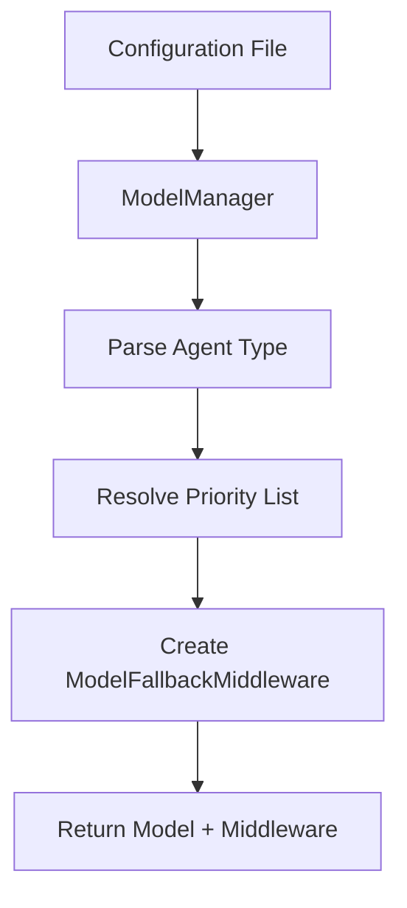

# Model Manager

## Overview

The `ModelManager` class manages Large Language Model (LLM) priorities and creates ModelFallbackMiddleware instances based on configuration. It provides a centralized way to handle model selection and fallback logic across different agent types.

## Architecture

### Core Components

- **ModelManager**: Main class for model configuration and middleware creation
- **ModelFallbackMiddleware**: LangChain middleware for handling model fallbacks
- **Configuration System**: Reads from `addons.settings.llm_config`

### Data Flow



## Class Reference

### ModelManager

#### Constructor

```python
def __init__(self) -> None
```

Initializes the model manager and loads configuration.

#### Methods

##### _load_config()

```python
def _load_config(self) -> None
```

**Description:**
Loads model priorities from `addons.settings.llm_config.model_priorities`. Handles errors gracefully by setting empty priorities and reporting via `func.report_error`.

**Error Handling:**
- Uses `func.report_error` for configuration loading failures
- Sets `self.priorities = {}` as fallback
- Continues operation even with missing configuration

##### _resolve_priority_list()

```python
def _resolve_priority_list(self, agent_type: str) -> List[str]
```

**Parameters:**
- `agent_type`: String identifier for agent type (e.g., "info_model", "message_model")

**Returns:**
- List of model strings in format "provider:model" (e.g., "openai:gpt-4", "anthropic:claude-3")

**Description:**
Converts agent_type configuration into provider:model strings. Supports both dict and list structures in configuration.

**Configuration Examples:**

```yaml
# Dict format
model_priorities:
  info_model:
    - provider: google
      models: [gemini-pro, gemini-pro-vision]
    - provider: openai
      models: [gpt-4, gpt-3.5-turbo]

# List format  
model_priorities:
  - info_model:
    - google: [gemini-pro, gemini-pro-vision]
    - openai: [gpt-4, gpt-3.5-turbo]
  - message_model:
    - anthropic: [claude-3-opus, claude-3-sonnet]
```

##### get_model()

```python
def get_model(self, agent_type: str) -> Tuple[str, ModelFallbackMiddleware]
```

**Parameters:**
- `agent_type`: Agent type identifier

**Returns:**
- Tuple of (primary_model: str, fallback_middleware: ModelFallbackMiddleware)

**Description:**
Public method that returns the primary model string and a ModelFallbackMiddleware instance configured with fallback models.

**Error Handling:**
- Raises `ValueError` if no model priorities configured for agent_type
- Reports errors via `func.report_error` for debugging
- Prevents ambiguous None returns by always raising exceptions

**Example Usage:**

```python
model_manager = ModelManager()

try:
    primary, fallback = model_manager.get_model("info_model")
    print(f"Primary: {primary}")
    print(f"Fallback models: {fallback.fallbacks}")
except ValueError as e:
    print(f"No model configuration: {e}")
```

## Configuration System

### YAML Structure

Model priorities are configured in YAML format:

```yaml
model_priorities:
  info_model:
    - provider: google
      models: [gemini-pro, gemini-pro-vision]
    - provider: openai
      models: [gpt-4, gpt-3.5-turbo]
  message_model:
    - provider: anthropic
      models: [claude-3-opus, claude-3-sonnet]
```

### Provider Support

#### Google
- **Models**: `gemini-pro`, `gemini-pro-vision`
- **API Key**: Set via `GOOGLE_API_KEY` or `GEMINI_API_KEY`

#### OpenAI  
- **Models**: `gpt-4`, `gpt-3.5-turbo`, `gpt-4-turbo`
- **API Key**: Set via `OPENAI_API_KEY`

#### Anthropic
- **Models**: `claude-3-opus`, `claude-3-sonnet`, `claude-3-haiku`
- **API Key**: Set via `ANTHROPIC_API_KEY`

#### Local/Ollama
- **Models**: Depends on local setup
- **Configuration**: Custom provider setup

## Fallback Logic

### Model Fallback Middleware

The `ModelFallbackMiddleware` provides automatic fallback when primary models fail:

1. **Primary Model**: First model in priority list
2. **Fallback Models**: Remaining models in priority list
3. **Automatic Switching**: Falls back to next model on failure
4. **Error Recovery**: Continues with next available model

### Failure Handling

```python
# Example fallback sequence
primary_model = "google:gemini-pro"
fallback_middleware = ModelFallbackMiddleware(
    "openai:gpt-4",
    "anthropic:claude-3-opus"
)

# If gemini-pro fails, automatically try gpt-4, then claude-3-opus
```

## Integration

### With Orchestrator

The ModelManager is initialized in the Orchestrator constructor:

```python
self.model_manager = ModelManager()

# Get models for info_agent
info_model, fallback = self.model_manager.get_model("info_model")

# Get models for message_agent  
message_model, fallback = self.model_manager.get_model("message_model")
```

### With LangChain Agents

```python
# Create agent with fallback middleware
agent = create_agent(
    model=info_model,
    tools=tool_list,
    system_prompt=system_prompt,
    middleware=[fallback_middleware]
)
```

## Error Scenarios

### Common Configuration Errors

1. **Missing Agent Type**: No configuration for requested agent_type
2. **Empty Provider Lists**: Provider configured but no models
3. **Invalid Model Names**: Non-existent model identifiers
4. **Missing API Keys**: Provider not accessible due to missing credentials

### Error Recovery

```python
# Safe usage pattern
try:
    model, fallback = model_manager.get_model(agent_type)
    return model, fallback
except ValueError as e:
    # Use fallback model or default
    logger.warning(f"Model configuration missing for {agent_type}: {e}")
    return "openai:gpt-3.5-turbo", ModelFallbackMiddleware()
```

## Performance Considerations

1. **Configuration Caching**: Model priorities loaded once and cached
2. **Priority Parsing**: Efficient conversion from config to model strings
3. **Memory Usage**: Minimal memory footprint
4. **Error Isolation**: Configuration errors don't affect other agent types

## Testing

### Unit Test Examples

```python
def test_model_manager():
    # Test configuration loading
    manager = ModelManager()
    assert isinstance(manager.priorities, dict)
    
    # Test priority resolution
    priorities = manager._resolve_priority_list("info_model")
    assert all(":" in p for p in priorities)
    
    # Test get_model with valid config
    model, fallback = manager.get_model("info_model")
    assert isinstance(model, str)
    assert isinstance(fallback, ModelFallbackMiddleware)
```

### Configuration Validation

```python
def validate_config(config):
    # Check required structure
    if not isinstance(config, dict):
        return False
        
    # Validate agent types have provider lists
    for agent_type, entries in config.items():
        if not entries:
            return False
            
    return True
```

## Dependencies

- `langchain.agents.middleware.ModelFallbackMiddleware`: LangChain fallback handling
- `addons.settings`: Configuration loading system
- `function.func`: Centralized error reporting
- `asyncio`: Async error reporting support