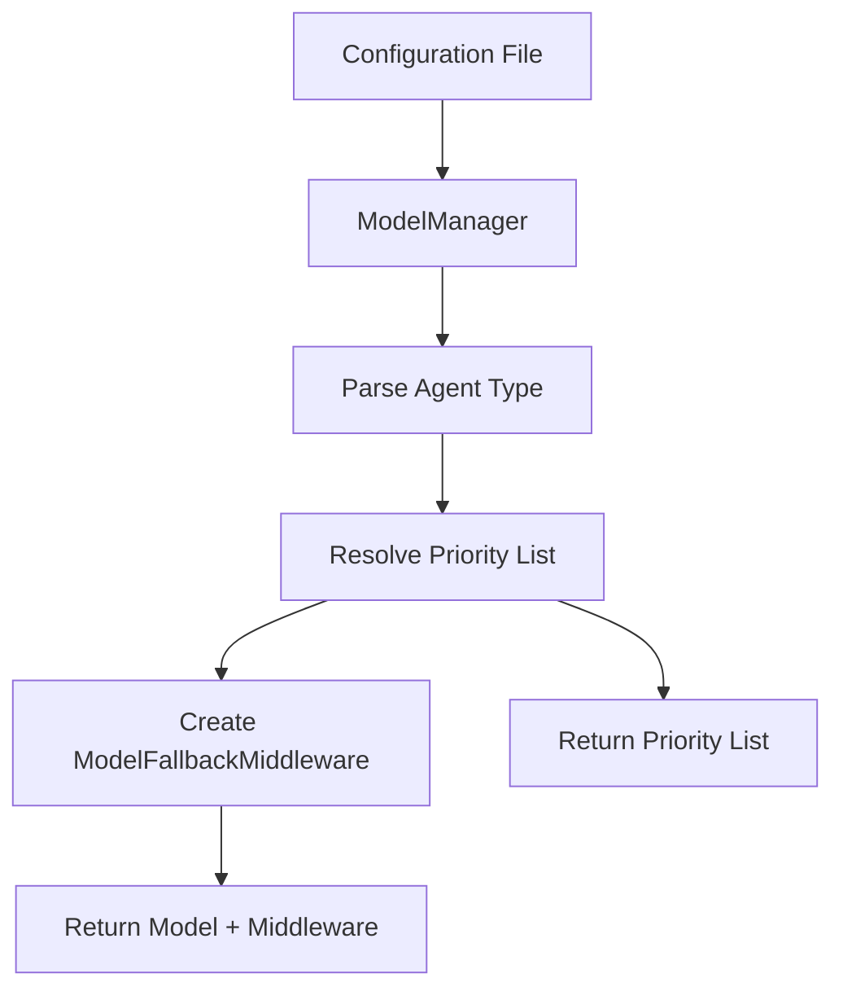

# Model Manager

## Overview

The `ModelManager` class manages Large Language Model (LLM) priorities and configurations. It provides a centralized way to handle model selection, fallback logic, and priority lists for different agent types (`info_model`, `message_model`, etc.).

## Architecture

### Core Components

- **ModelManager**: Main class for model configuration and middleware creation.
- **ModelFallbackMiddleware**: LangChain middleware for handling model fallbacks in non-streaming scenarios.
- **Priority Resolver**: Converts configuration settings into `provider:model` strings.

### Data Flow


```mermaid
graph TD
    A[Configuration File] --> B[ModelManager]
    B --> C[Parse Agent Type]
    C --> D[Resolve Priority List]
    D --> E[Create ModelFallbackMiddleware]
    D --> G[Return Priority List]
    E --> F[Return Model + Middleware]
```

## Class Reference

### ModelManager

#### Methods

##### get_model()
`def get_model(self, agent_type: str) -> Tuple[str, ModelFallbackMiddleware]`
Returns the primary model and a standard LangChain fallback middleware. Use this for standard agent invocations (non-streaming).

##### get_model_priority_list()
`def get_model_priority_list(self, agent_type: str) -> List[str]`
Returns the full list of models in priority order (e.g., `['google:gemini-pro', 'anthropic:claude-3']`). This is essential for **streaming fallback** scenarios where the standard middleware cannot be used.

## streaming Fallback and Circuit Breaker

The `ModelManager` works in tandem with the `CircuitBreaker` (managed in `llm/model_circuit_breaker.py`) to provide high availability:

1.  **Priority Fetching**: The Orchestrator fetches the full priority list from `ModelManager`.
2.  **Circuit Breaker Check**: For each model, it checks the `CircuitBreaker` to see if the model is currently "Open" (recently failed).
3.  **Manual Execution**: The Orchestrator manually iterates through available models to handle streaming data, ensuring that if one fails, the next is tried immediately.

## Configuration

Model priorities are configured in `config/llm.yaml`:

```yaml
model_priorities:
  info_model:
    - google: [gemini-pro, gemini-flash]
    - openai: [gpt-4-turbo]
  message_model:
    - anthropic: [claude-3-sonnet]
    - google: [gemini-pro]
```

### Supported Providers
- **google**: Gemini models (Flash, Pro).
- **openai**: GPT-4, GPT-3.5 series.
- **anthropic**: Claude 3 series.
- **ollama**: Locally hosted models.

## Design Philosophy

- **Centralized Control**: All model selections are managed in one place to avoid hardcoding across cogs.
- **Fail-Fast Fallback**: Priorities are ordered from most capable/expensive to fastest/cheapest.
- **Quota Resilience**: The system is designed to seamlessly transition between providers (e.g., from Google to OpenAI) when API quotas are reached.

---
*For fault tolerance implementation details, see the [Model Circuit Breaker](model_circuit_breaker.md) documentation.*