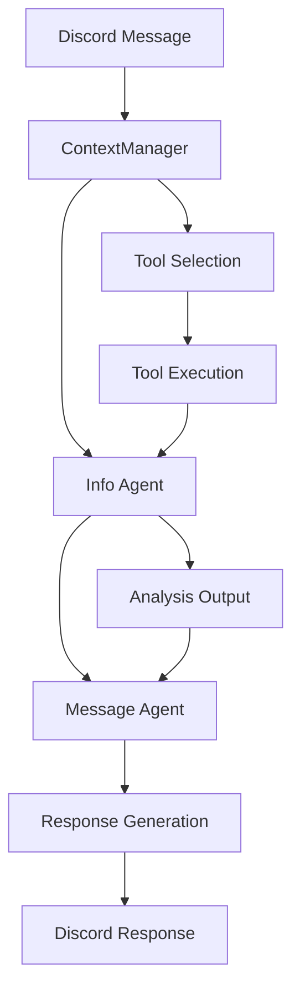
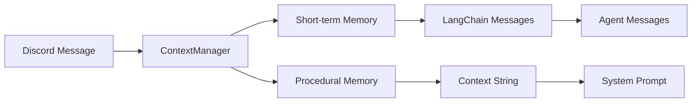

# Orchestrator

## Overview

The `Orchestrator` class serves as the central coordinator for LLM-powered Discord interactions. It manages the flow from incoming Discord messages through agent processing to final response generation, implementing a two-phase agent architecture with information analysis and message generation.

## Architecture

### Core Components

- **DirectToolOutputMiddleware**: Middleware for immediate tool execution
- **ContextManager**: Provides procedural context and short-term memory
- **ModelManager**: Handles model selection and fallbacks
- **ToolsFactory**: Dynamically loads and filters available tools

### Two-Phase Agent System



## Class Reference

### Orchestrator

#### Constructor

```python
def __init__(self, bot: Any) -> None
```

**Parameters:**
- `bot`: Discord bot instance

**Description:**
Initializes the orchestrator with model manager and context manager. Sets up memory providers and handles missing user manager gracefully.

#### Methods

##### handle_message()

```python
async def handle_message(
    self, 
    bot: Any, 
    message_edit: Message, 
    message: Message, 
    logger: Any
) -> OrchestratorResponse
```

**Parameters:**
- `bot`: Discord bot instance
- `message_edit`: Optional message to edit (for streaming responses)
- `message`: Original Discord message
- `logger`: Logger instance

**Returns:**
- `OrchestratorResponse`: Contains reply and tool calls

**Description:**
Main entry point for processing Discord messages. Implements the two-phase agent architecture:

1. **Info Agent Phase**: Analyzes user intent and extracts key information
2. **Message Agent Phase**: Generates final response based on analysis

**Error Handling:**
- Uses resilient error handling throughout the pipeline
- Reports errors via `func.report_error`
- Continues with available data when components fail

##### _build_info_agent_prompt()

```python
def _build_info_agent_prompt(self, bot_id: int, message: Message) -> str
```

**Parameters:**
- `bot_id`: Discord bot user ID
- `message`: Discord message for context

**Returns:**
- System prompt for info agent

**Description:**
Builds system prompt for information analysis agent. Uses configured prompt from `prompt_config` with fallback to default prompt if configuration is missing.

##### _get_info_agent_fallback_prompt()

```python
def _get_info_agent_fallback_prompt(self, bot_id: int) -> str
```

**Parameters:**
- `bot_id`: Discord bot user ID

**Returns:**
- Fallback system prompt

**Description:**
Provides hardcoded fallback prompt when configuration is unavailable. Focuses on information analysis and intent classification.

## Two-Phase Agent Architecture

### Phase 1: Information Agent

**Purpose:** Analyze user messages and extract key information

**Input:**
- Current Discord message
- Short-term memory messages
- Procedural context
- Available tools

**Process:**
1. Load info model via ModelManager
2. Create agent with tool access
3. Analyze message for intent, entities, and requirements
4. Generate structured analysis output

**Output:**
- Information analysis results
- Tool usage logs
- Intent classification

### Phase 2: Message Agent

**Purpose:** Generate final conversational response

**Input:**
- Analysis from info agent
- Procedural context
- System prompt (personality/behavior)
- No tool access (focus on generation)

**Process:**
1. Load message model via ModelManager  
2. Create agent with single call limit
3. Generate response based on analysis and context
4. Stream response to Discord

**Output:**
- Final message response
- Streamed to Discord channel

## Middleware System

### DirectToolOutputMiddleware

```python
class DirectToolOutputMiddleware(AgentMiddleware):
    @hook_config(can_jump_to=["end"])
    def after_tools(self, state, runtime):
        return {"jump_to": "end"}
```

**Purpose:** Immediately after tool execution, skip to agent completion

**Usage:**
- Prevents excessive agent tool interactions
- Forces agent to generate response after tools complete
- Improves response quality and speed

### ModelCallLimitMiddleware

```python
ModelCallLimitMiddleware(run_limit=1, exit_behavior="end")
```

**Purpose:** Limit model calls for message agent

**Configuration:**
- `run_limit=1`: Only one model call allowed
- `exit_behavior="end"`: End execution after call

## Tool Integration

### Dynamic Tool Loading

Tools are loaded dynamically based on user permissions:

```python
runtime_context = OrchestratorRequest(bot=bot, message=message, logger=logger)
tool_list = get_tools(user, guild=guild, runtime=runtime_context)
```

### Tool Filtering

Tools are filtered based on:
- User permissions (admin, moderator)
- Tool requirements (`required_permission` attribute)
- Runtime context availability

## Context Management

### Context Flow



### Context Usage

**For Info Agent:**
- Full context string in system prompt
- Memory messages in agent messages list
- Tools available for analysis

**For Message Agent:**
- Procedural context in system prompt
- Analysis output as messages
- No tool access

## Error Handling Strategy

### Resilient Processing

1. **Context Failures**: Continue with empty context
2. **Model Failures**: Try fallback models
3. **Tool Failures**: Skip unavailable tools
4. **Agent Failures**: Report and fallback to basic response

### Error Reporting

All errors reported via `func.report_error`:
- Context loading failures
- Model selection errors
- Tool execution issues
- Agent processing failures

## Integration Points

### With Bot Components

- **UserDataCog**: Provides user management for procedural memory
- **LanguageManager**: Enables multilingual responses
- **MessageHandler**: Coordinates message processing
- **UpdateManager**: Handles system updates

### With External Systems

- **VectorManager**: Episodic memory retrieval
- **Database Systems**: User data and memory storage
- **API Services**: External tool integrations

## Performance Optimization

### Caching Strategy

- **Model Configuration**: Cached in ModelManager
- **Context Data**: Cached per channel for short-term memory
- **Tool Lists**: Cached with file modification time checks

### Resource Management

- **Model Fallbacks**: Automatic failover to backup models
- **Tool Loading**: Dynamic loading with caching
- **Memory Limits**: Configurable limits for short-term memory

## Configuration

### Model Configuration

```yaml
llm_config:
  model_priorities:
    info_model:
      - provider: google
        models: [gemini-pro]
      - provider: openai
        models: [gpt-4]
    message_model:
      - provider: anthropic
        models: [claude-3-sonnet]
```

### System Prompts

```yaml
prompt_config:
  system_prompts:
    info_agent: "Analysis system prompt..."
    message_agent: "Generation system prompt..."
```

## Usage Examples

### Basic Message Processing

```python
orchestrator = Orchestrator(bot)

# Handle incoming message
response = await orchestrator.handle_message(
    bot=bot,
    message_edit=None,
    message=discord_message,
    logger=logger
)

print(f"Reply: {response.reply}")
print(f"Tools used: {response.tool_calls}")
```

### Custom Tool Integration

```python
# Tools are automatically loaded based on user permissions
# No additional configuration needed

# Tool requirements are checked automatically
# Admin tools only available to admin users
```

## Testing

### Unit Testing

```python
def test_orchestrator_initialization():
    bot = MockBot()
    orchestrator = Orchestrator(bot)
    assert orchestrator.model_manager is not None
    assert orchestrator.context_manager is not None

async def test_message_handling():
    orchestrator = Orchestrator(bot)
    message = MockMessage()
    response = await orchestrator.handle_message(bot, None, message, logger)
    assert isinstance(response, OrchestratorResponse)
```

### Integration Testing

```python
async def test_full_pipeline():
    # Test complete message flow
    message = create_test_message()
    response = await orchestrator.handle_message(bot, None, message, logger)
    
    # Verify agent execution
    assert response.reply is not None
    assert isinstance(response.tool_calls, list)
```

## Dependencies

- `langchain.agents`: Agent creation and management
- `langchain.agents.middleware`: Middleware for agent behavior
- `discord.py`: Discord message handling
- `llm.context_manager`: Context and memory management
- `llm.model_manager`: Model configuration and selection
- `llm.tools_factory`: Dynamic tool loading
- `function.func`: Centralized error reporting