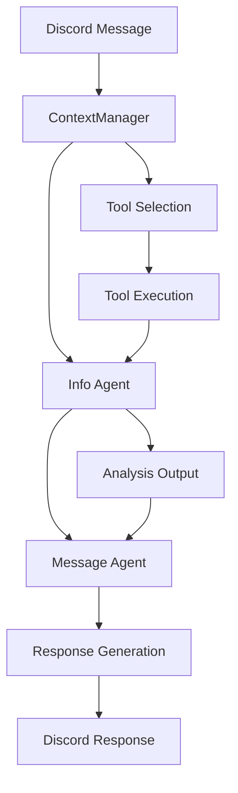

# Orchestrator

## Overview

The `Orchestrator` class serves as the central coordinator for LLM-powered Discord interactions. It implements a sophisticated **Two-Phase Agent Architecture** to ensure high-quality, information-rich responses. It manages the entire lifecycle from capturing incoming Discord messages, gathering multi-layered context, executing information analysis, and finally generating a conversational reply.

## Architecture

### Core Components

- **ContextManager**: Aggregates context from multiple memory providers (Short-term, Procedural, Episodic, Knowledge).
- **ModelManager**: Handles model selection priorities for both analysis and generation phases.
- **ToolsFactory**: Dynamically discovers and filters tools based on user permissions and agent mode.
- **Circuit Breaker**: Tracks model health and automatically skips failing providers to ensure system resilience.
- **ProtectedPromptManager**: Enforces immutable system rules (like output formatting) while allowing personality customization.

### Two-Phase Agent System

```mermaid
graph TD
    A[Discord Message] --> B[ContextManager]
    B --> C[Info Agent]
    C --> D[Message Agent]
    D --> E[Response Generation]
    E --> F[Discord Response]
    
    B --> G[Tool Selection]
    G --> H[Tool Execution]
    H --> C
    
    C --> I[Analysis Output]
    I --> D
```

## Two-Phase Processing Flow

### Phase 1: Information Agent (Info Agent)

**Purpose**: Analyze user intent and extract required information using specialized tools.

1.  **Context Injection**: Injects procedural context (user bio, server rules) and short-term memory directly into the message list.
2.  **Tool Access**: Accesses "Info" mode tools (Search, Memory Retrieval, Activity Stats).
3.  **Sanitization**: Specifically handles Gemini 3.x and Ollama requirements (e.g., converting past tool calls to text to prevent 400 errors).
4.  **Circuit Breaker**: Attempts to run the preferred model; if it fails, the circuit breaker triggers an immediate fallback to the next available provider.

### Phase 2: Message Agent (Generation Agent)

**Purpose**: Formulate the final conversational response based on the Info Agent's analysis.

1.  **Analysis Input**: Receives the raw output and tool results from Phase 1.
2.  **Protected Prompts**: Uses `ProtectedPromptManager` to ensure the bot follows formatting rules (like using `<som>` and `<eom>` tags) regardless of personality settings.
3.  **Streaming Fallback**: Since LangChain's standard middleware doesn't support streaming fallback, the Orchestrator implements a manual fallback loop to ensure the user always receives a response.
4.  **Reasoning Optimization**: Automatically injects thought-budget prompts for reasoning-capable models (e.g., DeepSeek R1, Gemma, Ollama reasoning models).

## Class Reference

### Orchestrator

#### Constructor
`def __init__(self, bot: Any)`
Initializes model manager, context manager, and sets up memory providers (Short-term, Procedural, Episodic, Knowledge) using the bot's resources.

#### Main Entry Point
`async def handle_message(self, bot: Any, message_edit: Message, message: Message, logger: Any) -> OrchestratorResponse`
Processes a Discord message through the two-phase pipeline. Supports streaming updates to the `message_edit` target.

## Key Features

### 🖼️ Image Caching
The orchestrator maintains an `image_cache` during a single message cycle. If multiple fallback models are tried, it avoids redundant downloads of the same image attachments, improving speed and reducing bandwidth.

### 🛡️ Fault Tolerance
- **Circuit Breaker**: Automatically "opens" (skips) models that have recently reached rate limits or returned errors.
- **Resilient Context**: If memory providers fail, the bot continues with an empty context rather than crashing.
- **Manual Fallback**: Guarantees a response even during provider outages.

### 🧠 Model Optimization
- **KV Cache Reuse**: Prompts are ordered (Static System Prompt -> Dynamic User Context) to maximize Key-Value cache efficiency on inference providers.
- **Thought Control**: Injects `reasoning_optimization_prompt` for models known to support chain-of-thought processing.

## Integration Points

- **UserDataCog**: Source of user preferences and memory management.
- **LanguageManager**: Handles dynamic translation of system status messages ("Analyzing...", "Thinking...").
- **DirectToolOutputMiddleware**: Forces the Info Agent to return results immediately after a tool call, preventing infinite loops.

---
*The Orchestrator is designed to be the "brain" of the bot, abstracting away the complexity of model selection and context assembly from the UI layers.*