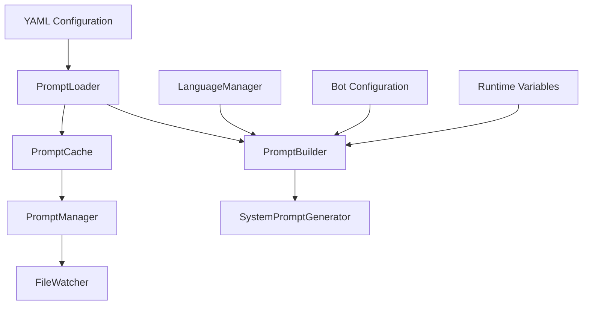

# Prompting System

## Overview

The `llm.prompting` module provides a comprehensive system for managing and building dynamic system prompts for LLM interactions. It features YAML-based configuration, intelligent caching, variable substitution, and multi-language support.

## Architecture

### Core Components



### System Flow

1. **Configuration Loading**: YAML files loaded via PromptLoader
2. **Caching**: Prompts cached with TTL for performance
3. **Building**: PromptBuilder constructs prompts from modules
4. **Language Processing**: LanguageManager handles multi-language support
5. **Runtime Variables**: Dynamic variables injected at runtime

## Module Components

### manager.py - PromptManager

**Central coordinator for prompt management**

```python
class PromptManager:
    """YAML-based system prompt manager."""
    
    def __init__(self, config_path: str = f'{prompt_config.path}/message_agent.yaml'):
        self.config_path = config_path
        self.loader = PromptLoader(config_path)
        self.cache = PromptCache()
        self.builder = PromptBuilder()
        self.file_watcher = FileWatcher()
```

**Key Features:**
- Centralized prompt management
- File watching for live configuration updates
- Multi-instance support with caching
- Fallback prompt system

**Main Methods:**
```python
def get_system_prompt(self, bot_id: str, message=None) -> str
async def reload_prompts(self) -> bool
def compose_prompt(self, modules: Optional[List[str]] = None) -> str
def get_available_modules(self) -> List[str]
```

### builder.py - PromptBuilder

**Constructs prompts from modular components**

```python
class PromptBuilder:
    """提示建構器"""
    
    def build_system_prompt(self, config: dict, modules: List[str]) -> str
    def apply_language_replacements(self, prompt: str, lang: str, lang_manager, mappings: Optional[dict] = None) -> str
    def format_with_variables(self, prompt: str, variables: dict, lang_manager=None, guild_id: Union[str, None] = None) -> str
```

**Module System:**
- **Base Module**: Core instructions
- **Identity Module**: Bot personality and role
- **Language Module**: Language requirements
- **Interaction Module**: Response guidelines
- **Memory Module**: Memory system instructions
- **Professional Module**: Professional behavior

**Language Replacement:**
- Double-brace placeholders: `{{lang.system.chat_bot.language.answer_in}}`
- Single-brace placeholders: `{lang.system.chat_bot.language.answer_in}`
- Automatic translation lookup
- Fallback to original text

### loader.py - PromptLoader

**YAML configuration management**

```python
class PromptLoader:
    """YAML 提示配置載入器"""
    
    def load_yaml_config(self) -> Dict[str, Any]
    def reload_if_changed(self) -> bool
    def get_cached_config(self) -> Optional[Dict[str, Any]]
    def validate_config_structure(self, config: Dict[str, Any]) -> bool
```

**Features:**
- File modification detection
- Configuration validation
- Caching with change detection
- Error handling and logging

### cache.py - PromptCache

**Intelligent caching system**

```python
class PromptCache:
    """智慧快取系統"""
    
    def get(self, key: str) -> Optional[Any]
    def set(self, key: str, value: Any, ttl: int = 3600) -> None
    def precompile_templates(self, config: dict) -> None
    def get_cache_stats(self) -> Dict[str, Any]
```

**Cache Features:**
- TTL-based expiration
- Access count tracking
- Precompiled template combinations
- Thread-safe operations
- Statistics and monitoring

### system_prompt.py - System Prompt Generation

**High-level prompt generation interface**

```python
def get_system_prompt(bot_id: str, message: Optional[discord.Message]) -> str
def get_channel_system_prompt(channel_id: str, guild_id: str, bot_id: str, message: Optional[discord.Message]) -> str
```

**Three-Tier Inheritance:**
1. **Channel Level**: Channel-specific prompts
2. **Guild Level**: Server-level prompts
3. **YAML Level**: Global default prompts

## Configuration Format

### YAML Structure

```yaml
metadata:
  version: "1.0.0"
  cache_ttl: 3600
  description: "Discord Bot System Prompts"

base:
  core_instruction: "You are an AI assistant..."
  bot_name: "🐖🐖"
  creator: "星豬"

composition:
  default_modules:
    - base
    - identity
    - language
    - interaction
    - professional
  module_order:
    - base
    - identity
    - language
    - interaction
    - memory
    - professional

language_replacements:
  mappings:
    "Always answer in Traditional Chinese": "system.chat_bot.language.answer_in"
    "Keep responses concise": "system.chat_bot.language.concise"

identity:
  role: "You are a helpful AI assistant..."
  personality: "Friendly and professional..."

language:
  requirements:
    - "Always answer in Traditional Chinese"
    - "Use casual but respectful tone"

interaction:
  guidelines:
    - "Engage in natural conversations"
    - "Ask clarifying questions when needed"
    - "Be helpful and informative"

memory:
  instructions:
    - "Remember user preferences"
    - "Use context from previous messages"

professional:
  behavior:
    - "Maintain professional standards"
    - "Avoid controversial topics"
    - "Stay within appropriate boundaries"
```

## Variable System

### Runtime Variables

```python
variables = {
    'bot_id': bot_id,
    'bot_owner_id': bot_owner_id,
    'bot_name': bot_name,
    'creator': creator,
    'environment': environment
}
```

### Variable Formatting

```python
# Placeholder replacement
prompt = "You are {bot_name}, created by {creator}."

# Automatic language variable
if 'lang' not in variables:
    variables['lang'] = lang_manager.default_lang
```

### Safe Replacement Logic

1. **Language Placeholders**: Resolved first via LanguageManager
2. **Variable Substitution**: Safe string replacement
3. **Fallback .format()**: For complex templates
4. **Unresolved Detection**: Warning for missing variables

## Language Integration

### Multi-language Support

```python
def apply_language_replacements(self, prompt: str, lang: str, lang_manager, mappings: Optional[dict] = None) -> str
```

**Language Features:**
- Server-specific language detection
- Automatic translation lookup
- Fallback to default language
- Cached translations

**Supported Languages:**
- Traditional Chinese (zh_TW) - Default
- Simplified Chinese (zh_CN)
- English (en_US)
- Japanese (ja_JP)

### Translation Path Resolution

```python
# Resolves paths like:
# system.chat_bot.language.answer_in
# -> "用繁體中文回答"
# system.chat_bot.language.concise  
# -> "保持回答簡潔"
```

## Caching Strategy

### Cache Keys

```python
cache_key = f"system_prompt_{bot_id}_{lang_key}"
```

### Cache Invalidation

- **Manual**: `reload_prompts()` clears cache
- **Automatic**: FileWatcher detects changes
- **TTL-based**: Time-based expiration
- **Language-specific**: Separate cache per language

### Precompilation

```python
# Precompile common module combinations
for i in range(1, len(default_modules) + 1):
    combo = default_modules[:i]
    cache_key = '_'.join(combo)
    precompiled_cache[f"combo_{cache_key}"] = combo
```

## Integration Points

### With Orchestrator

```python
# System prompt generation
message_system_prompt = get_system_prompt(bot.user.id, message)

# Channel-specific prompts
channel_prompt = get_channel_system_prompt(
    str(message.channel.id), 
    str(message.guild.id), 
    bot_id, 
    message
)
```

### With LangChain Agents

```python
# Agent creation with system prompt
agent = create_agent(
    model=model,
    tools=tool_list,
    system_prompt=system_prompt
)
```

### With LanguageManager

```python
# Server language detection
guild_id = str(message.guild.id)
server_lang = lang_manager.get_server_lang(guild_id)

# Translation lookup
translation = lang_manager.translate(guild_id, 'common', 'responses', 'processing')
```

## File Watching

### Automatic Reloading

```python
file_watcher.watch_file(config_path, self._on_config_changed)

def _on_config_changed(self, path: str):
    if self.reload_prompts():
        self.logger.info("Configuration reloaded successfully")
```

### Change Detection

- File modification time monitoring
- Immediate reload on changes
- Validation after reload
- Error handling for invalid configurations

## Performance Optimization

### Efficiency Features

1. **Caching**: Prompts cached with TTL
2. **Precompilation**: Common combinations pre-built
3. **Lazy Loading**: Configuration loaded on demand
4. **Thread Safety**: RLock for cache operations
5. **Memory Management**: Efficient template storage

### Memory Usage

- **Cache Size**: Configurable TTL
- **Template Storage**: Precompiled combinations
- **Language Cache**: Translation lookups cached
- **Module Cache**: Configuration sections cached

## Error Handling

### Resilient Design

- **Configuration Errors**: Fallback to defaults
- **Language Failures**: Use original text
- **File Watcher Failures**: Manual reload available
- **Cache Errors**: Regenerate prompts

### Fallback Strategy

```python
def _get_fallback_prompt(self, bot_id: str) -> str:
    return '''You are an AI chatbot named 🐖🐖 <@{bot_id}>, created by 星豬<@{bot_owner_id}>.
    
    1. Personality: Keep responses friendly and helpful.
    2. Language: Answer in Traditional Chinese.
    3. Interaction: Be concise and engaging.'''
```

## Testing

### Configuration Validation

```python
def test_config_validation():
    config = loader.load_yaml_config()
    assert manager._validate_config(config)

def test_prompt_building():
    prompt = builder.build_system_prompt(config, ['base', 'identity'])
    assert 'You are' in prompt
```

### Cache Operations

```python
def test_cache_functionality():
    cache.set("test", "value", ttl=3600)
    assert cache.get("test") == "value"
    
    cache.precompile_templates(config)
    stats = cache.get_cache_stats()
    assert stats['total_items'] > 0
```

### Language Integration

```python
def test_language_replacement():
    prompt = "Always {lang.system.chat_bot.language.answer_in}"
    result = builder.apply_language_replacements(prompt, "zh_TW", lang_manager)
    assert "用繁體中文回答" in result
```

## Dependencies

- `yaml`: YAML configuration parsing
- `opencc`: Traditional/Simplified Chinese conversion
- `discord.py`: Discord message handling
- `addons.settings`: Configuration management
- `function.func`: Centralized error reporting
- `llm.utils.file_watcher`: File monitoring
- `asyncio`: Async operations