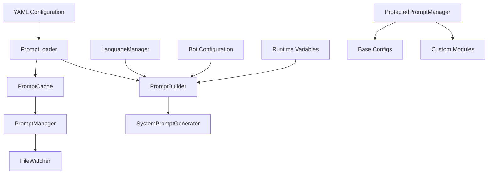

# Prompting System

## Overview

The `llm.prompting` module provides a comprehensive system for managing and building dynamic system prompts for LLM interactions. It features YAML-based configuration, intelligent caching, variable substitution, and a **Protected Prompt System** to ensure core logic stability.

## Architecture

### Core Components

```mermaid
graph TD
    A[YAML Configuration] --> B[PromptLoader]
    B --> C[PromptCache]
    B --> D[PromptBuilder]
    C --> E[PromptManager]
    D --> F[SystemPromptGenerator]
    E --> G[FileWatcher]
    
    H[LanguageManager] --> D
    I[Bot Configuration] --> D
    J[Runtime Variables] --> D
    
    K[ProtectedPromptManager] --> L[Base Configs]
    K --> M[Custom Modules]
```

## Prompt Managers

### 1. PromptManager (`manager.py`)
The standard manager used for general prompts and secondary agents. It supports modular construction from YAML configuration and hot-reloading via file watchers.

### 2. ProtectedPromptManager (`protected_prompt_manager.py`)
The primary manager for the **Message Agent**. It implements a two-tier permission system:
- **Protected Modules**: Critical logic (Formatting, Memory Handling, Error Logic) that is **always** loaded from immutable base configurations.
- **Customizable Modules**: Identity and personality traits that can be safely overridden by users or server admins without breaking the bot's parsing logic.

*For more details, see the [Protected Prompt System](../protected_prompt_system.md) documentation.*

## Module Components

### builder.py - PromptBuilder
**Constructs prompts from modular components**
- **Language Replacement**: Resolves `{{lang.key}}` placeholders via the `LanguageManager`.
- **Variable Injection**: Injects runtime data like `{bot_name}`, `{creator}`, and `{environment}`.
- **KV Cache Optimization**: Ensures the stable parts of the prompt are at the beginning to improve model performance.

### loader.py - PromptLoader
**YAML configuration management**
- Detects file changes and reloads configurations automatically.
- Validates YAML structure to prevent runtime crashes.
- Implements thread-safe loading.

### cache.py - PromptCache
**Intelligent caching system**
- **TTL Support**: Entries expire after a configurable time (default 3600s).
- **Precompilation**: Pre-builds common module combinations to reduce latency.
- **Access Tracking**: Monitors which prompts are used most frequently.

## Variable System

### Runtime Variables
The following variables are automatically available for substitution in templates:
- `{bot_id}`: The Discord ID of the bot.
- `{bot_owner_id}`: The Discord ID of the bot creator.
- `{bot_name}`: The display name of the bot.
- `{creator}`: The name of the creator (StarPig).
- `{environment}`: Usually "Discord server".

### Language Integration
Placeholders in the format `{{lang.path.to.key}}` are automatically looked up in the translation JSON files for the current guild. This allows the system prompt to instruct the model in its "native" language about specific server rules.

## Design Philosophy

1.  **Immutability for Core Logic**: System-critical instructions (like using `<som>`/`<eom>` tags) must never be customizable by users to prevent bot breakage.
2.  **Modular Composition**: Prompts are built from discrete modules (Identity, Memory, Language, etc.) rather than one giant string.
3.  **Language Awareness**: The prompt itself adapts to the server's language settings.
4.  **Fault Tolerance**: If a configuration file is corrupted, the system falls back to a hardcoded "Emergency Prompt" to keep the bot functional.

---
*The prompting system is designed to provide the LLM with the most relevant and stable instructions possible, balanced between developer control and user customization.*