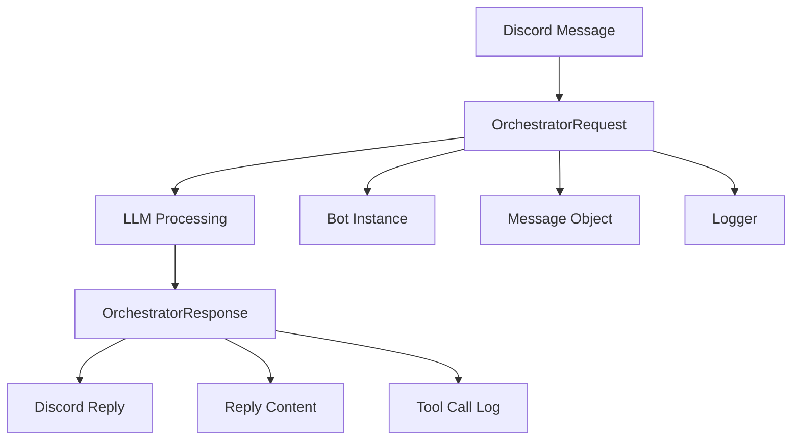

# Schema

## Overview

The `schema.py` module defines LangChain-compatible data structures for Discord bot requests and responses. These Pydantic models ensure type safety and validation across the LLM integration layer.

## Data Models

### OrchestratorRequest

```python
@dataclass
class OrchestratorRequest:
    bot: Any
    message: Message
    logger: Any
```

**Purpose:** Contains runtime context for orchestrator operations

**Fields:**
- `bot`: Discord bot instance
- `message`: Discord message object being processed
- `logger`: Logger instance for this request

**Usage:**
```python
runtime_context = OrchestratorRequest(
    bot=discord_bot,
    message=discord_message,
    logger=logging_logger
)
```

### OrchestratorResponse

```python
class OrchestratorResponse(BaseModel):
    """Response model returned by the orchestrator."""
    
    reply: Any | None = Field(default=None, description="Agent reply or structured response.")
    tool_calls: List[Dict] | None = Field(
        default=None, description="List of tool call records (each item is a dict)."
    )
```

**Purpose:** Standardized response format from orchestrator to Discord

**Fields:**
- `reply`: The agent's reply or structured response (type varies by provider)
- `tool_calls`: Optional list of tool call records represented as dicts

**Field Details:**

#### reply
- **Type:** `Any | None`
- **Default:** `None`
- **Description:** Contains the final response from the LLM agent
- **Format:** Varies by provider (string, dict, structured object)

#### tool_calls
- **Type:** `List[Dict] | None`
- **Default:** `None`
- **Description:** List of tool execution records
- **Structure:** Each dict contains:
  ```python
  {
      "tool": str,  # Tool name
      "args": Any   # Tool arguments
  }
  ```

**Usage:**
```python
response = OrchestratorResponse(
    reply="Hello! How can I help you today?",
    tool_calls=[
        {"tool": "search_episodic_memory", "args": {"query": "user preferences"}},
        {"tool": "calculate_math", "args": {"expression": "2 + 2"}}
    ]
)
```

## Data Flow



## Type Compatibility

### Discord Integration

The schema ensures compatibility with Discord.py:

```python
import discord
from discord import Message

# OrchestratorRequest expects Discord Message objects
def process_message(message: Message):
    request = OrchestratorRequest(
        bot=message.guild.me._state._get_client(),
        message=message,
        logger=get_logger()
    )
```

### LangChain Integration

Types are compatible with LangChain components:

```python
from langchain_core.messages import BaseMessage

# Schema supports LangChain message types
messages: List[BaseMessage] = []
reply: str = "Response content"
```

### Provider Flexibility

Schema accommodates different LLM providers:

```python
# OpenAI response format
reply = "text response"

# Claude/Anthropic response format  
reply = {"content": "structured response"}

# Custom provider format
reply = {"response": "custom format", "metadata": {}}
```

## Validation

### Pydantic Validation

OrchestratorResponse uses Pydantic for validation:

```python
# Valid response
response = OrchestratorResponse(
    reply="Hello world",
    tool_calls=[{"tool": "test", "args": {}}]
)

# Invalid - missing required structure
try:
    response = OrchestratorResponse(
        reply=123,  # Invalid type
        tool_calls="not a list"  # Invalid type
    )
except ValidationError as e:
    print(e)
```

### Field Constraints

- `reply`: Any type allowed (flexible for different providers)
- `tool_calls`: Must be List[Dict] or None if provided
- Both fields are optional (default to None)

## Serialization

### JSON Compatibility

Schema is JSON-serializable:

```python
import json

response = OrchestratorResponse(reply="Test")
json_data = response.model_dump_json()
parsed = OrchestratorResponse.model_validate_json(json_data)
```

### Dict Conversion

```python
response = OrchestratorResponse(reply="Test", tool_calls=[{"tool": "test"}])
data_dict = response.model_dump()
```

## Error Handling

### Graceful Degradation

Schema supports partial responses:

```python
# Only reply, no tool calls
response = OrchestratorResponse(reply="Response text")

# Only tool calls, no reply
response = OrchestratorResponse(tool_calls=[{"tool": "search", "args": {}}])

# Neither (both None)
response = OrchestratorResponse()
```

### Error Response Format

```python
# Standard error response
error_response = OrchestratorResponse(
    reply="I encountered an error processing your request.",
    tool_calls=None
)
```

## Usage Patterns

### Standard Flow

```python
async def handle_discord_message(message):
    # Create request
    request = OrchestratorRequest(
        bot=message.guild.me._state._get_client(),
        message=message,
        logger=get_logger()
    )
    
    # Process through orchestrator
    result = await orchestrator.process(request)
    
    # Return response
    return OrchestratorResponse(
        reply=result.generated_text,
        tool_calls=result.tools_used
    )
```

### Tool-Only Response

```python
# When LLM only needs to execute tools
response = OrchestratorResponse(
    reply=None,
    tool_calls=[{"tool": "set_reminder", "args": {"time": "5m", "message": "test"}}]
)
```

### Text-Only Response

```python
# When no tools needed
response = OrchestratorResponse(
    reply="Here's your answer!",
    tool_calls=None
)
```

## Integration Points

### With Orchestrator

```python
# Orchestrator creates response
resp = OrchestratorResponse.construct()
resp.reply = message_result
resp.tool_calls = [
    {"tool": getattr(t, "name", repr(t)), "args": getattr(t, "args", None)} 
    for t in tool_list
]
```

### With Discord Handler

```python
# Message handler consumes response
if response.reply:
    await message.channel.send(response.reply)

if response.tool_calls:
    logger.info(f"Tools executed: {response.tool_calls}")
```

### With Tool System

```python
# Tools report execution
tool_calls = []
for tool in executed_tools:
    tool_calls.append({
        "tool": tool.name,
        "args": tool.args
    })
```

## Testing

### Unit Tests

```python
def test_orchestrator_response_creation():
    response = OrchestratorResponse(
        reply="Test response",
        tool_calls=[{"tool": "test", "args": {}}]
    )
    assert response.reply == "Test response"
    assert len(response.tool_calls) == 1

def test_orchestrator_response_defaults():
    response = OrchestratorResponse()
    assert response.reply is None
    assert response.tool_calls is None
```

### Serialization Tests

```python
def test_response_serialization():
    response = OrchestratorResponse(reply="Test")
    json_str = response.model_dump_json()
    parsed = OrchestratorResponse.model_validate_json(json_str)
    assert parsed.reply == "Test"
```

### Validation Tests

```python
def test_response_validation():
    # Valid cases
    OrchestratorResponse(reply="test")
    OrchestratorResponse(tool_calls=[{"tool": "test"}])
    OrchestratorResponse()  # All optional
    
    # Invalid cases would raise ValidationError
    # (testing implementation depends on validation needs)
```

## Dependencies

- `pydantic.BaseModel`: Core model definition
- `pydantic.Field`: Field customization and validation
- `dataclasses.dataclass`: OrchestratorRequest structure
- `typing`: Type annotations
- `discord.Message`: Discord message type