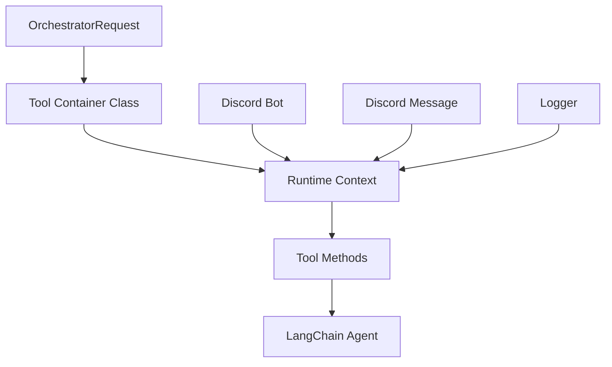

# Tools System

## Overview

The `llm.tools` module provides a comprehensive collection of LangChain-compatible tools for LLM agents to interact with the Discord bot's various capabilities. Each tool is designed as a container class that provides runtime-bound tools for specific functionality.

## Architecture

### Tool Container Pattern



### Tool Categories

1. **Memory Tools**: Episodic memory and user data management
2. **Content Tools**: Image generation and processing
3. **Information Tools**: Internet search and retrieval
4. **Utility Tools**: Math calculations and reminders
5. **Meta Tools**: Tool discovery and overview

## Available Tools

### Episodic Memory Tools (`episodic_memory.py`)

**Purpose**: Long-term memory search using vector storage

```python
class EpisodicMemoryTools:
    def get_tools(self):
        @tool
        async def search_episodic_memory(
            vector_query: Optional[str] = None,
            keyword_query: Optional[str] = None,
            user_id: Optional[str] = None,
            global_search: bool = False
        ) -> str:
```

**Features:**
- **Hybrid Search**: Combines semantic vector search with keyword matching
- **Scope Control**: Search current channel or all channels
- **User Filtering**: Filter by specific user ID
- **Rich Results**: Returns formatted summaries with metadata

**Usage Example:**
```python
# Semantic search
search_episodic_memory(vector_query="last discussion about database")

# Keyword search  
search_episodic_memory(keyword_query="Qdrant migration")

# Combined search
search_episodic_memory(
    vector_query="user preferences", 
    keyword_query="food likes",
    user_id="12345"
)
```

### Image Generation Tools (`image.py`)

**Purpose**: AI-powered image generation and editing

```python
class ImageTools:
    def get_tools(self):
        @tool
        async def generate_image(
            prompt: str, 
            image_url: Optional[str] = None
        ) -> str:
```

**Features:**
- **Text-to-Image**: Generate images from text descriptions
- **Image-to-Image**: Edit existing images using prompts
- **Format Support**: Handles various image formats
- **Error Handling**: Comprehensive error reporting

**Usage Example:**
```python
# Generate new image
generate_image(prompt="A beautiful sunset over mountains")

# Edit existing image
generate_image(
    prompt="Make the sky more dramatic",
    image_url="https://example.com/image.jpg"
)
```

### Internet Search Tools (`internet_search.py`)

**Purpose**: Web search capabilities with grounding

```python
class InternetSearchTools:
    def get_tools(self):
        @tool
        async def internet_search(
            query: str,
            search_type: Literal["general", "youtube", "eat"] = "general",
            search_instructions: str = ""
        ) -> str:
```

**Features:**
- **Multiple Providers**: Gemini grounding with Selenium fallback
- **Search Types**: General, YouTube, and restaurant search
- **Grounding Support**: Structured search instructions
- **Provider Metadata**: Returns search provider and duration

**Usage Example:**
```python
# General search
internet_search(query="latest AI developments")

# YouTube search
internet_search(
    query="Python tutorial",
    search_type="youtube"
)

# Restaurant search
internet_search(
    query="best pizza places in Taipei",
    search_type="eat",
    search_instructions="prefer recent reviews from local sources"
)
```

### Math Calculation Tools (`math.py`)

**Purpose**: Mathematical expression evaluation

```python
class MathTools:
    def get_tools(self):
        @tool
        async def calculate_math(expression: str) -> str:
```

**Features:**
- **Expression Support**: Basic arithmetic and advanced functions
- **Security**: Safe evaluation environment
- **Error Handling**: Comprehensive error reporting
- **Real-time Calculation**: Instant results

**Usage Example:**
```python
calculate_math(expression="2 + 2")
calculate_math(expression="sqrt(16)")
calculate_math(expression="sin(pi/2)")
```

### Reminder Tools (`reminder.py`)

**Purpose**: User reminder management

```python
class ReminderTools:
    def get_tools(self):
        @tool
        async def set_reminder(
            time_str: str, 
            message: str, 
            user_id: Optional[int] = None
        ) -> str:
```

**Features:**
- **Natural Language**: Parse natural time expressions
- **User Targeting**: Set reminders for specific users
- **Flexible Scheduling**: Relative and absolute time support
- **Error Handling**: Graceful failure handling

**Usage Example:**
```python
# Set reminder for message author
set_reminder(time_str="10 minutes", message="Meeting starts soon!")

# Set reminder for specific user
set_reminder(
    time_str="tomorrow 3pm", 
    message="Doctor appointment",
    user_id=123456789
)
```

### Tools Overview Tools (`tools_overview.py`)

**Purpose**: Dynamic tool discovery and description

```python
class ToolsOverviewTools:
    def get_tools(self):
        @tool
        async def list_tools() -> str:
```

**Features:**
- **Dynamic Discovery**: Automatically finds available tools
- **Rich Metadata**: Tool names, signatures, descriptions
- **Module Attribution**: Shows tool source module
- **Error Resilience**: Continues on individual tool failures

**Usage Example:**
```python
list_tools()
# Returns formatted list of all available tools
```

### User Memory Tools (`user_data.py`)

**Purpose**: Personal user memory management

```python
class UserMemoryTools:
    def get_tools(self):
        @tool
        async def read_user_memory(user_id: int) -> str:
        @tool
        async def save_user_memory(user_id: int, memory_to_save: str) -> str:
```

**Features:**
- **Read Operations**: Retrieve stored user preferences
- **Write Operations**: Save new user memories
- **Intelligent Merging**: Merge with existing data
- **Fallback Logic**: Handle invalid user IDs gracefully

**Usage Example:**
```python
# Read user memory
read_user_memory(user_id=12345)

# Save user memory
save_user_memory(
    user_id=12345, 
    memory_to_save="User prefers casual conversation style"
)
```

## Tool Implementation Pattern

### Container Class Structure

```python
class ExampleTools:
    def __init__(self, runtime: "OrchestratorRequest"):
        self.runtime = runtime
    
    def get_tools(self) -> list:
        runtime = self.runtime
        
        @tool
        async def example_tool(param: str) -> str:
            """Tool description with usage guidance."""
            # Get runtime context
            bot = getattr(runtime, "bot", None)
            message = getattr(runtime, "message", None)
            logger = getattr(runtime, "logger", None)
            
            # Implementation
            result = await perform_operation()
            
            return result
        
        return [example_tool]
```

### Runtime Context

Each tool receives the orchestrator runtime context:

```python
class OrchestratorRequest:
    bot: Any              # Discord bot instance
    message: Message      # Discord message object
    logger: Any           # Logger instance
    message_to_edit: Optional[Message]  # For editing responses
```

## Integration with Orchestrator

### Tool Loading

```python
# Tools are automatically loaded by ToolsFactory
runtime_context = OrchestratorRequest(bot=bot, message=message, logger=logger)
tool_list = get_tools(user, guild=guild, runtime=runtime_context)

# Tools are filtered by permissions
# Admin-only tools require admin privileges
# Moderator tools require moderator privileges
# Public tools available to all users
```

### Agent Creation

```python
# Tools are passed to LangChain agents
agent = create_agent(
    model=model,
    tools=tool_list,
    system_prompt=system_prompt,
    middleware=[fallback_middleware]
)
```

## Permission System

### Tool Requirements

Tools can declare permission requirements:

```python
class AdminTool(BaseTool):
    required_permission = "admin"  # Only admins can use

class ModTool(BaseTool):
    required_permission = "moderator"  # Only moderators can use

class PublicTool(BaseTool):
    # No requirement - public access
    pass
```

### Permission Checking

```python
# Permission checking is automatic
user_permissions = {
    "is_admin": is_admin_user,
    "is_moderator": is_moderator_user
}

# Tools filtered based on permissions
filtered_tools = []
for tool in collected_tools:
    required = getattr(tool, "required_permission", None)
    if required is None or has_permission(required, user_permissions):
        filtered_tools.append(tool)
```

## Error Handling

### Consistent Error Reporting

All tools use `func.report_error` for error reporting:

```python
try:
    result = await perform_operation()
    return result
except Exception as e:
    await func.report_error(e, f"Tool {tool_name} failed")
    return f"Error: {e}"
```

### Graceful Degradation

- Tool failures don't break other tools
- Partial functionality maintained when possible
- User-friendly error messages
- Automatic retry for transient failures

## Performance Considerations

### Caching

- Tool lists cached with file modification checks
- Runtime context binding minimizes repeated operations
- Database connections reused across tool calls

### Async Operations

- All tool methods are async for performance
- Concurrent tool execution supported
- Proper cleanup of resources

### Memory Management

- Tools loaded on demand
- Runtime context objects reused
- Cleanup of temporary resources

## Testing

### Unit Testing

```python
def test_tool_creation():
    runtime = MockRuntime()
    tools = ExampleTools(runtime).get_tools()
    assert len(tools) > 0
    assert all(hasattr(tool, '__name__') for tool in tools)

async def test_tool_execution():
    runtime = MockRuntime()
    tool = ExampleTools(runtime).get_tools()[0]
    result = await tool.afunc("test_param")
    assert result is not None
```

### Integration Testing

```python
async def test_tool_with_orchestrator():
    # Test tool integration with orchestrator
    runtime_context = OrchestratorRequest(bot=bot, message=message, logger=logger)
    tools = get_tools(user, guild, runtime_context)
    
    agent = create_agent(model, tools, system_prompt)
    result = await agent.ainvoke({"messages": messages})
    
    assert result is not None
```

## Dependencies

- `langchain_core.tools.BaseTool`: Base tool class
- `langchain_core.tools.tool`: Tool decorator
- `discord.py`: Discord integration
- `function.func`: Centralized error reporting
- `llm.schema.OrchestratorRequest`: Runtime context
- `asyncio`: Async operations
- `PIL`: Image processing (for image tools)
- `aiohttp`: HTTP requests (for internet search)
- `pdf2image`: PDF processing (for media tools)
- `sympy`: Mathematical expressions (for math tools)