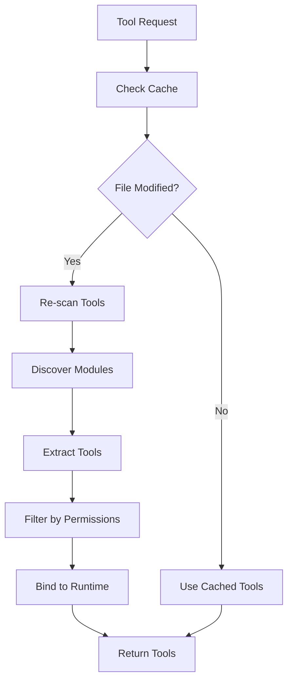

# Tools Factory

## Overview

The `tools_factory.py` module provides a factory system for dynamically loading and filtering LangChain tools based on user permissions. It automatically discovers tools from the `llm/tools/` package and provides permission-based access control for Discord users.

## Architecture

### Core Components

- **Tool Discovery System**: Automatically discovers modules in `llm/tools/`
- **Permission Filter**: Filters tools based on user permissions
- **Caching System**: Caches discovered tools for performance
- **Runtime Binding**: Binds tools to specific runtime contexts

### Tool Loading Flow



## Class Reference

### Main Functions

#### get_tools()

```python
def get_tools(
    user: discord.Member, 
    guild: discord.Guild, 
    runtime: OrchestratorRequest
) -> List[BaseTool]
```

**Parameters:**
- `user`: Discord user requesting tools
- `guild`: Discord guild (server) context
- `runtime`: Orchestrator runtime context

**Returns:**
- `List[BaseTool]`: Filtered and bound tool list

**Description:**
Main entry point for tool discovery and filtering. Implements the complete tool loading pipeline with caching, discovery, filtering, and binding.

#### _discover_tools_package()

```python
def _discover_tools_package() -> Iterable[Any]
```

**Returns:**
- Iterable of imported module objects

**Description:**
Discovers and imports all modules from the `llm/tools/` directory. Handles import errors gracefully and provides debug logging for troubleshooting.

#### _extract_tools_from_module()

```python
def _extract_tools_from_module(mod: Any, runtime: "OrchestratorRequest") -> List[Any]
```

**Parameters:**
- `mod`: Python module object
- `runtime`: Runtime context for tool binding

**Returns:**
- List of tool objects from the module

**Description:**
Extracts tools from a module using two strategies:

1. **Module-level get_tools()**: Calls `module.get_tools(runtime)` if available
2. **Class-based tools**: Instantiates `*Tools` classes and calls their `get_tools()` methods

#### _is_decorated_tool()

```python
def _is_decorated_tool(obj: Any) -> bool
```

**Parameters:**
- `obj`: Object to check

**Returns:**
- `True` if the object is a valid tool, `False` otherwise

**Description:**
Determines if an object is a valid LangChain tool by checking:
- BaseTool instance type
- Tool decorator attributes (`_is_tool`, `is_tool`, `__langchain_tool__`)
- Wrapper patterns and module signatures

## Tool Discovery Strategy

### Module Structure

Tools are expected to follow this pattern:

```python
# llm/tools/example_tool.py
from langchain_core.tools import tool

class ExampleTools:
    def __init__(self, runtime):
        self.runtime = runtime
    
    def get_tools(self):
        @tool
        async def example_tool(param: str) -> str:
            """Example tool description."""
            # Tool implementation
            return "result"
        
        return [example_tool]
```

### Alternative Patterns

#### Module-level get_tools()

```python
# llm/tools/example_tool.py
@tool
async def example_tool(param: str) -> str:
    """Example tool description."""
    return "result"

def get_tools(runtime):
    return [example_tool]
```

#### Multiple Tool Classes

```python
# llm/tools/combined_tools.py
class FirstTools:
    def get_tools(self):
        return [tool1, tool2]

class SecondTools:
    def get_tools(self):
        return [tool3, tool4]
```

## Permission System

### Permission Types

#### User Permissions

```python
def _get_user_permissions(user: discord.Member, guid: discord.Guild) -> dict
```

**Returns:**
```python
{
    "is_admin": bool,
    "is_moderator": bool
}
```

**Description:**
Retrieves Discord user permissions using the PermissionValidator system.

#### Tool Requirements

Tools can declare required permissions:

```python
# Admin-only tool
class AdminTool(BaseTool):
    required_permission = "admin"

# Moderator tool  
class ModTool(BaseTool):
    required_permission = "moderator"

# Public tool
class PublicTool(BaseTool):
    # No permission requirement
    pass
```

### Permission Filtering Logic

```python
for tool in collected_tools:
    required = getattr(tool, "required_permission", None)
    
    if required is None:
        result.append(tool)  # Public access
        continue
    
    # Check permissions
    if "admin" in required_set and perms.get("is_admin"):
        result.append(tool)
    elif "moderator" in required_set and perms.get("is_moderator"):
        result.append(tool)
```

## Caching System

### Cache Structure

```python
_cached_collected_tools: Optional[List[Any]] = None
_cached_collected_mtime: float = 0.0
_cache_lock = threading.Lock()
```

### Cache Invalidation

Cache is invalidated when:
- First access (cache is None)
- File modification time changes
- Directory structure changes

```python
current_mtime = _compute_pkg_dir_mtime(pkg_dir)
if _cached_collected_tools is None or current_mtime != _cached_collected_mtime:
    # Re-scan and update cache
    temp_collected = []
    for mod in _discover_tools_package():
        temp_collected.extend(_extract_tools_from_module(mod, runtime))
    _cached_collected_tools = temp_collected
    _cached_collected_mtime = current_mtime
```

## Tool Binding

### Runtime Context

Tools are bound to the orchestrator runtime context:

```python
runtime_context = OrchestratorRequest(bot=bot, message=message, logger=logger)

# Tools get access to:
# - runtime.bot: Discord bot instance
# - runtime.message: Current Discord message
# - runtime.logger: Logger for the operation
```

### Tool Availability

Available tools are automatically discovered from:

- **episodic_memory**: Long-term memory search
- **image**: AI image generation
- **internet_search**: Web search capabilities
- **math**: Mathematical calculations
- **reminder**: User reminders
- **tools_overview**: Tool discovery
- **user_data**: User memory management

## Error Handling

### Resilient Discovery

- Import failures don't stop other modules from being discovered
- Individual tool extraction errors are reported but don't break the process
- Tool filtering errors are caught and logged

### Error Reporting

All errors are reported via `func.report_error`:
- Module import failures
- Tool extraction errors
- Permission checking errors
- Runtime binding issues

## Performance Optimization

### Thread Safety

- Uses `threading.RLock` for cache access
- Prevents race conditions during tool discovery

### Efficient Scanning

- Only scans modified files based on mtime
- Uses pkgutil for efficient module discovery
- Minimizes I/O operations through caching

### Memory Management

- Caches tool lists to avoid repeated scanning
- Invalidates cache only when necessary
- Uses generators for memory-efficient processing

## Configuration

### Tool Directories

Tools are loaded from:
- Primary: `llm/tools/` directory
- Module structure: Each file represents a tool category

### Permission Integration

Permission checking integrates with:
- `cogs.system_prompt.permissions`: PermissionValidator
- Discord role system: Admin and moderator roles
- Custom permission attributes on tools

## Usage Examples

### Basic Tool Loading

```python
# Get tools for a user
user = message.author
guild = message.guild
runtime = OrchestratorRequest(bot=bot, message=message, logger=logger)

tools = get_tools(user, guild, runtime)

print(f"Available tools: {[tool.name for tool in tools]}")
```

### Permission-Based Access

```python
# Admin user gets all tools
admin_tools = get_tools(admin_user, guild, runtime)

# Regular user gets limited tools  
regular_tools = get_tools(regular_user, guild, runtime)

# Admin tools only
admin_only = [tool for tool in admin_tools if hasattr(tool, 'required_permission')]
```

### Tool Integration

```python
# Use tools with agent
tools = get_tools(user, guild, runtime)

agent = create_agent(
    model=model,
    tools=tools,
    system_prompt=prompt
)

result = await agent.ainvoke({"messages": messages})
```

## Testing

### Unit Tests

```python
def test_tool_discovery():
    modules = _discover_tools_package()
    assert len(modules) > 0

def test_tool_extraction():
    from llm.tools.example import ExampleTools
    runtime = MockRuntime()
    tools = _extract_tools_from_module(ExampleTools, runtime)
    assert len(tools) > 0

def test_permission_filtering():
    tools = get_tools(user, guild, runtime)
    # Verify permission filtering works
```

### Integration Tests

```python
async def test_full_tool_loading():
    tools = get_tools(user, guild, runtime)
    
    # Verify tool types
    for tool in tools:
        assert isinstance(tool, BaseTool)
    
    # Verify tool functionality
    for tool in tools:
        result = await tool.afunc("test_param")
        assert result is not None
```

## Dependencies

- `langchain_core.tools.BaseTool`: LangChain tool base class
- `discord.py`: Discord user and guild objects
- `pkgutil`: Module discovery utilities
- `importlib`: Dynamic module importing
- `threading`: Thread-safe caching
- `function.func`: Centralized error reporting
- `llm.schema.OrchestratorRequest`: Runtime context type