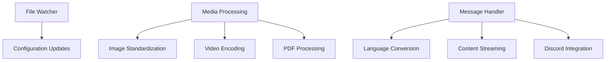

# Utils System

## Overview

The `llm.utils` module provides essential utility functions and classes for the LLM integration system. These utilities support core functionality like file monitoring, media processing, and message handling.

## Architecture

### Core Components



## Module Components

### file_watcher.py - FileWatcher

**Purpose**: Monitors file changes for hot-reloading configurations

```python
class FileWatcher:
    """檔案監控和熱重載"""
    
    def __init__(self, check_interval: float = 1.0):
        self.watched_files: Dict[str, datetime] = {}
        self.callbacks: Dict[str, Callable] = {}
        self.check_interval = check_interval
        self._running = False
```

**Key Features:**
- **Multi-file Monitoring**: Watch multiple files simultaneously
- **Thread-safe Operations**: Uses threading locks for safety
- **Automatic Detection**: File modification time tracking
- **Callback System**: Execute functions on file changes
- **Background Thread**: Non-blocking file monitoring

#### Core Methods

##### watch_file()

```python
def watch_file(self, path: str, callback: Callable):
    """監控檔案變更"""
```

**Parameters:**
- `path`: File path to monitor
- `callback`: Function to call when file changes

**Description:**
Adds a file to the watch list and starts monitoring if not already running.

##### _watch_loop()

```python
def _watch_loop(self):
    """監控迴圈"""
```

**Description:**
Background thread that continuously monitors all watched files for changes. Compares current modification times with last known times and triggers callbacks.

##### stop_watching()

```python
def stop_watching(self):
    """停止監控"""
```

**Description:**
Safely stops the monitoring thread with proper cleanup.

#### Usage Example

```python
watcher = FileWatcher(check_interval=1.0)

def on_config_change(path):
    print(f"Config file changed: {path}")
    # Reload configuration
    reload_prompts()

watcher.watch_file("config.yaml", on_config_change)

# Later cleanup
watcher.stop_watching()
```

### media.py - Media Processing

**Purpose**: Handles media file processing for multimodal LLM interactions

```python
# Constants
MAX_NUM_FRAMES = 16
TARGET_IMAGE_SIZE = (224, 224)
```

**Key Functions:**

#### image_to_base64()

```python
def image_to_base64(pil_image):
    """Convert PIL image to base64 string"""
    buffered = io.BytesIO()
    pil_image.save(buffered, format="JPEG")
    img_bytes = buffered.getvalue()
    return base64.b64encode(img_bytes).decode('utf-8')
```

**Description:** Converts PIL images to base64 strings for API transmission.

#### standardize_image()

```python
def standardize_image(image, target_size=TARGET_IMAGE_SIZE):
    """Standardize image to target size"""
    return image.resize(target_size)
```

**Description:** Resizes images to standardized dimensions for consistent processing.

#### encode_video()

```python
async def encode_video(video_data):
    """Extract and standardize video frames"""
```

**Description:** Extracts frames from video files and standardizes them for processing.

**Features:**
- **Uniform Sampling**: Evenly distributes frame extraction
- **Configurable Limits**: Limits maximum frames to prevent memory issues
- **Standardization**: Resizes frames to consistent dimensions
- **Error Handling**: Graceful failure with empty result

#### safe_process_pdf()

```python
def safe_process_pdf(file_data):
    """Process PDF into images safely"""
```

**Description:** Converts PDF pages to images for multimodal processing.

**Features:**
- **Safe Conversion**: Handles corrupted PDFs gracefully
- **Multiple Pages**: Processes all PDF pages
- **Image Standardization**: Resizes images consistently
- **Error Reporting**: Reports failures via `func.report_error`

#### process_attachment_data()

```python
async def process_attachment_data(message):
    """Process Discord message attachments"""
```

**Description:** Main function for processing Discord message attachments.

**Supported Formats:**
- **Images**: PNG, JPG, JPEG, GIF, BMP, TIFF, WEBP
- **Videos**: MP4, AVI, MOV, WEBM, MKV, FLV, WMV, M4V
- **PDFs**: Standard PDF documents

**Features:**
- **Download Handling**: Fetches attachments via HTTP
- **Format Detection**: Identifies file types by extension
- **Batch Processing**: Handles multiple attachments
- **Metadata Tracking**: Records processed files
- **Error Resilience**: Continues processing on individual failures

#### Usage Example

```python
# Process a Discord message
async def handle_multimodal_message(message):
    # Process all attachments
    media_data = await process_attachment_data(message)
    
    if isinstance(media_data, list):
        print(f"Processed {len(media_data)} media items")
        return media_data
    else:
        print(f"Error: {media_data}")
        return None
```

### send_message.py - Message Handler

**Purpose**: Handles Discord message generation with language conversion and streaming

```python
async def send_message(
    bot: Any,
    message_to_edit: Optional[discord.Message],
    message: discord.Message,
    streamer: AsyncIterator,
    update_interval: float = _UPDATE_INTERVAL
) -> str:
```

**Key Features:**

#### Language Conversion

```python
# Language converters
_CONVERTERS = {
    'zh_TW': opencc.OpenCC('s2twp'),  # Simplified to Traditional
    'zh_CN': opencc.OpenCC('tw2sp'),  # Traditional to Simplified
    'en_US': None,  # English (no conversion needed)
    'ja_JP': None,  # Japanese (no conversion needed)
}
```

**Supported Languages:**
- **Traditional Chinese (zh_TW)**: Default language
- **Simplified Chinese (zh_CN)**: Converted from Traditional
- **English (en_US)**: No conversion needed
- **Japanese (ja_JP)**: No conversion needed

#### Content Streaming

```python
async def _process_token_stream(
    streamer: AsyncIterator,
    converter: Optional[opencc.OpenCC],
    current_message: discord.Message,
    channel: discord.abc.Messageable,
    message: discord.Message,
    lang_manager,
    update_interval: float = _UPDATE_INTERVAL
) -> Tuple[str, discord.Message]:
```

**Streaming Features:**
- **Time-based Updates**: Updates Discord messages at regular intervals
- **Content Filtering**: Extracts display content using markers
- **Rate Limiting**: Respects Discord's rate limits
- **Continuation Messages**: Creates new messages when limit exceeded
- **Error Recovery**: Handles stream interruptions gracefully

#### Message Markers

```python
# Content markers for filtering
'<som>'  # Start of message content
'<eom>'  # End of message content

# Example usage in LLM output:
"[User] <som> Hello, how are you today? <eom>"
```

#### Safe Message Operations

##### safe_edit_message()

```python
async def safe_edit_message(
    message: discord.Message,
    content: str,
    max_retries: int = _MAX_RETRIES
) -> bool:
```

**Features:**
- **Retry Logic**: Retries on transient failures
- **Content Sanitization**: Prevents accidental @everyone/@here mentions
- **Rate Limit Compliance**: Respects Discord limits
- **Error Handling**: Graceful failure handling

##### _safe_send_message()

```python
async def _safe_send_message(
    channel: discord.abc.Messageable,
    content: str,
    files: Optional[List[discord.File]] = None,
    max_retries: int = _MAX_RETRIES
) -> discord.Message:
```

**Features:**
- **File Support**: Handles file attachments
- **Retry Logic**: Automatic retry on failures
- **Content Validation**: Ensures non-empty content
- **Mention Safety**: Sanitizes dangerous mentions

#### Language Integration

```python
def _get_processing_message(
    message: discord.Message,
    lang_manager,
    message_type: str = 'processing'
) -> str:
```

**Features:**
- **Server Language Detection**: Uses LanguageManager for server preferences
- **Localized Messages**: Returns translated processing messages
- **Fallback Support**: Uses default messages when translation fails

#### Usage Example

```python
# Handle streaming response
async def handle_response(bot, message_to_edit, message, streamer):
    result = await send_message(
        bot=bot,
        message_to_edit=message_to_edit,
        message=message,
        streamer=streamer,
        update_interval=0.5
    )
    
    return result
```

## Integration Points

### With Prompt System

```python
# FileWatcher integrates with PromptManager
file_watcher.watch_file(config_path, self._on_config_changed)

def _on_config_changed(self, path: str):
    if self.reload_prompts():
        self.logger.info("Configuration reloaded successfully")
```

### With Language System

```python
# SendMessage integrates with LanguageManager
lang_manager = bot.get_cog('LanguageManager')
if lang_manager:
    guild_id = str(message.guild.id)
    lang = lang_manager.get_server_lang(guild_id)
    converter = get_converter(lang)
```

### With Media System

```python
# Media processing for multimodal messages
all_image_data = await process_attachment_data(message)
# Returns standardized PIL images for LLM consumption
```

## Error Handling

### Resilient Design

- **File Watcher**: Continues monitoring even if individual files fail
- **Media Processing**: Skips problematic files and reports errors
- **Message Sending**: Retries failed operations with exponential backoff
- **Language Conversion**: Falls back to original text on conversion failure

### Error Reporting

All errors reported via `func.report_error`:
- File monitoring failures
- Media processing errors
- Message sending failures
- Language conversion errors

## Performance Considerations

### File Watching

- **Efficient Polling**: Uses file modification time checks
- **Thread Management**: Dedicated background thread
- **Resource Cleanup**: Proper thread cleanup on shutdown

### Media Processing

- **Memory Management**: Limits processed items to prevent OOM
- **Standardization**: Consistent image sizes for efficient processing
- **Batch Processing**: Handles multiple files efficiently

### Message Streaming

- **Rate Limiting**: Respects Discord's API limits
- **Efficient Updates**: Updates at configurable intervals
- **Content Filtering**: Efficient marker-based extraction

## Configuration

### Environment Variables

- **Language API Keys**: For language-specific processing
- **Media Processing Limits**: Configurable limits for performance
- **Message Update Intervals**: Configurable for rate limit compliance

### Constants

```python
_UPDATE_INTERVAL = 0.5  # Message update interval (seconds)
_HARD_LIMIT = 2000     # Discord message character limit
_MAX_RETRIES = 3       # Maximum retry attempts
MAX_NUM_FRAMES = 16    # Maximum video frames to process
TARGET_IMAGE_SIZE = (224, 224)  # Standard image size
```

## Testing

### File Watcher Tests

```python
def test_file_watching():
    watcher = FileWatcher()
    
    def callback(path):
        print(f"File changed: {path}")
    
    watcher.watch_file("test.txt", callback)
    assert watcher.is_watching("test.txt")
    
    watcher.stop_watching()
    assert not watcher.is_watching("test.txt")
```

### Media Processing Tests

```python
def test_image_standardization():
    img = Image.new('RGB', (100, 100), color='red')
    standardized = standardize_image(img)
    assert standardized.size == TARGET_IMAGE_SIZE

async def test_video_processing():
    # Mock video data
    video_data = b"fake video data"
    frames = await encode_video(video_data)
    assert isinstance(frames, list)
```

### Message Handling Tests

```python
def test_language_converter():
    converter = get_converter('zh_TW')
    assert converter is not None
    
    # Test conversion
    converted = converter.convert("你好")
    assert "你好" in converted

async def test_message_sanitization():
    # Test @everyone and @here replacement
    sanitized = _sanitize_response("Hello @everyone")
    assert sanitized == "Hello ＠everyone"
```

## Dependencies

- `threading`: Thread management for file watching
- `opencc`: Traditional/Simplified Chinese conversion
- `PIL`: Image processing and manipulation
- `pdf2image`: PDF to image conversion
- `decord`: Video frame extraction
- `aiohttp`: HTTP requests for attachment downloads
- `base64`: Base64 encoding/decoding
- `discord.py`: Discord message handling
- `function.func`: Centralized error reporting
- `asyncio`: Async operations