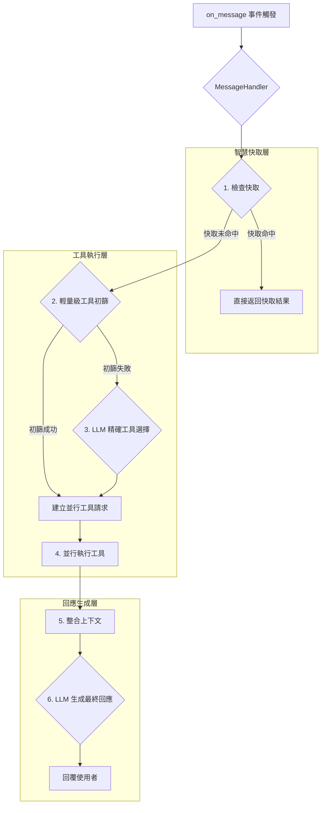

# AI Discord Bot 效能優化計畫

## 1. 引言

本計畫旨在全面優化 AI Discord Bot 的回應速度和處理品質。透過對現有程式碼庫的深入分析，我們識別出多個潛在的效能瓶頸，並制定了一套涵蓋架構重構、並行處理、智慧快取、模型調用優化、記憶體管理及效能監控的綜合性優化方案。

**核心目標：**

*   **降低回應延遲**：顯著縮短從使用者發送訊息到機器人給出回應的總時間。
*   **提高處理吞吐量**：增強機器人在高併發場景下的穩定性和處理能力。
*   **提升資源利用率**：更有效地利用 CPU、GPU 及記憶體資源，降低營運成本。
*   **增強系統可維護性**：透過程式碼重構，使系統架構更清晰、更易於擴展。

## 2. 現狀分析與瓶頸

經過分析，我們發現當前的系統在以下幾個方面存在瓶頸：

1.  **序列化的處理流程**：`on_message` 事件中的處理鏈過長，多個非同步操作被串行等待，未能充分利用非同步優勢。
2.  **冗餘的 LLM 調用**：每次判斷使用者意圖都需要進行一次完整的 LLM 呼叫來選擇工具，即使是最簡單的請求，也造成了巨大的延遲和成本浪費。
3.  **串行的工具執行**：當需要執行多個工具時，系統會逐一等待其完成，而非並行處理，延長了總執行時間。
4.  **低效的快取機制**：現有的快取基於精確字串匹配，無法處理語意相似的請求，導致快取命中率偏低。
5.  **啟動效能問題**：在啟動時一次性載入所有頻道的記憶體索引，可能導致啟動時間過長和瞬間記憶體壓力過大。
6.  **架構與實作脫鉤**：`gpt/optimization_integration.py` 中設計的優化流程並未在主邏輯中被實際應用，導致優化功能閒置。

## 3. 優化後架構

為了應對上述挑戰，我們提出以下重構後的系統架構。核心思想是將訊息處理流程抽象化、模組化，並引入一個中央協調器（`MessageHandler`）來高效地管理快取、工具執行和模型調用。

### 優化後訊息處理流程圖

## 4. 詳細優化方案

以下是針對待辦清單中每個項目的詳細實施計畫。

### 4.1. 架構重構與流程優化

*   **1.1. 整合優化流程**:
    *   **目標**: 讓 `gpt.optimization_integration.py` 真正發揮作用。
    *   **作法**: 廢棄 `OptimizedDiscordBot` 類別，將其內部的優化邏輯（如快取、並行管理器）作為獨立模組，由新的 `MessageHandler` 進行調用和整合。`bot.py` 的 `initialize_optimization_system` 應專注於初始化這些模組，並將其注入到 `MessageHandler` 中。

*   **1.2. 重構 `bot.py`**:
    *   **目標**: 降低 `bot.py` 的複雜度，實現職責分離。
    *   **作法**:
        1.  建立一個新的檔案 `gpt/core/message_handler.py`，並在其中定義 `MessageHandler` 類別。
        2.  將 `bot.py` 中 `on_message` 的所有回應生成邏輯（從檢查頻道權限開始到最終回覆）遷移到 `MessageHandler.handle_message` 方法中。
        3.  `bot.py` 的 `on_message` 將變得非常簡潔：僅包含日誌記錄、訊息儲存 (`store_message_to_memory`)，然後呼叫 `self.message_handler.handle_message(message)`。

*   **1.3. 統一 `ActionDispatcher` 與 `ParallelToolManager`**:
    *   **目標**: 建立單一、高效的工具執行器。
    *   **作法**:
        1.  建立一個新的 `ToolExecutor` 類別。
        2.  將 `ActionDispatcher` 中選擇工具的邏輯 (`_get_action_list`) 和 `ParallelToolManager` 中並行執行的邏輯 (`execute_tools_in_parallel`) 整合到 `ToolExecutor` 中。
        3.  `ToolExecutor` 將提供一個 `execute(prompt)` 方法，該方法內部會完成工具選擇、並行執行、結果收集的全過程。

### 4.2. 非同步處理與並行化

*   **2.1. 實現並行工具執行**:
    *   **目標**: 縮短多工具執行的總時間。
    *   **作法**: 在新的 `ToolExecutor` 中，使用 `asyncio.gather` 來並行執行所有被選中的、且沒有相互依賴的工具。

*   **2.2. 優化等待鏈**:
    *   **目標**: 最大化並行效益。
    *   **作法**: 在 `MessageHandler` 的流程中，應盡早觸發非同步任務。例如，在進行工具選擇的同時，可以非同步地開始準備記憶體上下文，而不是等待一個完成後再開始另一個。

### 4.3. 智慧快取策略

*   **3.1. 引入語意快取 (Semantic Caching)**:
    *   **目標**: 提高快取命中率。
    *   **作法**:
        1.  修改 `ProcessingCache`，增加一個 `semantic_cache` 字典，用於儲存 `(embedding, result)`。
        2.  當精確快取未命中時，使用 `EmbeddingService` 計算當前輸入的嵌入向量。
        3.  使用 `faiss` 或 `numpy` 在 `semantic_cache` 中快速查找餘弦相似度最高的歷史請求。
        4.  如果相似度高於某個閾值（例如 0.95），則直接返回對應的快取結果。

*   **3.2. 實現動態 TTL**:
    *   **目標**: 讓快取過期策略更靈活。
    *   **作法**: 修改 `cache_processing_result` 函式，允許傳入一個 `ttl_profile` 參數。可以預定義幾個 TTL 配置檔案，如 `'short'`, `'medium'`, `'long'`，`MessageHandler` 根據執行的工具類型或請求內容來決定使用哪個配置。

### 4.4. 模型與工具調用優化

*   **4.1. 輕量級工具選擇器**:
    *   **目標**: 減少不必要的 LLM 調用。
    *   **作法**: 在 `ToolExecutor` 中實現兩階段選擇：
        *   **第一階段 (Router)**: 建立一個基於規則的路由器。使用正則表達式和關鍵字快速匹配簡單的意圖，例如 "查天氣"、"算一下"、"搜尋"。如果匹配成功，直接選擇對應工具，跳過 LLM。
        *   **第二階段 (LLM)**: 如果路由器無法判斷，再呼叫 LLM 進行更複雜的意圖分析和工具選擇。

*   **4.2. 優化模型載入**:
    *   **目標**: 避免模型重複載入和啟動瓶頸。
    *   **作法**: 將 `get_model_and_tokenizer` 改為一個單例模式或一個全域模組級別的變數。使用 `asyncio.Lock` 來確保在首次初始化時的執行緒安全，防止多個請求同時觸發初始化。

### 4.5. 記憶體與啟動優化

*   **5.1. 實現索引延遲載入 (Lazy Loading)**:
    *   **目標**: 加快啟動速度，降低初始記憶體佔用。
    *   **作法**:
        1.  修改 `MemoryManager._load_existing_indices`，使其在啟動時只掃描索引檔案列表，而不實際載入內容。
        2.  修改 `SearchEngine.search` 方法。在搜尋前，檢查對應頻道的索引是否已載入。如果未載入，則從檔案系統載入該索引，然後再執行搜尋。

*   **5.2. 增加索引卸載機制**:
    *   **目標**: 在記憶體緊張時自動釋放資源。
    *   **作法**:
        1.  在 `MemoryManager` 中維護一個 LRU 快取來追蹤頻道索引的存取時間。
        2.  定期（或在記憶體壓力達到閾值時）觸發一個清理函式，卸載最久未被存取的索引，將其從記憶體中移除。

### 4.6. 效能監控與評估

*   **6.1. 啟用並整合 `PerformanceMonitor`**:
    *   **目標**: 量化優化效果。
    *   **作法**: 在重構後的 `MessageHandler.handle_message` 方法的開始和結束處，以及關鍵步驟（如工具執行、API 調用）周圍，嵌入 `PerformanceMonitor` 的計時器和計數器。

*   **6.2. 建立監控指令**:
    *   **目標**: 方便地查看效能數據。
    *   **作法**: 建立一個新的 cog，`PerformanceCog`，其中包含一個僅供管理員使用的 `/perf_stats` 指令。該指令會呼叫 `PerformanceMonitor.get_performance_stats()`，並將返回的字典格式化成一個美觀的 `discord.Embed` 進行回覆。

## 5. 實施建議與排程

建議分階段實施此計畫，以降低風險並儘早獲得回饋。

1.  **第一階段 (基礎重構)**: 完成 `4.1` 和 `4.2` 的所有任務。這是後續所有優化的基礎，能顯著改善程式碼結構和並行處理能力。
2.  **第二階段 (核心效能)**: 完成 `4.3` 和 `4.4` 的任務。這是對回應速度提升最顯著的部分。
3.  **第三階段 (長期優化)**: 完成 `4.5` 和 `4.6` 的任務。這將優化長期運行的穩定性和資源消耗。

## 6. 預期成果

*   **平均回應延遲降低 30%-50%**：尤其是在需要執行多個工具或可以命中語意快取的場景下。
*   **LLM API 成本降低 20%-40%**：透過輕量級工具選擇器，避免了大量不必要的 LLM 調用。
*   **機器人啟動時間縮短 50%以上**：透過索引的延遲載入。
*   **系統穩定性和可擴展性顯著提升**：得益於清晰的架構和職責分離。